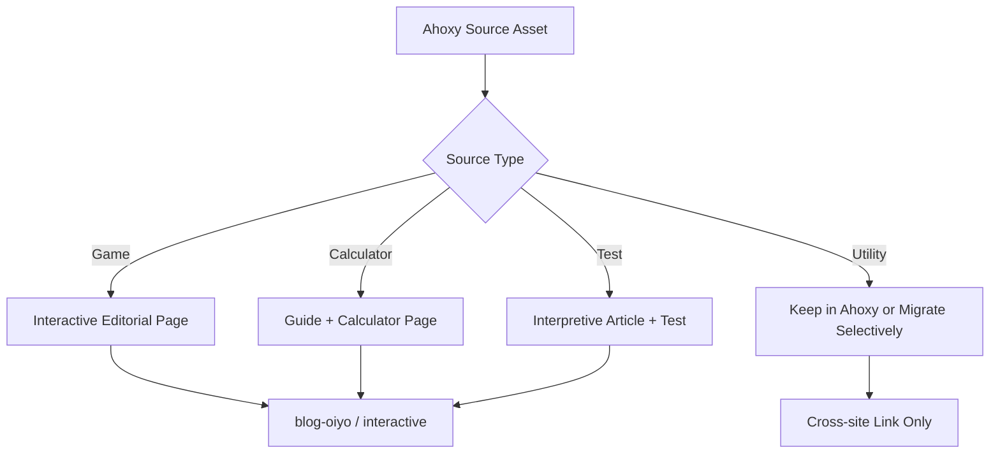

# Interactive Migration Map

## 1. Purpose

This document defines how Ahoxy assets should migrate into `blog-oiyo` as `interactive` or supporting content.

This is a domain-first migration map. It is designed to cover the full inventory without requiring every slug to be manually debated from scratch.

## 2. Migration Logic

## 3. Migration Status Vocabulary

1. `keep-source-only`
2. `cross-link-only`
3. `interactive-migrate`
4. `magazine-expand`
5. `academy-expand`
6. `archive-or-hide`
7. `revisit-later`

## 4. Domain-Level Mapping

### A. Board / Logic Games

Examples from Ahoxy families:

1. `gomoku`
2. `chess`
3. `checkers`
4. `reversi`
5. `domino`
6. `hearts`
7. `freecell`
8. `solitaire`
9. `minesweeper`
10. `hitori`
11. `kurodoko`
12. `lightup`
13. `puzzle-15`
14. `snake`

Target direction:

1. mostly `interactive`
2. some `magazine` support articles

Target format:

1. 역사/규칙/전략 설명
2. embedded island
3. 사고법/의사결정/패턴 읽기 연결

### B. Finance / Tax Calculators

Examples:

1. `compound`
2. `salary-calculator`
3. `meeting-cost`
4. `property-tax`
5. `acquisition-tax`
6. `capital-gains-tax`
7. `inheritance-tax`
8. `gift-tax`
9. `freelancer-tax`
10. `severance-pay`
11. `isa-calculator`
12. `pension-tax-calculator`
13. `stock-averaging`
14. `brokerage-fee`
15. `roi-calculator`

Target direction:

1. mostly `interactive`
2. strong linkage with `academy` tax and finance lectures

Target format:

1. concept guide
2. law/tax explanation
3. embedded calculator
4. internal links to lectures and comparison pages

### C. Personality / Psychology Tests

Examples:

1. `attachment-style`
2. `egogram`
3. `disc`
4. `mbti`
5. `lovelanguage`
6. `burnout`
7. `adhd-screening`
8. `stress-type`
9. `learning-style`
10. `mindset-compass`

Target direction:

1. some remain cross-site only if `oiyo` is the stronger destination
2. some become `magazine-expand`
3. selected ones become `interactive`

Target format:

1. interpretation article
2. concept clarification
3. careful internal linking to related self-discovery content

### D. Study / Productivity Tools

Examples:

1. `grade`
2. `dday`
3. `focus-blocker`
4. `meeting-cost`
5. `learning-style`
6. `number-sorter`
7. `metronome`

Target direction:

1. `magazine-expand`
2. selective `interactive`
3. `academy` support for study-method pages

### E. Real Estate / Housing / Life Finance

Examples:

1. `jeonse-vs-rent`
2. `jeonse-vs-buy`
3. `jeonse-guarantee`
4. `property-tax-regional`
5. `mortgage-calculator`
6. `rent-vs-jeonse`

Target direction:

1. `magazine-expand`
2. `interactive` when calculator use improves the article

### F. Image / Conversion / Dev Utilities

Examples:

1. `image-grayscale`
2. `image-metadata`
3. `image-pixelate`
4. `image-to-base64`
5. `json-parser`
6. `barcode-generator`
7. `css-unit-converter`

Target direction:

1. mostly `cross-link-only`
2. some `archive-or-hide`

Reason:

These do not match the current content expansion priority and image-light direction for `blog-oiyo`.

## 5. Migration Decision Rule

### Migrate to `interactive`

When:

1. the tool becomes stronger with explanation
2. the interaction teaches something
3. the page can support meaningful internal links

### Expand as `magazine`

When:

1. the concept is more important than the tool
2. the tool can be secondary or cross-linked

### Expand as `academy`

When:

1. the source maps directly to lecture topics
2. formal explanation and sequence matter more than standalone use

### Keep as cross-link only

When:

1. the utility is niche
2. the editorial payoff is weak
3. the asset conflicts with `blog-oiyo` priorities

### Revisit later

When:

1. the asset is interesting but not yet clearly positioned
2. the topic could become useful after a stronger surrounding series exists
3. the current editorial angle is still fuzzy

## 6. First Migration Wave

Priority wave 1:

1. `gomoku`
2. `chess`
3. `meeting-cost`
4. `compound`
5. `property-tax`
6. `acquisition-tax`
7. `capital-gains-tax`
8. `inheritance-tax`
9. `gift-tax`
10. `learning-style`

## 7. Mapping Output Requirement

Every mapped Ahoxy slug should eventually produce:

1. source slug
2. target track
3. target slug
4. target title
5. island component name
6. editorial angle
7. status
