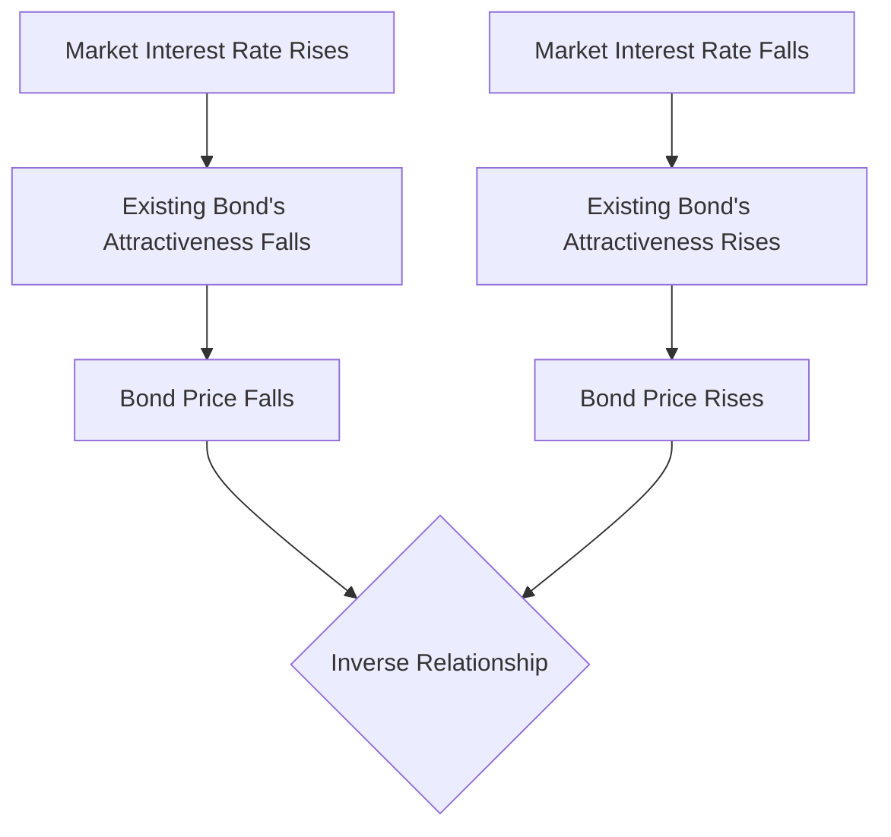

import Callout from "@/components/mdx/Callout.astro";

# Chapter 2. Aesthetics of Price and Value: Valuation of Stocks and Bonds

Welcome back. Last time, we learned about the heart of finance: 'Time Value of Money.' Today, we go to the field where that heart pumps—**Valuation** of stocks and bonds.

Warren Buffett said, "Price is what you pay. Value is what you get." The most important skill for a financial manager is to see through the 'price' floating in the market and identify the asset's true <mark><strong>"Intrinsic Value."</strong></mark> Let's master the magic formulas that pull future cash flows into the present.

---

## 1. Promises of Payment: Bond Valuation

A bond is a IOU where the issuer promises to pay 'interest' and 'principal.'

### (1) Logic of Bond Value

The value of a bond is the sum of discounted future interest and principal at the market interest rate (discount rate).
The fundamental law: <mark><strong>"When interest rates rise, bond prices fall."</strong></mark> Why? Because when new bonds offering higher interest appear, your old bond with lower interest becomes less attractive, so it must be sold at a discount.

### 🔄 See-saw Relationship: Bond Prices and Interest Rates

---

## 2. Price Tags of Dreams: Stock Valuation

Valuing stocks is much harder than bonds. There is no maturity, and dividends are uncertain. This is why it's said that stocks live on 'dreams.'

### (1) Dividend Discount Model (DDM)

The value of a stock is the present value of all dividends the company will pay until the end of time.

- **Gordon Growth Model**: Assumes dividends grow at a constant rate (g) every year.
- **<mark>Stock Price ($P_0$) = $D_1 / (k - g)$</mark>** (D: Dividend, k: Required return, g: Growth rate)

<Callout type="tip">
  **The Magic of Growth (g)**: In the formula, even a small increase in the growth rate (g) in the
  denominator can cause the stock price to skyrocket. This is mathematical proof for why the market
  is obsessed with 'growth stocks.'
</Callout>

### (2) Reinterpreting P/E Ratio (PER)

The P/E ratio is a summary of stock valuation. From a financial perspective, it is a scorecard assigned by the market on <mark><strong>"how low the risk is and how high the growth will be."</strong></mark>

---

## 3. Deep Dive: Intrinsic Value vs. Market Price

A sharp financial manager always compares these two:

- **Intrinsic Value > Market Price**: Undervalued. Time to **Buy**.
- **Intrinsic Value < Market Price**: Bubble. Time to **Sell**.

<Callout type="important">
  **Reflecting Risk**: While bond value depends on 'interest rates,' stock value depends on 'risk.'
  If risk increases, we demand a higher required return (k), which causes the denominator to grow
  and the intrinsic value to plummet.
</Callout>

---

## 4. Conclusion: Look Beyond Numbers to See Value

Remember: formulas are just tools. Behind bond valuation lies 'trust,' and behind stock valuation lies 'hope for the future.'

<mark><strong>"Value is a joint venture between future cash flows and the patience to wait for them."</strong></mark> Whether you are investing or running a firm, I hope you have the insight to see the deep sea of 'value' flowing beneath the waves of 'price.'

---

## 📖 참고문헌
- **[The Intelligent Investor] - Benjamin Graham**: The classic that first introduced 'intrinsic value' and 'margin of safety.'
- **[Investment Valuation] - Aswath Damodaran**: A rigorous guide to valuing everything from stocks to startups.
- **[One Up on Wall Street] - Peter Lynch**: Practical wisdom on finding great 'growth stocks' through everyday observation.

---

Next time, we will tackle the most important moment for any firm—**Capital Budgeting: Making Investment Decisions using NPV and IRR.**
