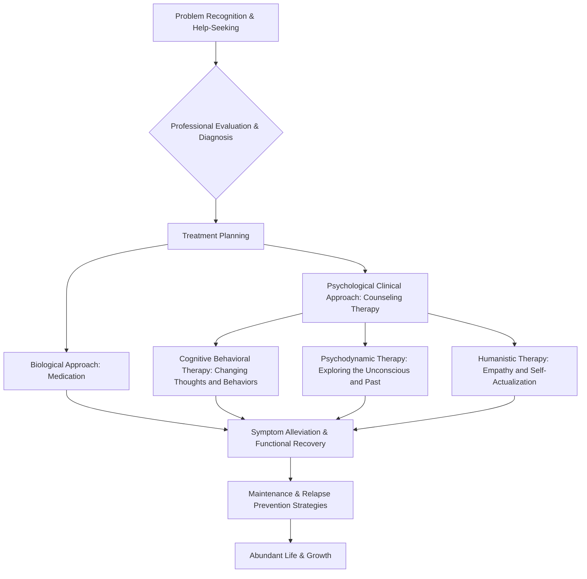

import Callout from "@/components/mdx/Callout.astro";

# Chapter 5. The Shadow of the Mind: Abnormal Psychology and the Journey of Healing

Hello, everyone. Up until now, we have learned about the universal operating principles of the human mind, such as development, social relationships, motivation, and emotion. Today, we are going to cover a subject that feels a bit heavy yet is most closely intertwined with our lives. It is none other than **Abnormal Psychology**.

The human mind is like a canvas of a painting. Sometimes bright light shines upon it, but other times dark shadows are cast. Abnormal psychology is the discipline that analyzes those **shadows**. However, remember: the darkness of a shadow is also proof that a strong light exists. Today, beyond simply viewing the pain of the mind as a "disease," we will begin a <mark><strong>journey to understand the suffering of human existence and explore paths toward healing</strong></mark>.

---

## 1. What is "Abnormal"? The Ambiguity of Standards

Where is the boundary line that separates "normal" and "abnormal"? In psychology, the following four criteria (the 4 Ds) are considered comprehensively.

### 📊 The 4 Ds of Identifying Abnormal Behavior

| Criterion | Term | Meaning | Example |
| :------------ | :-------------- | :-------------------------------------- | :------------------------------ |
| **Deviance** | **Deviance** | Departing from social norms or statistical averages | Extreme eccentric behavior in public places |
| **Distress** | **Distress** | Severe psychological distress felt by the individual | Deep sadness that paralyzes daily life |
| **Dysfunction** | **Dysfunction** | Difficulty maintaining daily tasks or social relationships | Job loss due to social phobia |
| **Danger** | **Danger** | Potential to be a threat to oneself or others | Intent to self-harm or violent impulses |

The important point is that no single factor can be an absolute criterion. An artist's unique eccentricities may be "deviant" but not "dysfunctional," and deep sadness can be a universal pain experienced by anyone. Diagnostic value only arises when <mark><strong>"the depth of suffering and life functionality"</strong></mark> are in harmony.

---

## 2. The Standard of Modern Diagnosis: DSM-5-TR

Psychologists and mental health professionals use **DSM-5-TR** (Diagnostic and Statistical Manual of Mental Disorders), a globally accepted diagnostic system. This is much like a topographical map of the mind. Let us systematically categorize the major disorders.

### 🧩 Summary of Major Psychological Disorders

1.  **Anxiety Disorders**: Excessive fear and anxiety. Generalized anxiety disorder, panic disorder, social anxiety disorder, etc.
2.  **Mood Disorders**: Difficulty regulating emotional highs and lows. Major depressive disorder, bipolar disorder (manic-depressive illness).
3.  **Personality Disorders**: Fixed thought and behavior patterns causing social maladjustment. Borderline personality disorder, narcissistic personality disorder, etc.
4.  **Schizophrenia Spectrum**: Loss of contact with reality, delusions, hallucinations.

---

## 3. The Process of Healing: From Darkness to Light

Once you have discovered the shadows of your mind, you must consider how to heal them. Psychotherapy is not simply about eliminating symptoms; it is <mark><strong>a process of accepting oneself and learning new ways of living</strong></mark>.

### 🔄 Psychotherapy and Recovery Guide (Flowchart)

The core of the most widely used **Cognitive Behavioral Therapy (CBT)** is the realization that <mark><strong>"it is not situations that make us struggle, but our thoughts about situations that make us struggle."</strong></mark> Merely wiping clean the lens of distorted thoughts allows the world to begin looking different.

---

## 4. Looking Deeper: Modern Society's Chronic Illnesses 'Anxiety' and 'Depression'

We tend to think of "anxiety" as unconditionally bad. However, anxiety is originally a **survival alarm** meant to protect us from danger. The problem occurs when the alarm does not stop even in situations where there is no threat.

<Callout type="note">
  **Depression is not the "mental flu."** The flu gets better once the virus leaves, but depression is often **an internal signal** to re-examine the direction of our lives. Psychologists emphasize that it may also be a message saying, "Your soul is exhausted by the current way of living."
</Callout>

---

## 5. Fixation of Personality: Understanding Personality Disorders

Personality disorders are not a "bad personality." They are like <mark><strong>"rigid yet inflexible armor"</strong></mark> formed to protect oneself from the deprivation or wounds of childhood. Behaviors such as being extremely sensitive to others' gazes or trying to control others often hide deep "anxiety and fear" underneath.

The beginning of healing is acknowledging that that armor is now hindering your growth, and summoning the courage to shed it piece by piece.

---

## 6. Conclusion: Human Beings as Wounded Healers

Fellow students, the purpose of studying abnormal psychology is not to attach a stigma to others. Rather, it is to acknowledge that <mark><strong>"anyone's mind can hurt if they are human"</strong></mark> and to broaden the scope of empathy to embrace each other's wounds.

The psychologist Carl Jung said, <mark><strong>"One does not become enlightened by imagining figures of light, but by making the darkness conscious."</strong></mark> Do not fear your shadows. When you observe and accept those shadows, true self-integration and maturation take place.

Next time, wrapping up our epic journey of studying psychology, we will talk about **happiness, positive psychology, and the psychological well-being we ought to pursue**.

---

## 📖 References
These are recommended books for those who want to embrace the shadows of the mind and gain the wisdom of healing.

- **[The No-Boundary Mind] by Ken Wilber**: Analyzes the spectrum of human consciousness and provides philosophical and psychological insights on how to integrate and heal our inner divisions.
- **[You Are Right] by Jung Hye-shin**: A book like "psychological CPR" that fills the starved corners of the mind through fierce field experience as a counselor, showing how empathy saves people.
- **[The Noonday Demon] by Andrew Solomon**: An anatomical, cultural, and personal record of the suffering called depression, showing a human narrative beyond mere illness.

---

You have worked hard. May it be a night where your hearts are filled with warm comfort and wisdom.