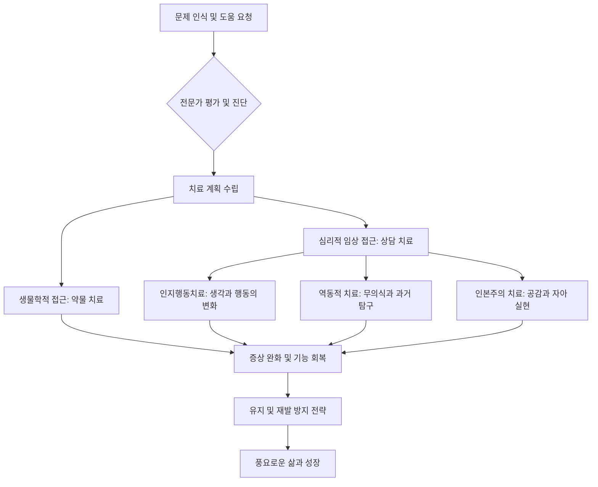

import Callout from "@/components/mdx/Callout.astro";

# Chapter 5. 마음의 그림자: 이상심리학과 치유의 여정

안녕하세요, 여러분. 지금까지 우리는 발달, 사회적 관계, 동기와 정서 등 인간의 보편적인 마음의 작동 원리를 배워왔습니다. 오늘은 조금은 무겁지만, 우리 삶과 가장 밀접하게 맞닿아 있는 주제를 다루고자 합니다. 바로 **이상심리학(Abnormal Psychology)**입니다.

인간의 마음은 한 폭의 그림과 같습니다. 때로는 밝은 빛이 비치기도 하지만, 때로는 짙은 그림자가 드리우기도 하죠. 이상심리학은 그 **그림자**를 분석하는 학문입니다. 하지만 기억하십시오. 그림자가 짙다는 것은 그만큼 빛이 강하게 존재한다는 증거이기도 합니다. 오늘 우리는 마음의 아픔을 단순히 '병'으로 보는 것을 넘어, <mark><strong>인간 존재의 고통을 이해하고 치유의 길을 모색하는 여정</strong></mark>을 시작할 것입니다.

---

## 1. 무엇이 '이상'인가? 기준의 모호함

'정상'과 '이상'을 가르는 경계선은 어디일까요? 심리학에서는 다음의 4가지 기준(4Ds)을 종합적으로 고려합니다.

### 📊 이상행동 판별의 4가지 기준 (4Ds)

| 기준          | 용어            | 의미                                    | 예시                            |
| :------------ | :-------------- | :-------------------------------------- | :------------------------------ |
| **일탈성**    | **Deviance**    | 사회적 규범이나 통계적 평균에서 벗어남  | 공공장소에서의 극단적인 기행    |
| **고통**      | **Distress**    | 개인 스스로가 느끼는 심한 심리적 괴로움 | 일상생활을 마비시키는 깊은 슬픔 |
| **기능 장애** | **Dysfunction** | 일상적 업무나 사회적 관계 유지가 어려움 | 사회 공포증으로 인한 실직       |
| **위험성**    | **Danger**      | 자신이나 타인에게 위협이 될 가능성      | 자해 의도나 폭력적 충동         |

중요한 점은 어느 하나만이 절대적인 기준이 될 수 없다는 것입니다. 예술가의 독특한 기행은 '일탈적'일 수 있지만 '기능 장애'가 아닐 수 있고, 깊은 슬픔은 누구나 겪는 보편적 고통일 수 있습니다. <mark><strong>"고통의 깊이와 삶의 기능성"</strong></mark>이 조화를 이룰 때 비로소 진단적 가치가 생깁니다.

---

## 2. 현대 진단의 표준: DSM-5-TR

심리학자와 정신건강 전문의들은 전 세계적으로 통용되는 진단 체계인 **DSM-5-TR** (정신질환 진단 및 통계 매뉴얼)을 사용합니다. 이는 마치 마음의 지형도와 같습니다. 주요 장애들을 체계적으로 분류해 보겠습니다.

### 🧩 주요 심리 장애 분류 요약

1.  **불안 장애 (Anxiety Disorders)**: 과도한 공포와 불안. 범불안장애, 공황장애, 사회불안장애 등.
2.  **기분 장애 (Mood Disorders)**: 감정의 높낮이 조절이 어려움. 주요우울장애, 양극성 장애(조울증).
3.  **성격 장애 (Personality Disorders)**: 고정된 사고와 행동 패턴이 사회적 부적응 초래. 경계선 성격장애, 자기애성 성격장애 등.
4.  **조현병 스펙트럼 (Schizophrenia Spectrum)**: 현실과의 접촉 상실, 망상, 환각.

---

## 3. 치유의 프로세스: 어둠에서 빛으로

마음의 그림자를 발견했다면, 이제 어떻게 치유할 것인가를 고민해야 합니다. 심리치료는 단순히 증상을 없애는 것이 아니라, <mark><strong>자신을 수용하고 새로운 삶의 방식을 학습하는 과정</strong></mark>입니다.

### 🔄 심리치료 및 회복 가이드 (Flowchart)

가장 널리 쓰이는 **인지행동치료(CBT)**의 핵심은 <mark><strong>"상황이 우리를 힘들게 하는 것이 아니라, 상황을 바라보는 우리의 생각이 우리를 힘들게 한다"</strong></mark>는 깨달음입니다. 왜곡된 생각의 렌즈를 닦아내는 것만으로도 세상은 다르게 보이기 시작합니다.

---

## 4. 깊이 들여다보기: 현대인의 고질병 '불안'과 '우울'

우리는 '불안'을 무조건 나쁜 것으로 생각합니다. 하지만 불안은 원래 위험으로부터 우리를 보호하려는 **생존의 경보음**입니다. 문제는 위협이 없는 상황에서도 경보음이 멈추지 않을 때 발생하죠.

<Callout type="note">
  **우울은 '정신적 독감'이 아닙니다.** 독감은 바이러스가 떠나면 낫지만, 우울은 우리 삶의 방향성을
  재검토하라는 **내면의 신호**인 경우가 많습니다. "당신의 영혼이 현재의 삶의 방식에 지쳤다"는
  메시지일 수도 있다는 점을 심리학자들은 강조합니다.
</Callout>

---

## 5. 성격의 고착: 성격 장애에 대한 이해

성격 장애는 '나쁜 성격'이 아닙니다. 어린 시절의 결핍이나 상처로부터 자신을 보호하기 위해 형성된 <mark><strong>'단단하지만 유연하지 못한 갑옷'</strong></mark>과 같습니다. 타인의 시선에 극단적으로 예민하거나, 타인을 통제하려 드는 행위들은 사실 그 밑에 깊은 '불안과 공포'를 숨기고 있는 경우가 많습니다.

치유의 시작은 그 갑옷이 이제는 성장을 방해하고 있음을 인정하고, 조금씩 벗어 던지는 용기를 내는 것입니다.

---

## 6. 결론: 상처받은 치유자로서의 인간

학우 여러분, 이상심리학을 공부하는 목적은 타인에게 꼬리표(Stigma)를 붙이기 위함이 아닙니다. 오히려 **"인간이라면 누구나 마음이 아플 수 있음"**을 인정하고, 서로의 상처를 보듬는 공감의 폭을 넓히기 위함입니다.

심리학자 칼 융은 말했습니다. <mark><strong>"빛의 형상을 상상하는 것이 아니라, 어둠을 의식화하는 것이 깨달음을 가져온다."</strong></mark> 여러분의 그림자를 두려워하지 마십시오. 그 그림자를 관찰하고 수용할 때, 비로소 진정한 의미의 자아 통합과 성숙이 일어납니다.

다음 시간, 심리학 공부의 대장정을 마무리하며, **행복과 긍정 심리학, 그리고 우리가 추구해야 할 심리적 안녕(Well-being)**에 대해 이야기하겠습니다.

---

## 📖 참고문헌
마음의 그림자를 보듬고 치유의 지혜를 얻고 싶은 분들을 위한 추천 도서입니다.

- **[장벽 없는 마음 (The No-Boundary Mind)] - 켄 윌버**: 인간 의식의 스펙트럼을 분석하며, 우리 내면의 분열을 어떻게 통합하고 치유할 것인지 철학적이고 심리학적인 통찰을 제공합니다.
- **[당신이 옳다] - 정혜신**: 공감이 어떻게 사람을 살리는지, 상담가로서의 치열한 현장 경험을 통해 마음의 허기진 구석을 채워주는 '심리적 심폐소생술' 같은 책입니다.
- **[나는 왜 죽지 않았는가 (The Noonday Demon)] - 앤드류 솔로몬**: 우울증이라는 고통의 해부학적, 문화적, 개인적 기록으로, 질병 그 이상의 인간적 서사를 보여줍니다.

---

수고하셨습니다. 여러분의 마음이 따뜻한 위로와 지혜로 채워지는 밤이 되길 바랍니다.
