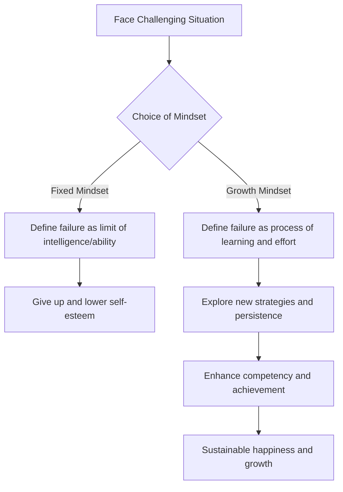

import Callout from "@/components/mdx/Callout.astro";

# Chapter 6. The Science of Happiness: Positive Psychology and the Flourishing Life

Hello everyone. We have finally reached the final session that will cap off our psychological journey together. Throughout our time, we have widely covered the human unconscious, social relationships, motivation and emotion, and even the pain of the mind. The topic we are covering today is the terminal station of all that knowledge and the ultimate reason why we study psychology—namely, **happiness**.

If past psychology focused on fixing "what is wrong?", modern **Positive Psychology** asks, <mark><strong>"What enriches us?"</strong></mark> Beyond simply not being unhappy, let's find the scientific answers on how we can flourish our lives.

---

## 1. The 5 Pillars of Well-being: Seligman's PERMA Model

Martin Seligman, the founder of positive psychology, states that happiness is not merely a momentary pleasant feeling. He proposed five core elements for sustainable well-being.

### 🌟 The PERMA Guide for a Flourishing Life

| Element                  | Meaning             | Core Question                         | Practice Strategy                     |
| :----------------------- | :------------------ | :------------------------------------ | :------------------------------------ |
| **P (Positive Emotion)** | **Positive Emotion**| How much joy and gratitude did you feel today? | Write 3 gratitude journal entries every night |
| **E (Engagement)**       | **Engagement**      | Is there anything you lost track of time doing? | Find opportunities to exercise your strengths |
| **R (Relationships)**    | **Relationships**   | Do you have healthy relationships supporting you? | Have deep conversations with loved ones |
| **M (Meaning)**          | **Meaning**         | Are you contributing to something greater than yourself? | Volunteer/contribute to realize your values |
| **A (Accomplishment)**   | **Accomplishment**  | Have you set and achieved goals?      | Record small successes (Small Wins)   |

Happiness comes when these 5 elements are in an even balance. Which pillar is currently your strongest, and which one do you need to reinforce?

---

## 2. Mental Strength: Resilience and Growth Mindset

Happiness is not a state free of hardship, but is maintained when you have the <mark><strong>"strength to overcome hardship."</strong></mark> This is called **Resilience**. The decisive key to building resilience is Carol Dweck's **Growth Mindset**.

### 🔄 The Mindset Shift Process

People with a growth mindset do not say, "I can't do it." Instead, they say, <mark><strong>"I just can't do it 'Yet (Not yet)'."</strong></mark> This single little word changes the brain's circuits and paves the way to happiness.

---

## 3. 40% of Happiness is Up to Us: Sonja Lyubomirsky's Formula

Psychologist Sonja Lyubomirsky analyzed the factors that determine happiness.

- **Genetic Set Point (50%)**: Innate temperament
- **External Environment (10%)**: Money, place of residence, marital status, etc.
- **Intentional Activity (40%)**: Our thoughts and daily actions

What is surprising is that environments like money or houses account for a mere 10% of happiness. On the other hand, <mark><strong>what habits we hold and what thoughts we have (intentional activity)</strong></mark> account for as much as 40%. This is a message of hope that we can change a significant portion of our happiness through our own efforts.

---

## 4. Time to Meet the True Self: Discovering Strengths

Rather than pouring energy into fixing your flaws, humans experience the greatest sense of accomplishment and happiness when they exercise their **Signature Strengths**. Find your own shining raw gems, such as persistence, curiosity, fairness, and creativity.

<Callout type="note">
  **Comparison is the thief of joy.** Happiness in positive psychology is not about gaining a competitive advantage over others, but the process of getting a little closer to your true "selfhood" than you were yesterday.
</Callout>

---

## 5. Semantic Tranquility: Mindfulness and Gratitude

Modern psychology has scientized the ancient wisdom of "meditation" under the name of **Mindfulness**. It is the ability to exist fully in the "present moment" without getting bogged down in the past or future. Add a pinch of **gratitude** to this. Gratitude is the most powerful neuroplasticity training that trains our brains to respond more sensitively to positive information.

---

## 6. Conclusion: Life is Not a 'Problem to be Solved', But a 'Mystery to be Experienced'

Fellow students, wrapping up our 6-week psychological epic, I deliver my final message. Psychology is not a discipline to make you a "perfect person." Rather, it is a discipline to **understand your imperfections and gain the courage to take one step further despite them**.

<mark><strong>"Happiness is not a destination, but the very method of traveling."</strong></mark> A warm word you give to someone you meet today, and a smile of encouragement you send to yourself are the very substance of happiness.

Thank you for drawing the map of the mind with me all this time. I will cheer for your lives to shine more transparently and beautifully through the lens of psychology.

---

## 📖 References
These are recommended books for those who want to apply the flourishing life and the science of happiness to their daily lives.

- **[Learned Optimism] - Martin Seligman**: A scripture of positive psychology that presents concrete methods to overcome pessimism and learn optimistic thinking (growth mindset).
- **[The Origins of Happiness] - Eunkook Suh**: A book that unconventionally and clearly unravels happiness from an evolutionary perspective—not as a "moral duty" but as a "tool for survival."
- **[Grit] - Angela Duckworth**: Scientifically proves that the core of success is not genius, but "grit," which is a combination of passion and perseverance.

---

You have worked hard. May your futures be filled with abundant blessings.