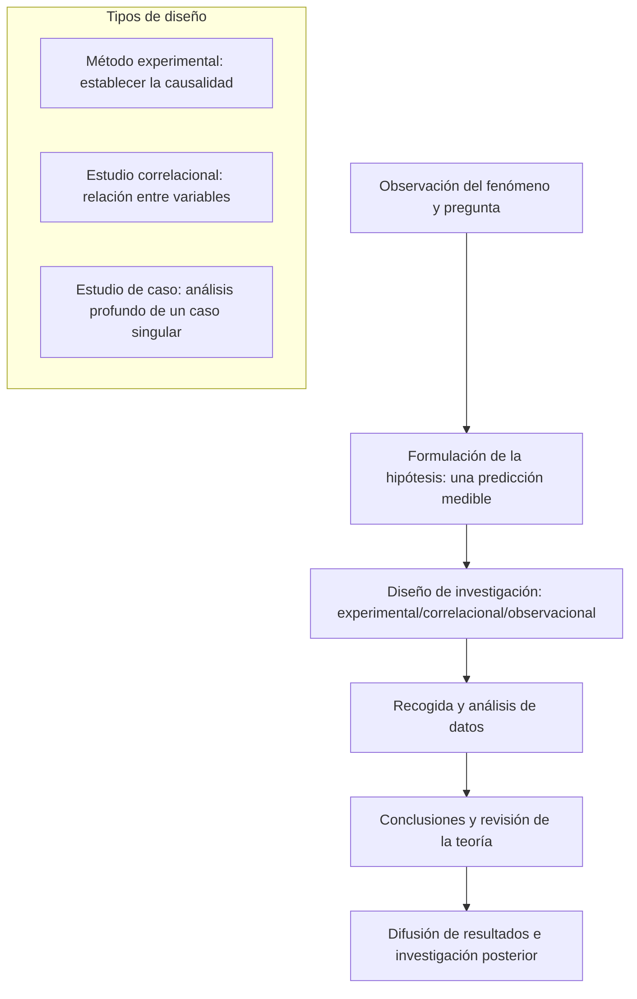

import Callout from "@/components/mdx/Callout.astro";

# Chapter 1. Los fundamentos de la psicología y la comprensión de la conducta humana

Hola a todos. Como «profesor», me alegra acompañarles al mundo de la ciencia de la mente: la **psicología (Psychology)**. Muchos piensan que se trata de «leer el pensamiento ajeno» o de hacer tests de personalidad. Sin embargo, la definición que yo propongo es esta: <mark><strong>«un noble esfuerzo por demostrar con los métodos más objetivos la experiencia humana más subjetiva»</strong></mark>.

¿Por qué actuamos de una manera determinada? ¿De dónde vienen nuestros pensamientos? Para responder a estas preguntas antiguas, hoy recorreremos una a una las bases intelectuales que la psicología ha ido levantando.

---

## 1. El origen de la psicología: de la filosofía a la ciencia

La psicología fue en su origen una rama de la filosofía. De Aristóteles a Descartes, se reflexionaba sobre el «alma» humana. Hasta que en 1879 Wilhelm Wundt fundó en la Universidad de Leipzig el primer laboratorio de psicología: solo entonces la disciplina echó a andar como **ciencia independiente**.

- **Etapa filosófica**: «¿Qué es la mente humana?» (reflexión y lógica)
- **Etapa científica**: «¿Cómo funciona la mente y cómo medirla?» (observación y experimentación)

---

## 2. Cinco lentes para mirar la mente: las grandes escuelas

La mente humana es demasiado compleja para que un único punto de vista la explique por completo. Repasemos las escuelas que han marcado la historia de la psicología para familiarizarnos con distintas maneras de mirar al ser humano.

### 🎭 Comparación de las grandes escuelas y sus perspectivas

| Escuela (perspectiva) | Autores representativos | Palabras clave | Mirada sobre el ser humano |
| :----------- | :----------------- | :---------------------- | :------------------------------------------ |
| **Psicoanálisis** | **Freud** | <mark>inconsciente</mark>, infancia | Un ser gobernado por pulsiones y un inconsciente invisibles |
| **Conductismo** | **Skinner, Watson** | <mark>estímulo-respuesta (E-R)</mark> | Un organismo moldeado y controlado por el ambiente |
| **Humanismo** | **Rogers, Maslow** | <mark>autorrealización</mark>, libre albedrío | Un sujeto con el potencial de crecer y realizarse |
| **Cognitivismo** | **Piaget, Neisser** | <mark>procesamiento de información</mark>, esquema | Un ser que codifica, almacena y recupera información como un ordenador |
| **Biológica** | **-** | **neurotransmisores**, evolución | El producto de reacciones electroquímicas cerebrales y de la herencia |

La psicología contemporánea no se encierra en ninguna escuela: interpreta los fenómenos integrando todas estas perspectivas. Es lo que se llama **enfoque integrador (Eclectic Approach)**.

---

## 3. Los métodos de investigación: la prueba científica

Lo que distingue a la psicología de la «adivinación» es su **metodología**. Formulamos hipótesis y las sometemos a una comprobación rigurosa.

### 🔄 El ciclo de la investigación psicológica

El **método experimental** en particular, al manipular la condición-causa (variable independiente) para observar cómo varía el resultado (variable dependiente), constituye <mark><strong>el arma más potente de la psicología para revelar la causalidad de la conducta humana</strong></mark>.

---

## 4. Mirar más de cerca: la conexión mente-cuerpo (Mind-Body)

Antaño se tenía a mente y cuerpo por separados. La psicología actual subraya, en cambio, su **interdependencia**. Nuestro estado de ánimo modifica el sistema inmunitario y, a la inversa, el estado de la microbiota intestinal puede influir en nuestro ánimo depresivo.

<Callout type="important">
  **El efecto placebo (Placebo Effect)**: creer simplemente que «voy a mejorar» basta para producir
  cambios físicos reales. Este fenómeno, en la frontera entre psicología y medicina, ilustra de forma
  ejemplar la fuerza de la mente.
</Callout>

---

## 5. Conclusión: el primer espejo para entenderse

Hoy hemos obtenido un mapa para adentrarnos en el bosque de la psicología. La psicología no es una herramienta para manipular a los demás. Se parece más bien a un espejo donde buscar la respuesta a la pregunta: **«¿por qué siento y actúo así?»**

A través de ese espejo, ustedes atisbarán su propio inconsciente, comprenderán los principios del aprendizaje y aprenderán, además, a empatizar con los demás.

---

## 📖 Referencias
Estas son algunas obras mayores para ampliar su horizonte en psicología.

- **_La interpretación de los sueños_ (The Interpretation of Dreams) — Sigmund Freud**: la obra monumental que descubre por primera vez ese continente desconocido que es el inconsciente. Aunque su lectura resulte exigente, ayuda mucho a entender las fuentes de la disciplina.
- **_El hombre en busca de sentido_ (Man's Search for Meaning) — Viktor Frankl**: un libro conmovedor que muestra que, incluso en el extremo de los campos de concentración, lo que decidía la supervivencia era la «búsqueda de sentido».
- **_Influencia_ (Influence) — Robert Cialdini**: un clásico de la psicología aplicada, que muestra con qué fuerza operan los principios de la psicología social en la vida diaria y en los negocios.

---

La clase termina aquí por hoy. La próxima vez estudiaremos de lleno cómo nuestro cerebro y nuestros sentidos acogen el mundo: el **hardware y el software de la mente**. Gracias por su atención.
