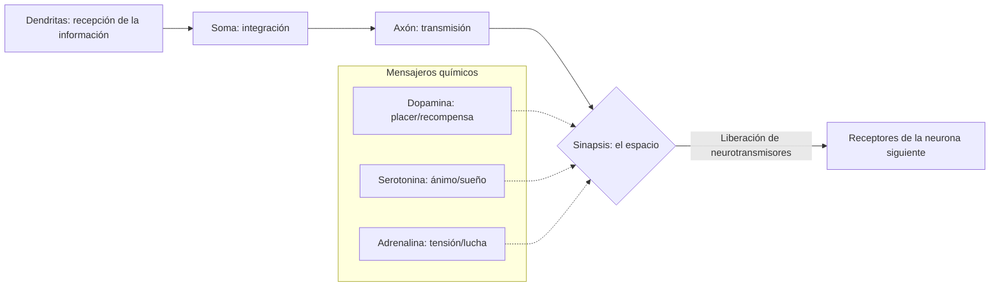

import Callout from "@/components/mdx/Callout.astro";

# El hardware del cerebro y la mente: neurociencia, sensación y percepción

Hola de nuevo, me alegra volver a verles. La clase pasada recorrimos la historia de la psicología y su metodología científica. Hoy partimos hacia el campo que con más fuerza está emergiendo dentro de la disciplina: la **psicología biológica (Biological Psychology)**.

Si la mente humana es un software refinado, nuestro cerebro y sistema nervioso son el **hardware de vanguardia** sobre el que corre. La tristeza, el amor e incluso las ideas más creativas son en realidad el resultado de diminutas reacciones electroquímicas dentro del cerebro. Examinemos hoy el funcionamiento de esta asombrosa máquina biológica.

---

## 1. Las señales eléctricas de la mente: neuronas y sinapsis

Nuestro cerebro contiene unos 86 000 millones de **neuronas (Neuron, células nerviosas)**. Intercambian información sin descanso y forman una red inmensa.

### 🔄 El mecanismo de la transmisión nerviosa

Como dice la fórmula <mark><strong>«si falta serotonina uno se deprime, si sobra dopamina uno se vuelve adicto»</strong></mark>, un desequilibrio mínimo de estas sustancias basta para transformar nuestro carácter y nuestra calidad de vida. Creemos poder superarlo todo con la sola «fuerza de voluntad», pero a veces restablecer el equilibrio químico del cerebro resulta una cura mucho más eficaz.

---

## 2. El mapa del cerebro: funciones y papeles por región

Nuestro cerebro es un **sistema de división del trabajo**, con funciones estrictamente repartidas por regiones. Y sin embargo esas regiones cooperan estrechamente para producir esa identidad que llamamos «yo».

### 🧠 Guía de las principales regiones cerebrales y sus funciones

| Región | Nombre | Funciones principales | Síntomas en caso de lesión |
| :----------- | :------------- | :-------------------------------- | :-------------------------- |
| **Corteza cerebral** | **Lóbulo frontal** | **Pensamiento superior**, planificación, juicio, moralidad | Trastornos del control de impulsos, cambio de personalidad |
| **Corteza cerebral** | **Lóbulo temporal** | Procesamiento auditivo, almacenamiento de recuerdos | Amnesia, incomprensión del lenguaje |
| **Sistema límbico** | **Amígdala** | **Respuestas emocionales**, miedo e ira | Embotamiento afectivo, incapacidad de detectar el peligro |
| **Sistema límbico** | **Hipocampo** | Almacenamiento a largo plazo de los **recuerdos nuevos** | Imposibilidad de aprender hechos nuevos |
| **Cerebelo** | **Cerebellum** | Equilibrio, control fino del movimiento | Marcha inestable, imposibilidad de tareas de precisión |

Lo que más distingue al ser humano de los demás animales es <mark><strong>un lóbulo frontal de evolución explosiva</strong></mark>. Si podemos inhibir nuestros impulsos y planificar el futuro, se lo debemos enteramente a él.

---

## 3. El mundo no se ve tal como es: sensación y percepción

Creemos que lo que vemos es la verdad. Pero, desde el punto de vista psicológico, no **vemos** el mundo: lo **interpretamos**.

- **Sensación**: proceso físico por el cual los órganos sensoriales —ojos, nariz, oídos— acogen los estímulos externos.
- **Percepción**: proceso psicológico por el cual el cerebro interpreta esa información y le da sentido.

<Callout type="important">
  **La constancia perceptiva (Perceptual Constancy)**: si un coche a lo lejos, del tamaño de una hormiga,
  sigue siendo para nosotros un coche real, es porque el cerebro ya mantiene la constancia de tamaño,
  forma y color. **<mark>«Las apariencias cambian, la sustancia permanece»</mark>**: he ahí una capacidad
  cognitiva notable.
</Callout>

---

## 4. La magia del cerebro: la plasticidad (Neuroplasticity)

Durante mucho tiempo se creyó que en la edad adulta las células cerebrales solo podían disminuir. La neurociencia actual ha demostrado, sin embargo, la **plasticidad cerebral**. Cuando aprendemos una habilidad nueva o pensamos en profundidad, las conexiones físicas entre neuronas (las sinapsis) se refuerzan y se dibujan mapas nuevos.

<mark><strong>«Nuestro cerebro puede seguir evolucionando hasta el último día.»</strong></mark> Alegar la edad para renunciar es, al menos desde la neurociencia, un mal argumento.

---

## 5. Conclusión: conocer el hardware cambia la vida

Hoy hemos estudiado el sustrato físico de la mente: el cerebro y los principios de la sensación. Saber que nuestra mente se apoya en bases biológicas nos vuelve humildes. Pero la plasticidad cerebral nos ofrece a la vez una esperanza poderosa: podemos transformarnos.

En este mismo instante, su cerebro procesa mi voz y este texto, y amplía su propio mapa. Recuerden bien que **cuidar su hardware (dormir lo suficiente, hacer ejercicio, buscar estímulos nuevos)** es la mejor manera de cuidar su mente.

---

## 📖 Referencias
Para quienes quieran sumergirse en los misterios del cerebro y la percepción.

- **_El hombre que confundió a su mujer con un sombrero_ (The Man Who Mistook His Wife for a Hat) — Oliver Sacks**: una obra magistral que relata, con mirada humanista y cálida, los síntomas extraños de pacientes con lesiones cerebrales. La quintaesencia de la psicología de la percepción.
- **_La consciencia_ (The Quest for Consciousness) — Christof Koch**: ¿en qué parte del cerebro nace la «conciencia»? Un libro que muestra la frontera actual de la ciencia.
- **_La mente organizada_ (The Organized Mind) — Daniel Levitin**: en la era de la sobrecarga informativa, cómo dirige nuestro cerebro la atención y procesa la información; un libro práctico que enseña la eficiencia desde la neurociencia.

---

Gracias por su atención. La próxima vez abordaremos de lleno cómo, gracias a este hardware tan refinado, aprendemos y recordamos: los **mecanismos del aprendizaje y la memoria**.
