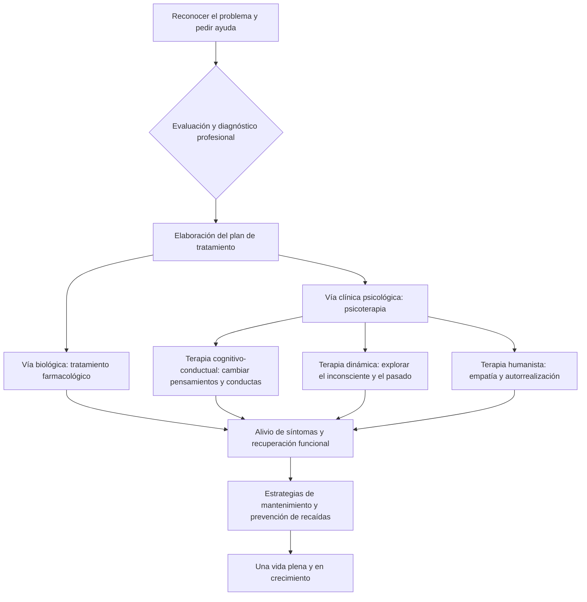

import Callout from "@/components/mdx/Callout.astro";

# La sombra de la mente: psicopatología y camino de sanación

Hola a todos. Hasta ahora hemos estudiado los principios universales del psiquismo: el desarrollo, las relaciones sociales, la motivación y la emoción. El tema de hoy es algo más grave, pero es el que roza más de cerca nuestras vidas: la **psicopatología (Abnormal Psychology)**.

La mente humana se parece a un cuadro. A veces la ilumina la luz; a veces se extiende sobre ella una sombra densa. La psicopatología es la disciplina que analiza esa **sombra**. Pero recuerden: una sombra densa es también la prueba de una luz intensa. Hoy iremos más allá de ver el sufrimiento psíquico como simple «enfermedad» y emprenderemos <mark><strong>un camino que busca comprender el dolor humano y explorar su sanación</strong></mark>.

---

## 1. ¿Qué es «anormal»? La imprecisión de los criterios

¿Dónde pasa la frontera entre lo «normal» y lo «anormal»? La psicología considera en conjunto los cuatro criterios siguientes (las 4D).

### 📊 Los cuatro criterios de la conducta anormal (4D)

| Criterio | Término | Significado | Ejemplo |
| :------------ | :-------------- | :-------------------------------------- | :------------------------------ |
| **Desviación** | **Deviance** | Apartarse de las normas sociales o de la media estadística | Conductas extremas en espacios públicos |
| **Malestar** | **Distress** | Sufrimiento psíquico intenso que la persona experimenta | Tristeza profunda que paraliza la vida diaria |
| **Disfunción** | **Dysfunction** | Dificultad para sostener el trabajo o las relaciones | Perder el empleo por fobia social |
| **Peligro** | **Danger** | Posible amenaza para uno mismo o para otros | Intención autolesiva o impulso violento |

Lo esencial es que ninguno de estos criterios vale por sí solo de forma absoluta. La excentricidad de un artista puede ser «desviada» sin constituir una «disfunción», y una tristeza profunda puede ser un dolor universal. Solo cuando <mark><strong>«la hondura del sufrimiento y la funcionalidad de la vida»</strong></mark> se corresponden adquiere valor un diagnóstico.

---

## 2. El estándar diagnóstico actual: el DSM-5-TR

Psicólogos y psiquiatras emplean el **DSM-5-TR** (Manual diagnóstico y estadístico de los trastornos mentales), sistema de referencia en todo el mundo. Es una suerte de mapa topográfico de la mente. Repasemos los grandes trastornos.

### 🧩 Clasificación resumida de los principales trastornos psíquicos

1.  **Trastornos de ansiedad (Anxiety Disorders)**: miedo y ansiedad excesivos. Trastorno de ansiedad generalizada, trastorno de pánico, ansiedad social.
2.  **Trastornos del estado de ánimo (Mood Disorders)**: dificultad para regular las oscilaciones afectivas. Trastorno depresivo mayor, trastorno bipolar.
3.  **Trastornos de la personalidad (Personality Disorders)**: patrones rígidos de pensamiento y conducta que producen desadaptación social. Trastorno límite, personalidad narcisista.
4.  **Espectro de la esquizofrenia (Schizophrenia Spectrum)**: pérdida de contacto con la realidad, delirios, alucinaciones.

---

## 3. El proceso de sanación: de la oscuridad a la luz

Una vez descubierta la sombra, queda pensar cómo sanar. La psicoterapia no consiste solo en eliminar síntomas: es <mark><strong>un proceso en el que uno se acepta y aprende una nueva manera de vivir</strong></mark>.

### 🔄 Guía de psicoterapia y recuperación (Flowchart)

El núcleo de la **terapia cognitivo-conductual (TCC)**, la más extendida, está en esta toma de conciencia: <mark><strong>«no son las situaciones las que nos hacen sufrir, sino la manera en que las pensamos»</strong></mark>. Limpiar la lente deformada del pensamiento basta ya para que el mundo empiece a verse de otro modo.

---

## 4. Mirar más de cerca: «ansiedad» y «depresión», males de nuestro tiempo

Solemos ver la «ansiedad» como algo sin más malo. Pero la ansiedad es en origen una **alarma de supervivencia** destinada a protegernos del peligro. El problema surge cuando la alarma no cesa, aunque no haya amenaza alguna.

<Callout type="note">
  **La depresión no es una «gripe del alma».** La gripe se cura cuando el virus se va; la depresión es
  muchas veces una **señal interior** que pide revisar la dirección de la propia vida. Los psicólogos
  insisten: el mensaje puede ser «tu alma está agotada de tu forma actual de vivir».
</Callout>

---

## 5. La fijación del carácter: entender los trastornos de la personalidad

Un trastorno de la personalidad no es un «mal carácter». Se parece más a <mark><strong>una armadura sólida pero ya rígida</strong></mark>, forjada para protegerse de las carencias o heridas de la infancia. La hipersensibilidad extrema a la mirada ajena, o la necesidad de controlar a los demás, esconden casi siempre una profunda «angustia» debajo.

La sanación empieza al reconocer que esa armadura estorba ya el crecimiento, y al reunir el valor de irla quitando pieza a pieza.

---

## 6. Conclusión: el ser humano como sanador herido

Queridos estudiantes, no estudiamos psicopatología para poner etiquetas (Stigma) a los demás. Al contrario: para admitir que **«ser humano es poder sufrir psíquicamente»** y para ensanchar la empatía con la que cuidamos las heridas ajenas.

Carl Jung lo escribió: <mark><strong>«Uno no alcanza la iluminación imaginando figuras de luz, sino haciendo consciente la oscuridad.»</strong></mark> No teman a su sombra. Es al observarla y acogerla cuando ocurren la verdadera integración del sí mismo y la madurez.

La próxima vez, para cerrar este largo recorrido, hablaremos de la **felicidad, la psicología positiva y el bienestar (Well-being) al que conviene aspirar**.

---

## 📖 Referencias
Para quienes quieran acoger la sombra de la mente y extraer de ella sabiduría.

- **_La conciencia sin fronteras_ (No Boundary) — Ken Wilber**: un análisis del espectro de la conciencia humana, con perspectivas filosóficas y psicológicas sobre cómo integrar y sanar nuestras divisiones internas.
- **_Tienes razón_ — Jung Hye-shin**: nutrido de una práctica clínica exigente, un libro que funciona como «reanimación psíquica» y muestra cómo la empatía salva.
- **_El demonio de la depresión_ (The Noonday Demon) — Andrew Solomon**: anatomía, cultura y relato íntimo de la depresión; un testimonio humano que va mucho más allá de la enfermedad.

---

Gracias por su atención. Que esta noche llene su mente de consuelo y sabiduría.
