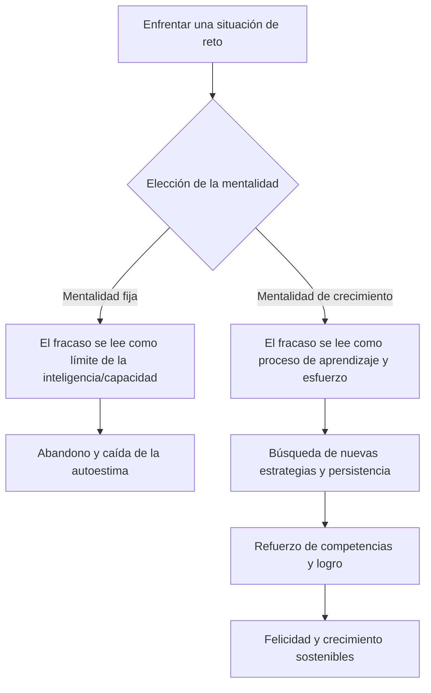

import Callout from "@/components/mdx/Callout.astro";

# La ciencia de la felicidad: psicología positiva y vida plena

Hola a todos. Llegamos por fin a la última sesión, la que corona el trayecto recorrido juntos. Hemos tratado el inconsciente, las relaciones sociales, la motivación y la emoción, y hasta el sufrimiento psíquico. El tema de hoy es la estación final de todo ese saber y la razón última por la que estudiamos psicología: la **felicidad**.

Si la psicología de antaño se centraba en reparar «qué es lo que va mal», la **psicología positiva (Positive Psychology)** actual pregunta: <mark><strong>«¿qué es lo que nos hace florecer?»</strong></mark> Busquemos juntos la respuesta científica a esta cuestión: cómo ir más allá de simplemente no ser infelices y lograr que una vida florezca (Flourish).

---

## 1. Los cinco pilares del bienestar: el modelo PERMA de Seligman

Martin Seligman, fundador de la psicología positiva, sostiene que la felicidad no es un buen humor pasajero. Propone cinco elementos esenciales para un bienestar (Well-being) sostenible.

### 🌟 Guía PERMA para una vida plena

| Elemento | Significado | Pregunta central | Estrategia práctica |
| :----------------------- | :-------------- | :------------------------------------ | :------------------------------- |
| **P (Positive Emotion)** | **Emociones positivas** | ¿Cuánta alegría y gratitud he sentido hoy? | Anotar cada noche tres motivos de gratitud |
| **E (Engagement)** | **Compromiso** | ¿Ha habido algo en lo que olvidé el paso del tiempo? | Buscar ocasiones de ejercer las propias fortalezas |
| **R (Relationships)** | **Relaciones** | ¿Tengo vínculos sanos que me sostengan? | Conversar de verdad con las personas que importan |
| **M (Meaning)** | **Sentido** | ¿Contribuyo a algo mayor que yo? | Implicarse donde se realizan los propios valores |
| **A (Accomplishment)** | **Logro** | ¿He fijado metas y las he alcanzado? | Registrar las pequeñas victorias (Small Wins) |

La felicidad llega cuando estos cinco elementos se equilibran. ¿Cuál de sus pilares está hoy más firme, y cuál necesita reparación?

---

## 2. La musculatura de la mente: resiliencia y mentalidad de crecimiento

La felicidad no es la ausencia de dificultades: se sostiene cuando existe <mark><strong>«la fuerza de atravesarlas»</strong></mark>. A eso se le llama **resiliencia (Resilience)**. La llave decisiva para desarrollarla es la **mentalidad de crecimiento (Growth Mindset)** de Carol Dweck.

### 🔄 El cambio de mentalidad

Quien tiene mentalidad de crecimiento no dice «no puedo». Dice: <mark><strong>«todavía (Not yet) no puedo»</strong></mark>. Esa sola palabra cambia los circuitos del cerebro y traza el camino de la felicidad.

---

## 3. El 40 % de la felicidad nos pertenece: la fórmula de Lyubomirsky

La psicóloga Sonja Lyubomirsky analizó los factores que determinan la felicidad.

- **Punto de ajuste genético (50 %)**: el temperamento innato
- **Circunstancias externas (10 %)**: dinero, lugar de residencia, estado civil…
- **Actividades intencionales (40 %)**: nuestros pensamientos y conductas cotidianas

Lo asombroso es que el entorno —el dinero, la vivienda— solo pesa un 10 % en la felicidad. En cambio, <mark><strong>los hábitos que adoptamos y los pensamientos que sostenemos (las actividades intencionales)</strong></mark> suponen nada menos que un 40 %. Es un mensaje de esperanza: buena parte de nuestra felicidad sigue siendo modificable por nuestro propio esfuerzo.

---

## 4. Encontrarse con quien uno es: descubrir las fortalezas

Antes que gastar la energía en corregir defectos, es al ejercer las **fortalezas características (Signature Strengths)** cuando se experimenta el mayor logro y la mayor felicidad. Perseverancia, curiosidad, equidad, creatividad: busquen la piedra en bruto que solo les pertenece a ustedes.

<Callout type="note">
  **La comparación es la ladrona de la felicidad.** La felicidad de la que habla la psicología positiva
  no consiste en aventajar a los demás, sino en acercarse cada día un poco más a lo que uno realmente es.
</Callout>

---

## 5. La serenidad del sentido: atención plena y gratitud

La psicología contemporánea ha dado forma científica a la antigua sabiduría de la meditación bajo el nombre de **atención plena (Mindfulness)**: la capacidad de estar plenamente presente en «este instante», sin quedar absorbido por el pasado o el futuro. Añádanle el condimento de la **gratitud**. La gratitud es el entrenamiento más potente de plasticidad cerebral: enseña al cerebro a responder con mayor finura a la información positiva.

---

## 6. Conclusión: la vida no es un «problema por resolver», sino un «misterio por vivir»

Queridos estudiantes, al término de estas seis semanas, este es mi último mensaje. La psicología no es una disciplina destinada a convertirles en «personas perfectas». Es más bien **una disciplina para comprender su imperfección y, aun así, encontrar el valor de dar un paso más**.

<mark><strong>«La felicidad no es un destino, sino una manera de viajar.»</strong></mark> La palabra cálida que hoy dirigen a alguien, la sonrisa de aliento que se dan a ustedes mismos: eso es la sustancia de la felicidad.

Gracias por haber dibujado conmigo este mapa de la mente. Deseo que su vida, vista a través de la lente de la psicología, brille con más claridad y belleza.

---

## 📖 Referencias
Para quienes quieran aplicar a diario la ciencia de la felicidad.

- **_Aprenda optimismo_ (Learned Optimism) — Martin Seligman**: el evangelio de la psicología positiva, con métodos concretos para superar el pesimismo y aprender el pensamiento optimista.
- **_El origen de la felicidad_ — Suh Eunkook**: una lectura audaz y nítida que trata la felicidad como «herramienta de supervivencia» surgida de la evolución, y no como «deber moral».
- **_Grit_ — Angela Duckworth**: la demostración científica de que la clave del éxito no es el talento, sino la combinación de pasión y perseverancia.

---

Gracias por su atención. Que todos sus días por venir estén colmados.
