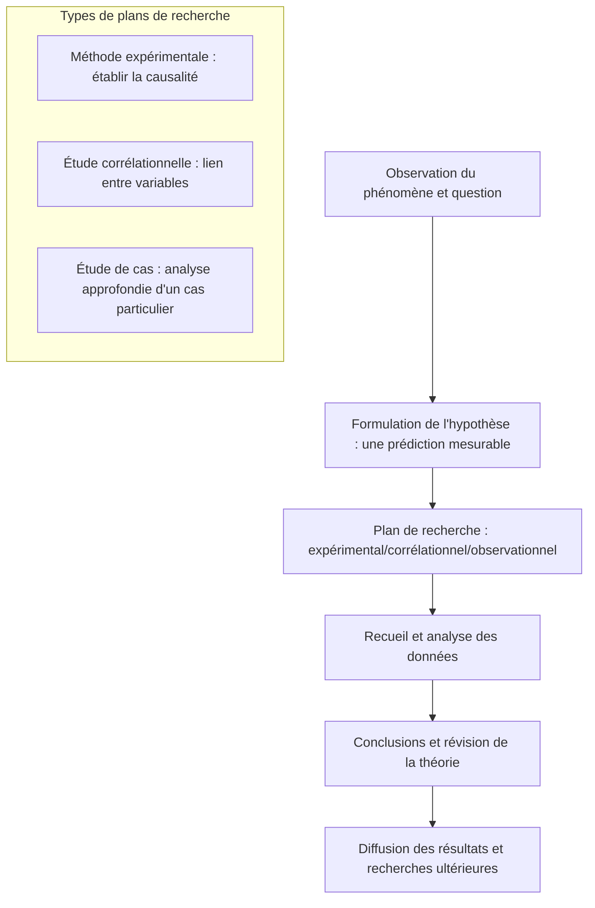

import Callout from "@/components/mdx/Callout.astro";

# Chapter 1. Les fondements de la psychologie et la compréhension du comportement humain

Bonjour à toutes et à tous. C'est avec plaisir qu'en tant que « professeur » je vous accompagne dans le monde de la science de l'esprit : la **psychologie (Psychology)**. Beaucoup imaginent qu'il s'agit de « lire dans les pensées d'autrui » ou de faire passer des tests de personnalité. Or, la définition que j'en donne est celle-ci : <mark><strong>« un noble effort pour démontrer par les méthodes les plus objectives l'expérience humaine la plus subjective »</strong></mark>.

Pourquoi agissons-nous d'une certaine manière ? D'où viennent nos pensées ? Pour répondre à ces questions anciennes, nous allons parcourir aujourd'hui, une à une, les fondations intellectuelles que la psychologie a patiemment bâties.

---

## 1. Les origines de la psychologie : de la philosophie à la science

La psychologie était à l'origine une branche de la philosophie. D'Aristote à Descartes, on y méditait sur l'« âme » humaine. Puis, en 1879, Wilhelm Wundt fonde à l'université de Leipzig le premier laboratoire de psychologie : la discipline s'engage alors véritablement sur la voie d'une **science autonome**.

- **Étape philosophique** : « Qu'est-ce que l'esprit humain ? » (réflexion et logique)
- **Étape scientifique** : « Comment l'esprit fonctionne-t-il, et comment le mesurer ? » (observation et expérimentation)

---

## 2. Cinq lentilles pour regarder l'esprit : les grands courants

L'esprit humain est trop complexe pour qu'un seul point de vue suffise à l'expliquer. Parcourons les courants qui ont marqué l'histoire de la psychologie afin de nous familiariser avec les différentes façons de regarder l'humain.

### 🎭 Comparaison des grands courants et de leurs perspectives

| Courant (perspective) | Auteurs représentatifs | Mots-clés | Regard porté sur l'humain |
| :----------- | :----------------- | :---------------------- | :------------------------------------------ |
| **Psychanalyse** | **Freud** | <mark>inconscient</mark>, enfance | Un être gouverné par des pulsions et un inconscient invisibles |
| **Béhaviorisme** | **Skinner, Watson** | <mark>stimulus-réponse (S-R)</mark> | Un organisme façonné et contrôlé par son environnement |
| **Humanisme** | **Rogers, Maslow** | <mark>réalisation de soi</mark>, libre arbitre | Un sujet porteur du potentiel de croître et de s'accomplir |
| **Cognitivisme** | **Piaget, Neisser** | <mark>traitement de l'information</mark>, schème | Un être qui encode, stocke et récupère l'information comme un ordinateur |
| **Biologique** | **-** | **neurotransmetteurs**, évolution | Le produit de réactions électrochimiques cérébrales et de l'hérédité |

La psychologie contemporaine ne s'enferme dans aucun courant : elle interprète les phénomènes en intégrant toutes ces perspectives. C'est ce qu'on appelle l'**approche intégrative (Eclectic Approach)**.

---

## 3. Les méthodes de recherche : la preuve scientifique

Ce qui distingue la psychologie de la « divination » tient à sa **méthodologie**. Nous formulons des hypothèses et les soumettons à une vérification rigoureuse.

### 🔄 Le cycle de la recherche en psychologie

La **méthode expérimentale** en particulier, en manipulant la condition-cause (variable indépendante) pour observer comment varie le résultat (variable dépendante), constitue <mark><strong>l'arme la plus puissante de la psychologie pour mettre au jour la causalité du comportement humain</strong></mark>.

---

## 4. Regarder de plus près : le lien corps-esprit (Mind-Body)

Autrefois, on tenait le corps et l'esprit pour séparés. La psychologie contemporaine insiste au contraire sur leur **interdépendance**. Notre humeur modifie le système immunitaire et, réciproquement, l'état de notre microbiote intestinal peut peser sur notre humeur dépressive.

<Callout type="important">
  **L'effet placebo (Placebo Effect)** : le simple fait de croire que « cela va aller mieux » suffit à
  produire de véritables changements physiques. Ce phénomène, à la frontière de la psychologie et de la
  médecine, illustre de façon exemplaire la puissance de l'esprit.
</Callout>

---

## 5. Conclusion : le premier miroir pour se comprendre

Nous voici en possession d'une carte pour entrer dans la forêt de la psychologie. La psychologie n'est pas un outil pour manipuler autrui. Elle ressemble plutôt à un miroir où chercher la réponse à la question : **« pourquoi est-ce que je ressens et j'agis ainsi ? »**

À travers ce miroir, vous entreverrez votre propre inconscient, comprendrez les principes de l'apprentissage et apprendrez, plus loin encore, à faire preuve d'empathie envers les autres.

---

## 📖 Références
Voici quelques ouvrages majeurs pour élargir votre horizon en psychologie.

- **_L'Interprétation du rêve_ (The Interpretation of Dreams) — Sigmund Freud** : l'œuvre fondatrice qui découvre pour la première fois ce continent inconnu qu'est l'inconscient. Même si la lecture en est exigeante, elle éclaire les sources mêmes de la discipline.
- **_Découvrir un sens à sa vie_ (Man's Search for Meaning) — Viktor Frankl** : un livre bouleversant qui montre que, jusque dans l'extrémité des camps, c'est la « recherche de sens » qui décidait de la survie.
- **_Influence et manipulation_ (Influence) — Robert Cialdini** : un classique de la psychologie appliquée, qui montre la force avec laquelle les principes de la psychologie sociale opèrent au quotidien et dans les affaires.

---

Le cours s'arrête ici pour aujourd'hui. La prochaine fois, nous étudierons pour de bon comment notre cerveau et nos sens accueillent le monde : le **matériel et le logiciel de l'esprit**. Merci de votre attention.
