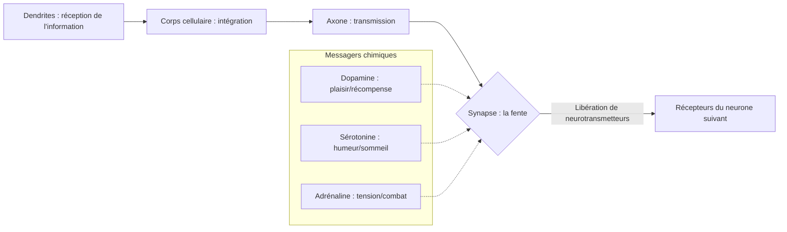

import Callout from "@/components/mdx/Callout.astro";

# Le matériel du cerveau et de l'esprit : neurosciences, sensation et perception

Bonjour à toutes et à tous, heureux de vous retrouver. La dernière fois, nous avons parcouru l'histoire de la psychologie et sa méthodologie scientifique. Aujourd'hui, nous partons vers le domaine qui connaît l'essor le plus vigoureux de la discipline : la **psychologie biologique (Biological Psychology)**.

Si l'esprit humain est un logiciel d'une grande finesse, notre cerveau et notre système nerveux en sont le **matériel de pointe**. La tristesse, l'amour, jusqu'aux idées les plus créatives : tout cela résulte en réalité de minuscules réactions électrochimiques à l'intérieur du cerveau. Examinons aujourd'hui le fonctionnement de cette étonnante machine biologique.

---

## 1. Les signaux électriques de l'esprit : neurones et synapses

Notre cerveau compte environ 86 milliards de **neurones (Neuron, cellules nerveuses)**. Ils échangent sans cesse de l'information et forment un réseau immense.

### 🔄 Le mécanisme de la transmission nerveuse

Comme le dit la formule <mark><strong>« quand la sérotonine manque on déprime, quand la dopamine déborde on devient dépendant »</strong></mark>, un déséquilibre infime de ces substances suffit à transformer notre caractère et notre qualité de vie. Nous croyons volontiers pouvoir tout surmonter par la seule « force mentale », mais rétablir l'équilibre chimique du cerveau se révèle parfois un remède bien plus efficace.

---

## 2. La carte du cerveau : fonctions et rôles par région

Notre cerveau est un **système de division du travail**, où les rôles sont strictement répartis selon les régions. Ces régions coopèrent pourtant étroitement pour produire cette identité que nous appelons « moi ».

### 🧠 Guide des principales régions cérébrales et de leurs fonctions

| Région | Nom | Fonctions principales | Symptômes en cas de lésion |
| :----------- | :------------- | :-------------------------------- | :-------------------------- |
| **Cortex cérébral** | **Lobe frontal** | **Pensée supérieure**, planification, jugement, moralité | Troubles du contrôle des impulsions, changement de personnalité |
| **Cortex cérébral** | **Lobe temporal** | Traitement auditif, stockage des souvenirs | Amnésie, incompréhension du langage |
| **Système limbique** | **Amygdale** | **Réponses émotionnelles**, peur et colère | Émoussement affectif, incapacité à détecter le danger |
| **Système limbique** | **Hippocampe** | Stockage à long terme des **souvenirs nouveaux** | Impossibilité d'apprendre des faits nouveaux |
| **Cervelet** | **Cerebellum** | Équilibre, contrôle fin du mouvement | Démarche instable, gestes de précision impossibles |

Ce qui distingue le plus l'humain des autres animaux, c'est <mark><strong>un lobe frontal à l'évolution fulgurante</strong></mark>. Si nous pouvons inhiber nos pulsions et planifier l'avenir, c'est entièrement grâce à lui.

---

## 3. Le monde ne se donne pas tel qu'il est : sensation et perception

Nous croyons que ce que nous voyons est la vérité. Or, du point de vue psychologique, nous ne **voyons** pas le monde : nous l'**interprétons**.

- **Sensation** : processus physique par lequel les organes sensoriels — yeux, nez, oreilles — accueillent les stimuli extérieurs.
- **Perception** : processus psychologique par lequel le cerveau interprète cette information et lui donne du sens.

<Callout type="important">
  **La constance perceptive (Perceptual Constancy)** : si une voiture au loin, grosse comme une fourmi,
  reste pour nous une véritable voiture, c'est que le cerveau maintient déjà la constance de la taille,
  de la forme et de la couleur. **<mark>« Les apparences changent, la substance demeure »</mark>** : voilà
  une capacité cognitive remarquable.
</Callout>

---

## 4. La magie du cerveau : la plasticité (Neuroplasticity)

On a longtemps cru qu'à l'âge adulte les cellules cérébrales ne faisaient plus que décliner. Les neurosciences contemporaines ont pourtant démontré la **plasticité cérébrale**. Lorsque nous apprenons une compétence nouvelle ou réfléchissons en profondeur, les connexions physiques entre neurones (les synapses) se renforcent et de nouvelles cartes se dessinent.

<mark><strong>« Notre cerveau peut continuer d'évoluer jusqu'à notre dernier jour. »</strong></mark> Invoquer l'âge pour renoncer est, du point de vue des neurosciences au moins, un mauvais argument.

---

## 5. Conclusion : connaître le matériel change la vie

Nous avons étudié aujourd'hui le socle physique de l'esprit : le cerveau et les principes de la sensation. Savoir que notre esprit repose sur des bases biologiques nous rend humbles. Mais la plasticité cérébrale nous offre en même temps un espoir puissant : nous pouvons nous transformer nous-mêmes.

À cet instant même, votre cerveau traite ma voix et ce texte, et élargit sa propre carte. Retenez bien que **prendre soin de votre matériel (sommeil suffisant, exercice, stimulations nouvelles)** est la meilleure façon de prendre soin de votre esprit.

---

## 📖 Références
Pour celles et ceux qui veulent se plonger dans les mystères du cerveau et de la perception.

- **_L'Homme qui prenait sa femme pour un chapeau_ (The Man Who Mistook His Wife for a Hat) — Oliver Sacks** : un livre magistral qui raconte, avec un regard humaniste et chaleureux, les symptômes étranges de patients cérébrolésés. La quintessence de la psychologie de la perception.
- **_À la recherche de la conscience_ (The Quest for Consciousness) — Christof Koch** : où, dans le cerveau, naît la « conscience » ? Un ouvrage qui montre le front avancé de la science actuelle.
- **_L'Esprit organisé_ (The Organized Mind) — Daniel Levitin** : à l'ère de la surcharge informationnelle, comment notre cerveau dirige son attention et traite l'information — un livre pratique qui enseigne l'efficacité au sens des neurosciences.

---

Merci de votre attention. La prochaine fois, nous aborderons pour de bon la façon dont, grâce à ce matériel si raffiné, nous apprenons et nous nous souvenons : les **mécanismes de l'apprentissage et de la mémoire**.
