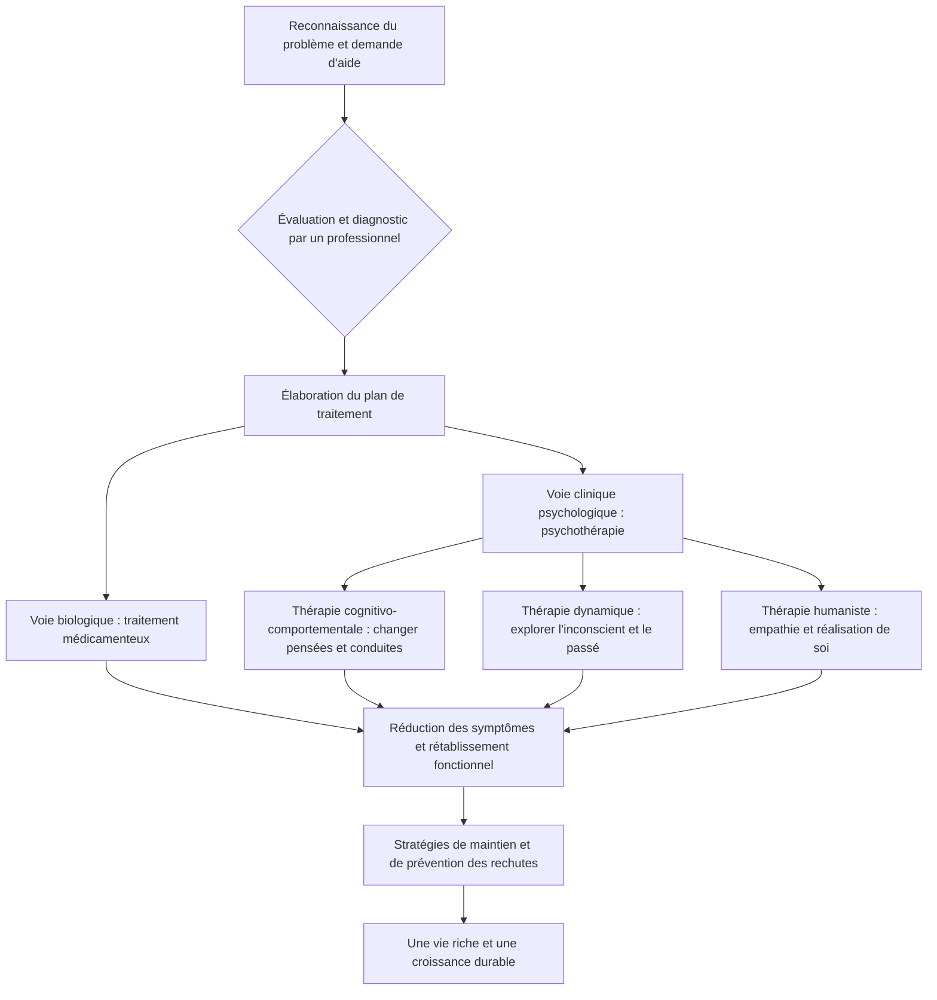

import Callout from "@/components/mdx/Callout.astro";

# L'ombre de l'esprit : psychopathologie et chemin de la guérison

Bonjour à toutes et à tous. Nous avons jusqu'ici étudié les principes universels du psychisme : le développement, les relations sociales, la motivation et l'émotion. Le sujet d'aujourd'hui est un peu plus grave, mais c'est celui qui touche au plus près nos existences : la **psychopathologie (Abnormal Psychology)**.

L'esprit humain ressemble à un tableau. Parfois la lumière l'éclaire, parfois une ombre épaisse s'y étend. La psychopathologie est la discipline qui analyse cette **ombre**. Mais souvenez-vous : une ombre dense est aussi la preuve d'une lumière intense. Aujourd'hui, nous dépasserons la vision de la souffrance psychique comme simple « maladie » pour entreprendre <mark><strong>un chemin qui cherche à comprendre la souffrance humaine et à en explorer la guérison</strong></mark>.

---

## 1. Qu'est-ce qui est « anormal » ? L'imprécision des critères

Où passe la frontière entre le « normal » et l'« anormal » ? La psychologie considère conjointement les quatre critères suivants (les 4D).

### 📊 Les quatre critères du comportement anormal (4D)

| Critère | Terme | Signification | Exemple |
| :------------ | :-------------- | :-------------------------------------- | :------------------------------ |
| **Déviance** | **Deviance** | S'écarter des normes sociales ou de la moyenne statistique | Conduites extrêmes en public |
| **Détresse** | **Distress** | Souffrance psychique intense éprouvée par la personne | Tristesse profonde qui paralyse le quotidien |
| **Dysfonctionnement** | **Dysfunction** | Difficulté à assurer son travail ou ses relations | Perte d'emploi liée à la phobie sociale |
| **Dangerosité** | **Danger** | Menace possible pour soi ou pour autrui | Intention auto-agressive ou impulsion violente |

L'essentiel est qu'aucun de ces critères ne saurait valoir seul de façon absolue. L'excentricité d'un artiste peut être « déviante » sans être un « dysfonctionnement », et une tristesse profonde peut n'être qu'une souffrance universelle. Ce n'est que lorsque <mark><strong>« la profondeur de la souffrance et la fonctionnalité de la vie »</strong></mark> se répondent qu'un diagnostic prend valeur.

---

## 2. La norme diagnostique actuelle : le DSM-5-TR

Psychologues et psychiatres utilisent le **DSM-5-TR** (Manuel diagnostique et statistique des troubles mentaux), système de référence à l'échelle mondiale. C'est une sorte de carte topographique de l'esprit. Passons en revue les grands troubles.

### 🧩 Classification résumée des principaux troubles psychiques

1.  **Troubles anxieux (Anxiety Disorders)** : peur et anxiété excessives. Trouble d'anxiété généralisée, trouble panique, anxiété sociale.
2.  **Troubles de l'humeur (Mood Disorders)** : difficulté à réguler les variations affectives. Trouble dépressif caractérisé, trouble bipolaire.
3.  **Troubles de la personnalité (Personality Disorders)** : des schémas rigides de pensée et de conduite entraînent une inadaptation sociale. Trouble borderline, personnalité narcissique.
4.  **Spectre de la schizophrénie (Schizophrenia Spectrum)** : perte de contact avec la réalité, délires, hallucinations.

---

## 3. Le processus de guérison : de l'obscurité vers la lumière

Une fois l'ombre repérée, reste à savoir comment guérir. La psychothérapie ne consiste pas seulement à supprimer des symptômes : c'est <mark><strong>un processus où l'on s'accepte et où l'on apprend une nouvelle manière de vivre</strong></mark>.

### 🔄 Guide de la psychothérapie et du rétablissement (Flowchart)

Le cœur de la **thérapie cognitivo-comportementale (TCC)**, la plus répandue, tient dans cette prise de conscience : <mark><strong>« ce ne sont pas les situations qui nous font souffrir, mais la façon dont nous les pensons »</strong></mark>. Nettoyer la lentille déformée de nos pensées suffit déjà à faire apparaître le monde autrement.

---

## 4. Regarder de plus près : « anxiété » et « dépression », maux de notre temps

Nous tenons l'« anxiété » pour un mal absolu. Or l'anxiété est d'abord une **alarme de survie** destinée à nous protéger du danger. Le problème surgit quand l'alarme ne s'arrête plus, alors qu'aucune menace n'est présente.

<Callout type="note">
  **La dépression n'est pas une « grippe de l'âme ».** La grippe guérit quand le virus s'en va ; la
  dépression est bien souvent un **signal intérieur** qui demande de réexaminer la direction de sa vie.
  Les psychologues insistent : le message peut être « ton âme est épuisée par ta façon actuelle de vivre ».
</Callout>

---

## 5. La fixation du caractère : comprendre les troubles de la personnalité

Un trouble de la personnalité n'est pas un « mauvais caractère ». Il s'apparente à <mark><strong>une armure solide mais devenue rigide</strong></mark>, forgée pour se protéger des manques ou des blessures de l'enfance. L'hypersensibilité extrême au regard d'autrui, ou le besoin de contrôler les autres, dissimulent le plus souvent une profonde « angoisse » sous-jacente.

La guérison commence lorsque l'on reconnaît que cette armure entrave désormais la croissance, et que l'on trouve le courage de la déposer, pièce par pièce.

---

## 6. Conclusion : l'humain comme soignant blessé

Chers étudiants, nous n'étudions pas la psychopathologie pour apposer des étiquettes (Stigma) sur autrui. Au contraire : pour admettre que **« être humain, c'est pouvoir souffrir psychiquement »**, et pour élargir l'empathie avec laquelle nous prenons soin des blessures les uns des autres.

Carl Jung l'a écrit : <mark><strong>« On n'atteint pas l'illumination en imaginant des figures de lumière, mais en rendant conscientes les ténèbres. »</strong></mark> N'ayez pas peur de votre ombre. C'est en l'observant et en l'accueillant que surviennent l'intégration du soi et la maturité véritables.

La prochaine fois, pour clore ce long parcours, nous parlerons du **bonheur, de la psychologie positive et du bien-être (Well-being) auquel il nous faut tendre**.

---

## 📖 Références
Pour celles et ceux qui veulent accueillir l'ombre de l'esprit et en tirer une sagesse.

- **_No Boundary_ — Ken Wilber** : une analyse du spectre de la conscience humaine, avec des aperçus philosophiques et psychologiques sur la manière d'intégrer et de guérir nos divisions intérieures.
- **_Vous avez raison_ — Jung Hye-shin** : nourri d'une pratique clinique exigeante, un livre en forme de « réanimation psychique » qui montre comment l'empathie sauve.
- **_Le Démon de midi_ (The Noonday Demon) — Andrew Solomon** : anatomie, culture et récit intime de la dépression — un témoignage humain qui dépasse de loin la maladie.

---

Merci de votre attention. Que cette soirée remplisse votre esprit de réconfort et de sagesse.
