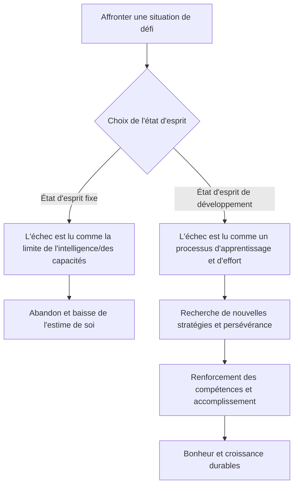

import Callout from "@/components/mdx/Callout.astro";

# Chapter 6. La science du bonheur : psychologie positive et vie accomplie

Bonjour à toutes et à tous. Nous voici à la dernière séance, celle qui vient couronner le parcours accompli ensemble. Nous avons abordé l'inconscient, les relations sociales, la motivation et l'émotion, jusqu'à la souffrance psychique. Le sujet d'aujourd'hui est le terminus de tout ce savoir, et la raison ultime pour laquelle nous étudions la psychologie : le **bonheur**.

Là où la psychologie d'autrefois s'attachait à réparer « ce qui ne va pas », la **psychologie positive (Positive Psychology)** contemporaine demande : <mark><strong>« qu'est-ce qui nous rend florissants ? »</strong></mark> Cherchons ensemble la réponse scientifique à cette question : comment dépasser le simple fait de ne pas être malheureux pour faire véritablement s'épanouir (Flourish) une existence.

---

## 1. Les cinq piliers du bien-être : le modèle PERMA de Seligman

Martin Seligman, fondateur de la psychologie positive, affirme que le bonheur n'est pas un agrément passager. Il propose cinq éléments essentiels à un bien-être (Well-being) durable.

### 🌟 Guide PERMA pour une vie accomplie

| Élément | Signification | Question centrale | Stratégie concrète |
| :----------------------- | :-------------- | :------------------------------------ | :------------------------------- |
| **P (Positive Emotion)** | **Émotions positives** | Combien de joie et de gratitude ai-je éprouvées aujourd'hui ? | Noter chaque soir trois motifs de gratitude |
| **E (Engagement)** | **Engagement** | Y a-t-il eu une activité où j'ai oublié l'heure ? | Chercher les occasions d'exercer ses forces |
| **R (Relationships)** | **Relations** | Ai-je des liens sains qui me soutiennent ? | Avoir de vraies conversations avec ses proches |
| **M (Meaning)** | **Sens** | Est-ce que je contribue à plus grand que moi ? | S'engager là où se réalisent ses valeurs |
| **A (Accomplishment)** | **Accomplissement** | Ai-je fixé puis atteint des objectifs ? | Consigner ses petites victoires (Small Wins) |

Le bonheur vient quand ces cinq éléments s'équilibrent. Aujourd'hui, lequel de vos piliers est le plus solide, et lequel demande à être réparé ?

---

## 2. La musculature de l'esprit : résilience et état d'esprit de développement

Le bonheur n'est pas l'absence d'épreuves : il se maintient quand existe <mark><strong>« la force de traverser les épreuves »</strong></mark>. C'est ce qu'on nomme la **résilience (Resilience)**. La clé décisive pour la développer est l'**état d'esprit de développement (Growth Mindset)** de Carol Dweck.

### 🔄 Le basculement des états d'esprit

Qui possède cet état d'esprit ne dit pas « je n'y arrive pas ». Il dit : <mark><strong>« je n'y arrive pas *encore* (Not yet) »</strong></mark>. Ce seul petit mot modifie les circuits du cerveau et trace la route du bonheur.

---

## 3. 40 % du bonheur nous appartient : la formule de Lyubomirsky

La psychologue Sonja Lyubomirsky a analysé les facteurs qui déterminent le bonheur.

- **Point de consigne génétique (50 %)** : le tempérament inné
- **Circonstances extérieures (10 %)** : argent, lieu de vie, statut marital…
- **Activités intentionnelles (40 %)** : nos pensées et nos conduites quotidiennes

Le plus frappant est que l'environnement — l'argent, le logement — ne pèse que 10 % dans le bonheur. En revanche, <mark><strong>les habitudes que nous prenons et les pensées que nous entretenons (les activités intentionnelles)</strong></mark> en représentent 40 %. C'est un message d'espoir : une part considérable de notre bonheur reste modifiable par nos propres efforts.

---

## 4. Rencontrer qui l'on est vraiment : découvrir ses forces

Plutôt que d'épuiser son énergie à corriger ses défauts, c'est en exerçant ses **forces signatures (Signature Strengths)** que l'on éprouve le plus grand accomplissement et le plus grand bonheur. Persévérance, curiosité, équité, créativité : cherchez la pierre brute qui n'appartient qu'à vous.

<Callout type="note">
  **La comparaison est le voleur du bonheur.** Le bonheur dont parle la psychologie positive ne consiste
  pas à l'emporter sur autrui, mais à se rapprocher un peu plus, chaque jour, de ce que l'on est vraiment.
</Callout>

---

## 5. La sérénité du sens : pleine conscience et gratitude

La psychologie contemporaine a donné une forme scientifique à la sagesse antique de la méditation, sous le nom de **pleine conscience (Mindfulness)** : la capacité d'être pleinement présent à « cet instant », sans se laisser engloutir par le passé ou l'avenir. Ajoutez-y l'assaisonnement de la **gratitude**. La gratitude est le plus puissant des entraînements à la plasticité cérébrale : elle apprend au cerveau à réagir plus finement aux informations positives.

---

## 6. Conclusion : la vie n'est pas un « problème à résoudre » mais un « mystère à vivre »

Chers étudiants, au terme de ces six semaines, voici mon dernier message. La psychologie n'est pas une discipline destinée à faire de vous des « personnes parfaites ». Elle est plutôt **une discipline pour comprendre votre imperfection et, malgré elle, trouver le courage d'avancer d'un pas**.

<mark><strong>« Le bonheur n'est pas une destination, c'est une manière de voyager. »</strong></mark> Le mot chaleureux adressé aujourd'hui à quelqu'un, le sourire d'encouragement que vous vous offrez à vous-même : voilà la substance du bonheur.

Merci d'avoir dessiné avec moi cette carte de l'esprit. Je souhaite que votre vie, vue à travers la lentille de la psychologie, brille avec plus de clarté et de beauté encore.

---

## 📖 Références
Pour celles et ceux qui veulent appliquer au quotidien la science du bonheur.

- **_La Force de l'optimisme_ (Learned Optimism) — Martin Seligman** : l'évangile de la psychologie positive, avec des méthodes concrètes pour surmonter le pessimisme et apprendre la pensée optimiste.
- **_L'Origine du bonheur_ — Suh Eunkook** : une lecture aussi audacieuse que limpide, qui traite le bonheur comme un « outil de survie » issu de l'évolution, et non comme un « devoir moral ».
- **_L'Art de la niaque_ (Grit) — Angela Duckworth** : la démonstration scientifique que la clé du succès n'est pas le génie, mais la combinaison de la passion et de la persévérance.

---

Merci de votre attention. Que tous vos jours à venir soient comblés.
