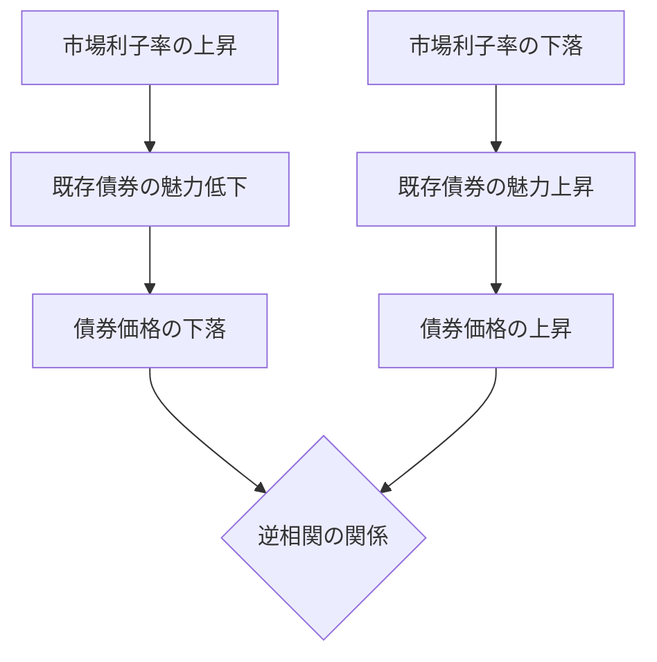

import Callout from "@/components/mdx/Callout.astro";

# Chapter 2. 価格と価値の美学：株式と債券の価値評価

皆さん、こんにちは。前回、私たちは「貨幣の時間価値」という財務学の心臓部を学びました。今日は、その心臓がポンプのように送り出す実践の現場へ行ってみましょう。**株式と債券の価値評価 (Valuation)** です。

ウォーレン・バフェットは言いました。「価格とは、あなたが支払うもの。価値とは、あなたが受け取るものだ。」財務管理者の最も重要な能力は、市場に漂う「価格」に振り回されず、その資産が持つ真の <mark><strong>「内在価値 (Intrinsic Value)」</strong></mark> を見抜く目を持つことです。未来のキャッシュフローを現在の価値へと引き寄せる魔法の公式を、今日一緒に攻略していきましょう。

---

## 1. 約束の証：債券の価値評価 (Bond Valuation)

債券とは、発行者が投資家に対して「いつまでに利息を払い、後で元本を返す」と約束した借用証書です。

### (1) 債券価値決定の論理

債券の価値は、将来受け取る決まった「利息」と「元本」を市場利子率（割引率）で割り引いて合計したものです。
<mark><strong>「利子率が上がると債券価格は下がる」</strong></mark> という財務学の基本法則はここから生まれます。なぜでしょうか？市場により高い利息をくれる新しい債券が登場すると、昔の低い利息しかくれない私の債券は人気がなくなり、価格を下げて売らなければならなくなるからです。

### 🔄 債券価格と利子率のシーソー関係

---

## 2. 夢の値札：株式の価値評価 (Stock Valuation)

株式は債券よりもずっと難しいです。満期もなく、支払われる配当も不確実だからです。そのため、株式は「夢」を食べて生きるとも言われます。

### (1) 配当割引モデル (DDM: Dividend Discount Model)

株式の価値は、その会社が存続する限り支払われるすべての配当金を現在価値で合計したものです。

- **ゴードンの定率成長モデル**: 「配当が毎年一定の割合 (g) で成長する」と仮定した場合の公式です。
- **<mark>株価 ($P_0$) = $D_1 / (k - g)$</mark>** (D: 配당, k: 株主資本コスト, g: 成長率)

<Callout type="tip">
  **成長率 (g) の魔法**: 公式の分母にある成長率 (g)
  がわずかに大きくなるだけでも、株価は爆発的に上昇します。これが、市場がなぜ「成長株」に熱狂するのかを示す数式上の証拠です。
</Callout>

### (2) 株価収益率 (PER) の再解釈

私たちがよく使う PER も、結局は株式価値評価の要約版です。利益に対して株価が何倍かを見るものです。しかし財務学的に見れば、PER は <mark><strong>「この企業のリスクがいかに低く、成長がいかに高いか」</strong></mark> を市場がつけたスコアカードなのです。

---

## 3. 深掘り：内在価値 vs 市場価格

優れた財務管理者は、常にこの2つを比較します。

- **内在価値 > 市場価格**: 過소評価の状態です。**買い (Buy)** です。
- **内在価値 < 市場価格**: バブルの状態です。**売り (Sell)** です。

<Callout type="important">
  **リスクの反映**:
  債券の価値が「利子率」に左右されるならば、株式の価値は企業の「リスク」に左右されます。リスクが大きくなれば、私たちはより高い要求収益率
  (k) を求めるようになり、分母が大きくなることで株式の内在価値は一気に低下します。
</Callout>

---

## 4. 結論：数字を超えて価値を見なさい

今日、私たちは複雑な数式に出会いました。しかし覚えておいてください。数式は道具に過ぎません。債券評価の裏には「信頼」があり、株式評価の裏에는「未来への希望」があります。

<mark><strong>「価値とは、未来のキャッシュフローとそれを待つ忍耐力の合作です。」</strong></mark> 皆さんが投資をするにせよ、企業を運営するにせよ、価格という波の下で悠々と流れる価値という深海を見ることができる炯眼を持たれることを願っています。

---

## 📚 セウン教授の厳選ライブラリ

- **[賢明なる投資家] - ベンジャミン・グレアム**: 価値投資の父が書いた古典です。「内在価値」と「安全域」の概念を世界に初めて紹介した本です。
- **[証券分析] - アスワス・ダモダラン**: 価値評価の世界的な権威による著作で、株式や債券を超え、スタートアップ企業の価値を算定するロジックを網羅しています。
- **[ピーター・リンチの株で勝つ] - ピーター・リンチ**: 数式を超え、日常の観察を通じていかに偉大な「成長株」を見つけ出すかという実践の知恵を伝えてくれます。

---

お疲れ様でした。次回は、企業がどの事業に巨額の投資をするか決定する最も重要な瞬間、**「資本予算：NPVとIRRを活用した投資決定」**について本格的に学習します。
