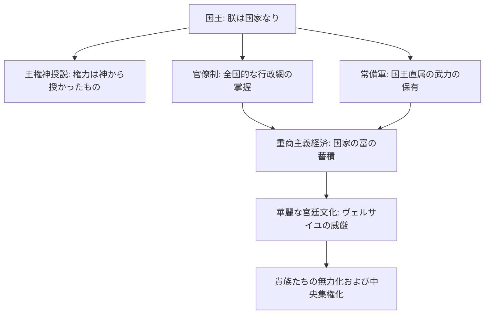

import Callout from "@/components/mdx/Callout.astro";

# Chapter 5. 理性の時代：科学革命と絶対王政の衝突

皆さん、こんにちは、歴史学徒の皆さん。前回私たちはルネサンスと宗教改革を通じて、人間がどのように神の影から脱し、自身の主体性を自覚したのかを学びました。今日私たちは、その自覚が実質的な世界の変化へとつながった二つの巨大な流れを見ていこうと思います。一つは宇宙の秘密を解き明かした**科学革命**であり、もう一つは地上の権力を一つに集めた**絶対王政**です。

この時代は一言で言えば、<mark><strong>「伝統的権威と新しい理性の激しい闘争」</strong></mark>の時期でした。教会や国王が「我々が真理だ」と叫ぶ時、科学者たちは「証拠を持ってこい」と答えました。この緊張がどのように現代社会の土台を作ったのかをたどってみましょう。

---

## 1. 宇宙の地図を書き換える：科学革命

16世紀から17世紀にかけて起きた科学革命は、人類の思考様式を根本的に変えてしまいました。核心は、目に見えない権威よりも<mark><strong>「観察と実験、そして数学」</strong></mark>を信頼し始めたという点です。

### 🔭 科学的思考のパラダイム転換

| 人物                    | 核心的業績                      | 示唆点                                                          |
| :---------------------- | :------------------------------ | :-------------------------------------------------------------- |
| **コペルニクス**        | **地動説(Heliocentrism)** の提案| 人間中心の宇宙観（天動説）に対する最初の挑戦                    |
| **ガリレオ**            | 望遠鏡による観察と慣性の法則の発見 | 「それでも地球は回る」 - 宗教的権威に立ち向かった科学の勇気     |
| **ニュートン (Isaac Newton)** | **万有引力の法則**の確立        | 宇宙全体が一つの機械のように精巧な法則（数学）で動いていることを証明 |

ニュートンによって宇宙はもはや神が毎瞬魔法をかける空間ではなく、数学的に予測可能な<mark><strong>「巨大な時計」</strong></mark>になりました。これは人間が理性を通じて自然の法則を支配できるという莫大な自信を抱かせてくれました。

---

## 2. 地上の太陽の下へ：絶対王政(Absolutism)

科学が空の主人を塗り替えている時、地上では国王たちが自分を世界の中心であると宣言しました。これを象徴する人物がまさにフランスのルイ14世、**太陽王**です。

### 絶対王政の権力構造 (Flowchart)

絶対王政は、**王権神授説(Divine Right of Kings)**という思想的武器と、**官僚制および常備軍**という物理的道具を通じて地方の領主たちを抑え込み、権力を独占しました。特にルイ14世の「朕は国家なり(L'État, c'est moi)」という言葉は、この時期の国家権力の頂点を象徴しています。

---

## 3. 重商主義：国家という名の株式会社

絶対王政を維持するには莫大なお金が必要でした。戦争を行い、常備軍を養い、華麗な宮殿を建てなければならなかったからです。ここで誕生した経済政策が**重商主義(Mercantilism)**です。

<Callout type="important">
  **重商主義の論理**: 「世界の富（金と銀）は限られている。したがって他人より多く持とうとするならば、輸出を増やし輸入を抑制しなければならない。」
</Callout>

重商主義は国家に経済への積極的な介入を行わせました。関税を高めて輸入品を遮断し、植民地を建設して原料を奪い取り、市場を開拓しました。この過程でヨーロッパは豊かになりましたが、世界の他の地域は帝国主義の犠牲者になり始めました。

---

## 4. 王権に亀裂を入れる声：社会契約説

国王の権力が絶対的であった分、これに抵抗する思想的流れも強力になりました。科学革命が「自然には法則がある」と教えたように、思想家たちは「政治にも普遍的な法則がある」と主張し始めました。

### 📜 社会契約説の核心人物の比較

1.  **ホッブズ (Thomas Hobbes)**: 「人間は万人の万人に対する闘争の状態にある。混乱を防ぐために強力な君主（リヴァイアサン）に権力をすべて渡さなければならない。」（絶対王政擁護的）
2.  **ロック (John Locke)**: 「政府の目的は、生命、自由、財産を保護することである。<mark><strong>王がこれに背いた場合、人民には抵抗する権利（抵抗権）がある。</strong></mark>」（近代民主主義の礎石）

ロックの考えは革命的でした。権力の源泉が神ではなく**人々の間の契約**から生じるというこの考えは、のちにアメリカ独立革命とフランス大革命の火種となります。

---

## 5. 結論：巨大な変化の前夜

学友の皆さん、17世紀のヨーロッパはまるで爆発直前の圧力鍋のようでした。ニュートンの科学は古い迷信を打ち砕いており、ルイ14世の絶対権力は、その華麗さの中にすでに財政危機と怒りの種を孕んでいました。

何よりも重要なのは、この時期を経て人々の頭の中に<mark><strong>「理性(Reason)」</strong></mark>という強力な武器が定着したという点です。今や人々はもはや暗闇の中で祈るだけではありません。質問し、計算し、行動し始めました。

次回、私たちはこの理性の火花がどのように古い体制を焼き払い、市民が主人となる時代を開いたのか――**市民革命と産業革命**を通じて近代世界の完成を見ていきます。

---

## 📖 参考文献
理性の飛翔と帝国主義の明暗を深く洞察したい方のための推薦図書です。

- **[科学革命の構造 (The Structure of Scientific Revolutions)] - トーマス・クーン (Thomas Kuhn)**: 科学的知識が単純に積み重なるのではなく、「パラダイム」の転換を通じてどのように革命的に変化するのかを示す現代の古典。
- **[ルイ14世とヴェルサイユ宮殿] - 朱京哲 (Ju Gyeong-cheol)**: 太陽王ルイ14世がどのようにヴェルサイユを通じて絶対権力を視覚化し統制したのか、その華麗さの裏側の政治を暴く。
- **[正義論 (A Theory of Justice)] - ジョン・ロールズ (John Rawls)**: 社会契約説の現代的継承者として、公正で正義ある社会のための合理的理性の役割とは何かを深く論じる。

---

お疲れ様でした。皆さんが立っているまさにこの場所が、数多くの理性的奮闘の結果であることを記憶する一日になることを願います。