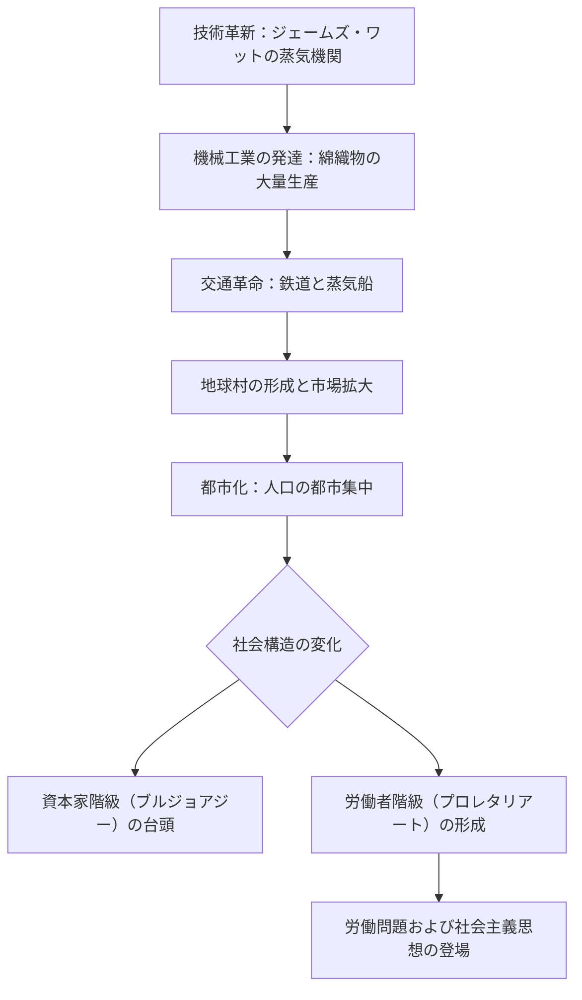

import Callout from "@/components/mdx/Callout.astro";

# Chapter 6. 変革の嵐：市民革命と産業革命が生み出した現代

皆さん、こんにちは。いよいよ私たちの歴史の大河ドラマがその大団円を迎える、最終回に到達しました。私たちは人類文明の発生から中世の神中心社会、ルネサンスの人間の再発見、そして科学革命と絶対王政の衝突まで息つく間もなく駆け抜けてきました。

今日私たちが扱うテーマは、現代社会の二つの柱を築いた**二重革命（Dual Revolution）**です。一つは政治体制を変えた**市民革命**であり、もう一つは経済体制と生活の様式を変えた**産業革命**です。この二つの流れがどのように一つになり、私たちが今生きているこの世界を作り上げたのか、その動的なドラマを追跡してみましょう。

---

## 1. 政治の主人が変わる：市民革命

18世紀後半、王と貴族が支配した古い体制（Ancien Régime）が崩れ、<mark><strong>「人間は平等に生まれ、権力の主人は人民である」</strong></mark>という宣言が鳴り響きました。

### 📜 近代市民革命の二つの流れ

| 区分 | アメリカ独立革命（1776年） | フランス大革命（1789年） |
| :--- | :--- | :--- |
| **性格** | 植民地独立および共和国建設 | 旧体制の打破および民主主義の確立 |
| **核心文書** | **独立宣言**（生命、自由、幸福追求権） | **人権宣言**（自由、平等、博愛、抵抗権） |
| **哲学的背景** | ロックの社会契約説 | ルソーの一般意志、啓蒙思想 |
| **歴史的結果** | 初の民主共和国誕生 | 封建制の廃止、市民社会の到来 |

アメリカ革命が「代表なくして課税なし」という実質的な権利から始まったとすれば、フランス革命は<mark><strong>「王の首を斬ることですべての人間の尊厳を宣言した」</strong></mark>最も激しく根本的な変化でした。もはや国家は君主の所有物ではなく、市民たちの合意によって運営される公共のものとなりました。

---

## 2. 世界のスピードを変える：産業革命

政治的に市民が誕生しつつあるとき、イギリスでは人類史上最も巨大な経済的変化が始まりました。他ならぬ**産業革命**です。手先の器用な職人の手ではなく、疲れることのない**機械の動力**が世界を動かし始めたのです。

### ⚙️ 産業革命の拡散と影響（Flowchart）

産業革命は人類を飢餓と貧困のくびきから解放する土台を整えました。しかし同時に、<mark><strong>「資本が人間を支配する新しい階級社会」</strong></mark>というもう一つの扉を開けました。工場の黒い煙は豊かさの象徴であると同時に、労働搾取と環境破壊という近代の影でもありました。

---

## 3. 理念の戦争：自由主義とナショナリズム

革命の火花はナポレオンの戦争に乗ってヨーロッパ全域に広がりました。ナポレオンは敗北したものの、彼が蒔いた<mark><strong>自由主義（Liberalism）</strong></mark>と<mark><strong>ナショナリズム（Nationalism）</strong></mark>の種は19世紀を通じて巨大な木へと成長しました。

- **自由主義**：「国家は個人の自由と権利を侵害してはならない。」（憲法と議会の重視）
- **ナショナリズム**：「我々は一つの民族であり、我々だけの独立した国家を持つ権利がある。」（イタリア、ドイツの統一）

この二つの理念は現代の国民国家（Nation State）を形成する最も強力な原動力となりました。

---

## 4. 深く見つめる：帝国主義という怪物

産業革命によって生産力が爆発すると、ヨーロッパの列強はより多くの原料とより広い市場を求めて旅立ちました。これが**帝国主義（Imperialism）**の始まりです。「未開の地域を文明化する」というもっともらしい名目のもと、アフリカとアジアは植民地に転落しました。

<Callout type="important">
  **歴史のアイロニー**：ヨーロッパ内部では「自由と平等」を叫んでいた市民たちが、海の向こうでは他民族の自由を圧政する帝国主義者となりました。この矛盾は20世紀の二度の世界大戦という凄惨な代償となって返ってくることになります。
</Callout>

---

## 5. 私たちの生きる世界：現代の誕生

さあ、皆さんの周囲を見回してください。私たちが投票を通じて指導者を選ぶこと（市民革命の遺産）、スマートフォンや自動車を使用すること（産業革命の遺産）、そして大韓民国という国民国家の構成員として生きること（ナショナリズムの遺産）は、すべてこの激動の時期に根を張っています。

歴史とは過去と現在の絶え間ない対話だと言います。<mark><strong>「私たちがどこから来たのかを知る時、はじめて私たちがどこへ向かうべきかも知ることができるのです。」</strong></mark>

---

## 6. 結論：歴史は皆さんの手で書かれます

学友の皆さん、6週間の歴史の旅を締めくくり最後の挨拶をお伝えします。私たちは遠い遠い古代から現代の閾（いき）まで共に歩んできました。歴史とは単なる死者たちの記録ではありません。それは**数多くの人間がより良い生のために闘ってきた「生存の記録」**です。

講義室の扉を出る瞬間、皆さんは歴史の観察者ではなく**歴史の主人公**になります。今皆さんが下す決定、皆さんが叫ぶ正義、皆さんが実践する愛が、将来また別の者たちが学ぶことになる「歴史」の一ページとなるでしょう。

<mark><strong>「歴史を記憶しない者はその悲劇を繰り返す運命に処される」</strong></mark>という格言を胸に刻んでください。

これまでこの長い旅を共にしてくださりありがとうございます。皆さん一人ひとりが、自分の属する時代の素晴らしい主体となることを心から祈願しましょう。

---

## 📖 参考文献
市民革命と産業革命が作った現代社会の本質を見通したい方のための推薦図書です。

- **[革命の時代 1789〜1848（The Age of Revolution: 1789-1848）] - エリック・ホブズボーム（Eric Hobsbawm）**：二重革命（市民革命と産業革命）がどのように全世界を近代に引きずり込んだのかを分析する、歴史学界の記念碑的な著作です。
- **[国富論（The Wealth of Nations）] - アダム・スミス（Adam Smith）**：産業革命初期、市場の「見えざる手」がどのように富を創出するのかを分析し、現代資本主義の理論的土台を築きました。
- **[自由論（On Liberty）] - ジョン・スチュアート・ミル（John Stuart Mill）**：市民革命の精神である「個人の自由」が社会的多数の横暴からどのように守られるべきかを論じる、自由主義の聖典です。

---

お疲れ様でした。皆さんの前途に歴史の知恵がいつも共にあることを応援しています。