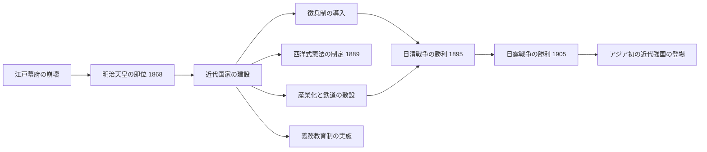

import Callout from "@/components/mdx/Callout.astro";

# Chapter 7. 民族主義と帝国主義：統一と膨張の時代

皆さん、こんにちは。前回、私たちは市民革命と産業革命という二つの巨大なうねりがどのように現代世界の土台を築いたのかを見てきました。自由主義と民族主義という二つの理念を胸に抱いた19世紀の人類は、いまや一層ダイナミックな歴史の舞台へと歩み入ります。

今日私たちが扱うテーマは**民族主義と帝国主義**です。一つの民族が一つの国家を形成すべきだという熱望がヨーロッパの地図を塗り替える一方で、産業革命で武装したヨーロッパ列強はアジアとアフリカに向けて鋭い爪を剥き出しにしました。そしてその激浪の中で、日本という国はまったく予想もしなかった方法で生き残る道を選択しました。

---

## 1. 血と鉄で築かれた帝国：ドイツとイタリアの統一

19世紀半ばまで、「ドイツ」や「イタリア」は国名ではありませんでした。数十の小王国や公国に分裂した地理的概念に過ぎなかったのです。しかし民族主義の炎は、この分裂した土地においても強烈に燃え上がりました。

### 🇩🇪 ドイツの統一：ビスマルクと「鉄血政策」

プロイセンの宰相<mark><strong>オットー・フォン・ビスマルク（Otto von Bismarck）</strong></mark>は現実政治の化身でした。彼は有名な演説で宣言しました。*「当面の偉大な問題は、演説や多数決によって決まるのではなく、ひたすら血と鉄（Blut und Eisen）によって決まるのだ。」*

ビスマルクは3次にわたる戦争によりドイツの統一を成し遂げました。

| 戦争 | 年代 | 結果 |
|------|------|------|
| デンマーク戦争 | 1864 | シュレスヴィヒ＝ホルシュタインを獲得 |
| 普墺戦争（プロイセン・オーストリア戦争） | 1866 | オーストリアを排除、北ドイツ連邦を結成 |
| 普仏戦争（プロイセン・フランス戦争） | 1870〜71 | アルザス・ロレーヌを獲得、ドイツ帝国の成立を宣言 |

1871年1月18日、フランスのベルサイユ宮殿「鏡の間」で<mark><strong>ヴィルヘルム1世</strong></mark>がドイツ皇帝に即位しました。屈辱的な方法で達成された統一ではあったものの、これによりヨーロッパ最強の陸軍国家が誕生しました。

<Callout type="important">
  **歴史の復讐**: ビスマルクが屈辱的な場所（ベルサイユ宮殿）を選んでドイツ帝国の成立を宣言したことは、フランスに深い恨みを残しました。そして44年後、同じ場所でドイツは第一次世界大戦の敗戦国として屈辱的なベルサイユ条約に署名することになります。
</Callout>

### 🇮🇹 イタリアの統一：外交・武力・民衆の三位一体

イタリアの統一は三人の英雄の役割分担によって成し遂げられました。

- **カヴール（Cavour）**: サルデーニャ王国の宰相。冷徹な外交官としてフランスと同盟を結びオーストリアを排除。
- **ガリバルディ（Garibaldi）**: 「千人隊（赤シャツ隊）」を率いて南イタリアを解放した民族的英雄。
- **ヴィットーリオ・エマヌエーレ2世**: サルデーニャ王国の君主で、統一イタリア王国の初代国王となる。

1870年にローマが首都に編入され、イタリア半島の統一が完成しました。

---

## 2. 東アジアの選択：明治維新と近代化

19世紀半ば、アジアの国々はヨーロッパの膨張の前にそれぞれ異なる運命に直面しました。中国（清朝）はアペル戦争（アペン戦争）と屈辱的な不平等条約によって半植民地状態に陥り、朝鮮は鎖国政策で持ちこたえました。

しかし日本は違いました。1853年にアメリカのペリー提督が黒船を率いて開港を強要すると、日本は衝撃の中で根本的な選択を下しました。

### 🇯🇵 明治維新（1868）：東アジアの自己革命

<mark><strong>明治維新</strong></mark>は単なる政治改革ではありませんでした。日本社会全体を西洋式に再構築しようとする文明の大転換でした。

1904〜05年の**日露戦争**の勝利は全世界を揺動させました。有色人種の亜細亜（アジア）国家がヨーロッパ列強を撃破したというニュースは、植民地の被支配民族に強烈な希望と刺激を与えました。

---

## 3. アフリカの悲劇：帝国主義の素顔

### 新帝国主義（New Imperialism）の論理

ヨーロッパ列強がアジアとアフリカを分割する際に掲げた大義名分は次のようなものでした。

1. **経済的動機**: 産業化に必要な原料供給地と余剰商品の市場。
2. **戦略的動機**: 海軍基地と貿易路の確保。
3. **イデオロギー的大義名分**: 社会ダーウィン主義（「強い民族が弱い民族を支配するのは自然の法則」）と「文明化の使命」。

<Callout type="important">
  **社会ダーウィン主義の歪曲**: ダーウィンの自然選択説は生物の適応を説明する科学でした。しかし帝国主義者たちはこれを「優秀な人種が劣った人種を支配することは正当である」という風に悪用しました。科学が暴力と搾取を正当化する道具に変貌したのです。
</Callout>

### アフリカの分割：ベルリン会議（1884〜85）

1884年、ヨーロッパ列強はベルリンに集まり、アフリカをまるでケーキを切るかのように分割しました。**一人のアフリカ人も交渉のテーブルにつきませんでした。** 1914年までにエチオピアとリベリアを除くアフリカ全域がヨーロッパの植民地に転落しました。

---

## 4. 歴史の教訓：民族主義は両刃の剣

民族主義は分断された民族を統合し、植民地支配に抵抗する強力な力でした。しかし同時に、他の民族を排他的に差別し、帝国主義的膨張を正当化する論理としても悪用されました。

<mark><strong>「我が民族は偉大だ」</strong></mark>という自負心が<mark><strong>「それゆえ他の民族を支配してもよい」</strong></mark>という傲慢に変質したとき、歴史は血に染まりました。この教訓は21世紀においても依然として有効です。

---

## 📚 コアチェックリスト

- [ ] ビスマルクがドイツ統一のために用いた現実政治的方法論を何と呼びますか？（答：鉄血政策 / リアリスト政治（Realpolitik））
- [ ] 明治維新の結果、日本がアジアで初めて撃破したヨーロッパの大国はどこですか？（答：ロシア - 1905年の日露戦争）
- [ ] 1884〜85年にヨーロッパ列強がアフリカを分割するために開催した会議を何と呼びますか？（答：ベルリン会議）

---

## 📖 おすすめの図書

- **[ドイツ帝国主義への道 (Paths to the German Empire)] - 多様な著者**: ビスマルクの外交戦略とドイツ統一の力学を分析する古典的研究書。
- **[明治維新 (The Meiji Restoration)] - W.G. ビーズリー（W.G. Beasley）**: 日本近代化の性質と限界を客観的に分析した英文の古典。
- **[アフリカ分割 (The Scramble for Africa)] - トマス・パケンハム（Thomas Pakenham）**: ベルリン会議から第一次世界大戦まで、ヨーロッパによるアフリカ分割の過程を生々しく描写した大作。

---

お疲れ様でした。次回はこれらすべての衝突が一度に爆発した**第一次世界大戦**を見ていきます。