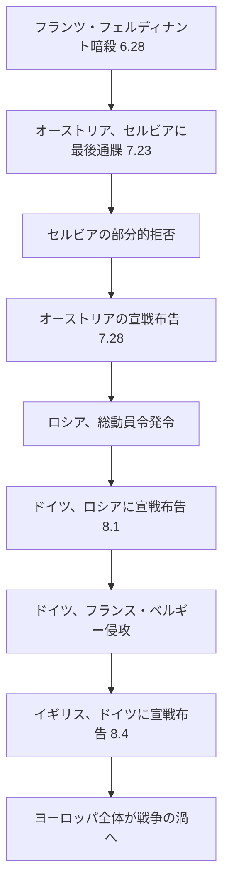

import Callout from "@/components/mdx/Callout.astro";

# 第1次世界大戦：塹壕の中の人類、そして新しい世界

受講生の皆さん、前回私たちは19世紀の華やかな民族主義と帝国主義が、ヨーロッパをどれほど張り詰めた緊張の導火線の上に置いていたのかを見てきました。本日、その導火線についに火がつく瞬間を一緒に目撃しましょう。

1914年7月28日。人類は、その日まで経験したことのない規模の戦争の中へと足を踏み入れました。4年3ヶ月後、戦争が終わったとき、世界には約1,700万個の死体と、何も解決されないままより複雑になった世界秩序だけが残っていました。

本日は、第1次世界大戦の原因、展開、そしてそれが残した傷跡を深く掘り下げていきます。

---

## 1. なぜ戦争が起きたのか：火薬庫の上のヨーロッパ

歴史家たちは、第1次世界大戦の原因を4つのキーワードで要約します。**M.A.I.N.**

| 原因 | 内容 |
|------|------|
| **M**ilitarism (軍国主義) | ドイツ・イギリス・ロシアなどが軍備競争に突入、戦争への備えを極限まで強化 |
| **A**lliances (同盟体制) | 三国同盟(ドイツ・オーストリア・イタリア) vs 三国協商(イギリス・フランス・ロシア) |
| **I**mperialism (帝国主義) | 植民地獲得競争に起因する列強間の確執と不信 |
| **N**ationalism (民族主義) | オーストリア＝ハンガリー帝国内のスラブ民族の独立熱望 |

これらすべての要素が緊密に圧縮された状態で、たった一つの火花が必要でした。

### 🔫 サラエボの銃声 (1914.6.28)

ボスニアの首都サラエボ。オーストリア＝ハンガリー帝国の皇太子<mark><strong>フランツ・フェルディナント大公</strong></mark>が訪問中でした。セルビアの民族主義団体「黒手組 (Black Hand)」の青年<mark><strong>ガブリロ・プリンツィプ</strong></mark>が放った2発の銃声。

この一つの事件が、同盟体制のドミノを倒しました。

<Callout type="important">
  **ドミノの恐怖**：この連鎖反応はわずか37日の間に起きました。1914年6月28日の暗殺事件から8月4日のイギリスの宣戦布告まで。どの国もこの戦争を望んでいないと主張しましたが、どの国も止まりませんでした。硬直した同盟体制と軍事動員計画が、人間の理性を圧倒したのです。
</Callout>

---

## 2. 地獄の戦争：塹壕戦 (Trench Warfare)

「クリスマスまでには家に帰れる」 — 1914年の夏、戦場へと旅立つ兵士たちの言葉でした。

現実は違いました。機関銃、有刺鉄線、毒ガス。19世紀のロマンチックな戦争観が、20世紀の産業技術の残酷さの前に打ち砕かれました。

### ⚔️ 西部戦線の塹壕地獄

イギリス海峡からスイス国境まで、750kmに及ぶ塹壕線が4年間を通してほとんど動きませんでした。

| 戦闘 | 期間 | 犠牲者 |
|------|------|--------|
| ヴェルダンの戦い | 1916年2月〜12月 | 約70万人 |
| ソンムの戦い | 1916年7月11月 | 約120万人 (初日にイギリス軍5万7千人の死傷者) |
| パッシェンダールの戦い | 1917年 | 約50万人 |

兵士たちはネズミやシラミ、泥と砲弾の中で暮らしました。塹壕熱 (Trench Fever)、砲弾ショック (Shell Shock、今日のPTSD) が蔓延しました。これが**総力戦 (Total War)**の現実でした。

---

## 3. 戦争の拡大：世界へ

この戦争が「世界大戦」となった理由があります。

- **オスマン帝国の参戦**：中東戦線が開かれました。イギリスはアラブ民族に独立を約束して蜂起を支援しました（『アラビアのロレンス』）。
- **植民地の兵士たち**：イギリスのインド・オーストラリア・カナダ・アフリカの兵士たち、フランスの北アフリカの兵士たちがヨーロッパの戦場に動員されました。彼らの犠牲がのちに民族独立運動の火種となります。
- **アメリカの参戦 (1917)**：ドイツの無制限潜水艦作戦とツィンメルマン電報を契機にアメリカが参戦し、戦勢を決定的に傾けました。
- **ロシア革命 (1917)**：戦争の苦痛に耐えかねたロシアでボリシェヴィキ革命が勃発し、ロシアが戦線から離脱しました。

---

## 4. 終戦と傷跡：ヴェルサイユ条約の遺産

1918年11月11日午前11時、銃声が止みました。しかし、真の平和は訪れませんでした。

### ヴェルサイユ条約 (1919)：復讐か、平和か？

| 条項 | 内容 |
|------|------|
| 戦争責任条項 (第231条) | ドイツに戦争に対するすべての責任を負わせる |
| 賠償金 | 1,320億金マルク (現在の価値で数兆円〜数十兆円規模) |
| 領土の剥奪 | アルザス＝ロレーヌの返還、すべての植民地没収 |
| 軍備の制限 | 陸軍を10万人に制限、空軍・潜水艦の保有禁止 |

アメリカ大統領ウッドロウ・ウィルソンは**「十四か条の平和原則」**により民族自決、軍備縮小、国際連盟の創設を約束しました。しかし、アメリカ上院は国際連盟への加盟を拒否し、連盟は牙を抜かれた虎へと成り下がりました。

<Callout type="important">
  **歴史の予告編**：ジョン・メイナード・ケインズはヴェルサイユ条約を「平和条約ではなく20年の休戦」と予言しました。屈辱的な賠償金の要求と領土の喪失は、ドイツ人の心に復讐心を植え付けました。20年後、その復讐心を利用する一人の人物が登場することになります — アドルフ・ヒトラー。
</Callout>

---

## 5. 戦争が残したもの：世界地図の再編

第1次世界大戦は4つの帝国を歴史から消し去りました。

- **オスマン帝国** → トルコ共和国 + 英仏の委任統治領 (現在イラク、シリア、パレスチナ)
- **オーストリア＝ハンガリー帝国** → オーストリア、ハンガリー、チェコスロバキア、ユーゴスラビアなどに分裂
- **ロシア帝国** → ソビエト連邦 (ボリシェヴィキ革命)
- **ドイツ帝国** → ヴァイマル共和国

新しく誕生した国境線は民族の分布を適切に反映しておらず、各地で少数民族問題という時限爆弾を抱えて誕生しました。

---

## 📚 コアチェックリスト

- [ ] 第1次世界大戦の構造的原因を示す4つのキーワード（頭文字）を挙げてみてください。(答え：M.A.I.N. — 軍国主義、同盟体制、帝国主義、民族主義)
- [ ] サラエボで暗殺された人物は誰であり、どの組織がそれを実行しましたか？(答え：オーストリア＝ハンガリー皇太子フランツ・フェルディナント大公 / セルビアの民族主義団体「黒手組」)
- [ ] ヴェルサイユ条約の第231条は何を規定しており、これがその後の歴史にどのような影響を与えましたか？(答え：ドイツの戦争責任条項。ドイツの極端な民族主義とナチズムの台頭に寄与しました。)

---

## 📖 おすすめの書籍

- **『八月の砲銃 (The Guns of August)』 - バーバラ・タチュマン**：1914年8月、ヨーロッパがいかにして戦争へと滑り落ちていったのかを臨場感あふれる筆致で描いたピューリッツァー賞受賞作。
- **『西部戦線異状なし (All Quiet on the Western Front)』 - エーリヒ・マリア・レマルク**：塹壕戦の恐怖を直接体験したドイツ兵の目を通して、戦争の非人間性を告発する反戦小説の傑作。
- **『ヴェルサイユ条約 (The Peace to End All Peace)』 - デイヴィッド・フロムキン**：第1次世界大戦後の中東秩序が、いかにして今日まで続く確執の種となったのかを追跡する。

---

お疲れ様でした。次回は、この戦争がもたらした傷と怒りが、全体主義という怪物をいかにして誕生させたのかを見ていきます。