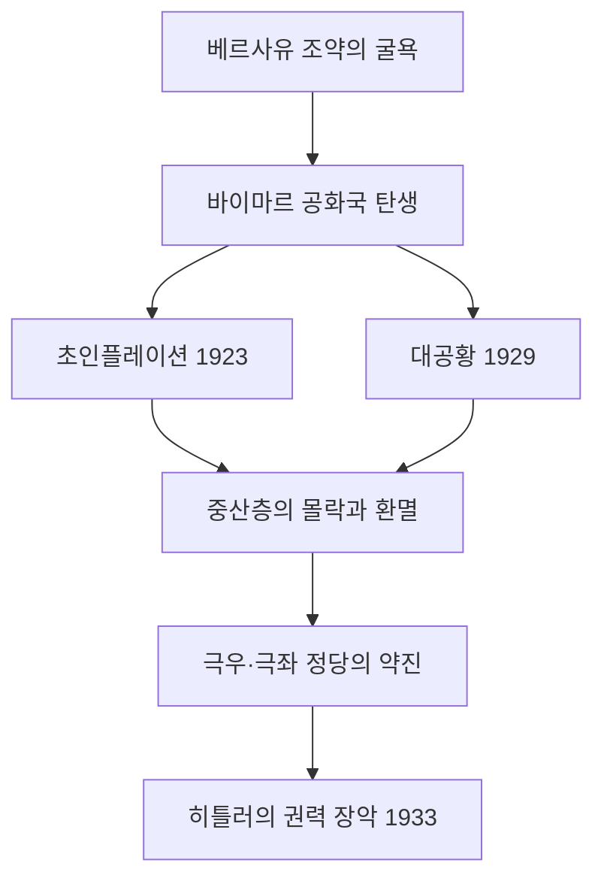

import Callout from "@/components/mdx/Callout.astro";

# Chapter 9. 불안한 평화: 두 전쟁 사이의 전체주의

학우 여러분, 드디어 우리 강의 시리즈의 마지막을 앞두고 있습니다. 지난 시간에는 제1차 세계 대전의 참혹함과 베르사유 조약이 남긴 상처를 살펴보았습니다. 이번 시간에는 그 상처 위에서 어떻게 인류 역사 최악의 정치 체제들이 자라났는지를 냉정하게 추적합니다.

전쟁 후 유럽에는 잠깐의 평화가 찾아왔습니다. 하지만 그것은 <mark><strong>불안한 평화</strong></mark>였습니다. 경제 붕괴, 민주주의에 대한 환멸, 그리고 전쟁 패배의 굴욕감이 뒤섞인 사회는, 가장 위험한 약속을 내미는 자들에게 자신을 통째로 내맡길 준비가 되어 있었습니다.

---

## 1. 민주주의의 실험과 실패: 바이마르 공화국

독일의 첫 번째 민주주의 실험인 <mark><strong>바이마르 공화국(1919~1933)</strong></mark>은 처음부터 가혹한 조건 속에서 태어났습니다.

### 📉 바이마르의 세 가지 위기

**첫 번째 위기: 탄생의 낙인**
- 베르사유 조약을 서명한 자들이 '11월의 배신자'로 낙인찍혔습니다.
- 민주주의는 패전과 굴욕의 상징으로 시작했습니다.

**두 번째 위기: 초인플레이션 (1923)**
- 전쟁 배상금을 지불하기 위해 화폐를 남발한 결과, 독일 경제는 초인플레이션에 빠졌습니다.
- 빵 한 덩어리 값이 수십억 마르크에 달하는 상황. 저축과 연금이 하루아침에 휴지 조각이 되었습니다.

**세 번째 위기: 대공황 (1929)**
- 미국 주식 시장 붕괴의 충격파가 전 세계를 강타했고, 독일 경제는 특히 심각한 타격을 받았습니다.
- 1932년 독일 실업자 600만 명. 거리에는 굶주린 사람들이 가득했습니다.

<Callout type="important">
  **민주주의의 조건**: 바이마르 공화국의 실패는 중요한 교훈을 줍니다. 민주주의는 단지 제도를 만드는 것으로 완성되지 않습니다. 경제적 안정, 시민의 신뢰, 그리고 민주주의를 수호하려는 의지가 함께해야 합니다. 제도만 있고 기반이 없으면, 민주주의는 독재자가 권력을 장악하는 통로가 될 수 있습니다.
</Callout>

---

## 2. 파시즘의 등장: 이탈리아와 독일

### 🇮🇹 이탈리아 파시즘: 무솔리니의 등장

<mark><strong>베니토 무솔리니(Benito Mussolini)</strong></mark>는 1차 세계 대전 후 이탈리아의 혼란과 사회주의 운동에 대한 공포를 먹고 성장했습니다.

- 1919년 파시스트 운동 창설. 검은 셔츠를 입은 폭력 부대(검은 셔츠단)로 좌익 세력 테러.
- 1922년 **로마 진군**: 수만 명의 파시스트가 로마를 향해 행진. 국왕은 겁에 질려 무솔리니에게 정권을 넘겼습니다.
- 1925년 독재 체제 확립. 스스로를 **'두체(Il Duce, 지도자)'**라 칭함.

파시즘의 핵심 사상: 강한 국가, 초민족주의, 반공주의, 폭력의 미학화. 개인은 오직 국가를 위해 존재합니다.

---

### 🇩🇪 나치즘의 공포: 히틀러의 독일

아돌프 히틀러는 1차 세계 대전 패전 후 빈에서 유랑하던 무명 화가였습니다. 그는 전쟁의 패배와 경제 위기의 책임을 유대인과 공산주의자에게 돌리는 선동으로 급격히 세력을 키웠습니다.

| 연도 | 사건 |
|------|------|
| 1923 | 뮌헨 폭동(맥주홀 폭동) 실패, 투옥 중 《나의 투쟁》 집필 |
| 1933.1 | 히틀러, 독일 총리 취임 |
| 1933.3 | **수권법(授權法)**: 의회 동의 없이 법률 제정 권한 획득 → 사실상 독재 완성 |
| 1935 | **뉘른베르크 법**: 유대인의 시민권 박탈 |
| 1938 | **수정의 밤(Kristallnacht)**: 전국의 유대인 상점·회당 방화 및 파괴 |
| 1938 | 오스트리아 병합(안슐루스), 체코 주데텐란트 강제 병합 |
| 1939.9.1 | 폴란드 침공 → 제2차 세계 대전 발발 |

<Callout type="important">
  **평범한 악**: 나치즘의 공포는 특별한 악당들만이 저지른 것이 아닙니다. 평범한 독일 시민들이 투표를 통해 나치당을 선택했고, 평범한 관료들이 유대인 학살 명령을 집행했습니다. 철학자 한나 아렌트는 이를 "악의 평범성(Banality of Evil)"이라 불렀습니다. 우리 시대의 가장 무거운 질문은 이것입니다: "나였다면 어떻게 했을까?"
</Callout>

---

## 3. 스탈린주의: 공포로 통치한 좌파 독재

소련에서는 레닌 사후(1924) 권력 투쟁에서 승리한 <mark><strong>이오시프 스탈린(Joseph Stalin)</strong></mark>이 공산주의 국가를 전체주의적 공포 정치의 도구로 만들었습니다.

- **강제 집단화**: 농민들의 토지를 집단 농장으로 강제 통합. 저항하는 쿨라크(부농)를 숙청. **우크라이나 대기근(홀로도모르)**으로 수백만 명이 사망.
- **5개년 계획**: 강제 산업화로 소련을 세계적 공업 국가로 변모시켰으나, 그 대가는 수백만 명의 강제 노동.
- **대숙청(1936~38)**: 정치적 반대파, 군 장성, 심지어 자신의 동지들까지 가짜 재판으로 처형. 약 75만 명이 총살됨.

| 체제 | 지도자 | 국가 | 이념 |
|------|--------|------|------|
| 파시즘 | 무솔리니 | 이탈리아 | 극우 민족주의 |
| 나치즘 | 히틀러 | 독일 | 인종주의 + 반유대주의 |
| 스탈린주의 | 스탈린 | 소련 | 공산주의 전체주의 |

---

## 4. 유화 정책의 실패: 전쟁을 허락한 외교

히틀러가 라인란트를 재무장하고(1936), 오스트리아를 병합하고(1938), 체코슬로바키아의 주데텐란트를 요구했을 때, 영국과 프랑스는 **유화 정책(Appeasement)**으로 대응했습니다. 즉, 히틀러의 요구를 들어주면 전쟁을 막을 수 있다는 계산이었습니다.

**뮌헨 협정(1938)**: 영국의 체임벌린이 히틀러에게 주데텐란트를 내주고 돌아와 "우리 시대의 평화(Peace for our time)"를 선언했습니다.

<mark><strong>윈스턴 처칠의 경고</strong></mark>: *"당신들은 불명예와 전쟁 중 하나를 선택해야 했다. 당신들은 불명예를 선택했다. 그리고 전쟁도 갖게 될 것이다."*

1939년 9월 1일, 독일이 폴란드를 침공했습니다. 처칠의 예언은 적중했습니다.

---

## 5. 역사의 거울 앞에서

학우 여러분, 우리 강의 대장정의 마지막 페이지에 이르렀습니다.

두 전쟁 사이의 역사는 인류가 저지를 수 있는 최악의 실수들을 집약해서 보여줍니다. 경제적 고통이 극단주의를 낳고, 지도자에 대한 무비판적 복종이 집단 범죄를 허용하고, 눈앞의 편안함을 위해 정의를 외면하는 것이 결국 더 큰 재앙을 초래한다는 교훈.

<Callout type="important">
  **21세기에 던지는 질문**: 전체주의는 사라진 것일까요? 경제 위기, 혐오 선동, 민주주의 제도 약화, 그리고 강한 지도자에 대한 열망은 오늘날에도 우리 주변에 존재합니다. 역사는 이렇게 경고합니다: **"극단주의는 절망에서 자란다."** 그리고 그 절망을 방치하는 것은 우리 모두의 책임이기도 합니다.
</Callout>

<mark><strong>"역사를 기억하지 못하는 자는 그 비극을 되풀이할 운명에 처한다."</strong></mark> — 조지 산타야나

우리가 이 강의를 통해 배운 모든 것은 결국 이 한 문장으로 돌아옵니다. 역사를 기억하는 것, 그것이 우리가 더 나은 세상을 만들기 위해 할 수 있는 첫 번째 걸음입니다.

---

## 📚 핵심 체크리스트

- [ ] 바이마르 공화국이 붕괴한 세 가지 핵심 위기를 말해보세요. (답: 베르사유 조약의 굴욕, 1923년 초인플레이션, 1929년 대공황)
- [ ] 히틀러가 독일에서 합법적으로 독재 권력을 장악하는 데 이용한 법률은 무엇인가요? (답: 1933년 수권법(授權法))
- [ ] 영국과 프랑스가 히틀러의 팽창에 굴복한 외교 전략을 무엇이라 하며, 이것이 실패한 이유는 무엇인가요? (답: 유화 정책(Appeasement). 히틀러의 요구는 끝이 없었고, 굴복은 더 큰 요구를 낳았습니다.)

---

## 📖 추천 도서

- **[나의 투쟁 (Mein Kampf)] - 연구 목적**: 히틀러의 세계관과 이념을 이해하기 위해 비판적으로 읽는 1차 자료. (주석 달린 비판 편집본 권장)
- **[한나 아렌트의 전체주의의 기원] - 한나 아렌트**: 나치즘과 스탈린주의를 '전체주의'라는 새로운 범주로 분석한 20세기 정치 철학의 대작.
- **[히틀러 (Hitler) - 1889-1936 Hubris] - 이언 커쇼**: 히틀러 개인의 심리와 나치 독일의 구조를 가장 치밀하게 분석한 현대 역사학의 결정판.

---

학우 여러분, 9번의 긴 강의를 끝까지 함께해주셔서 깊이 감사드립니다. 역사의 무게를 느끼고, 그 속에서 오늘을 살아갈 지혜를 얻으시길 진심으로 기원합니다. 여러분의 앞날에 역사의 빛이 함께하기를 바랍니다.
