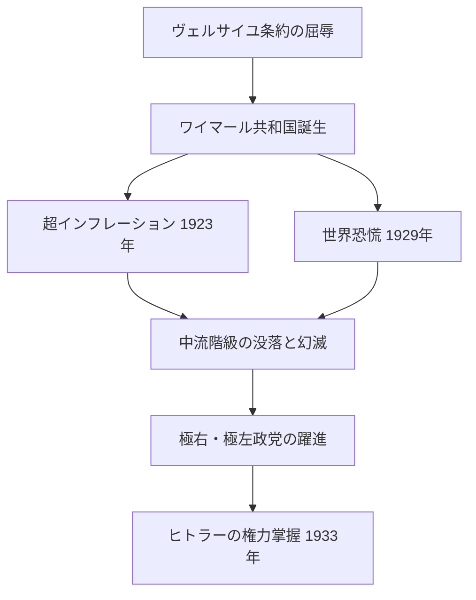

import Callout from "@/components/mdx/Callout.astro";

# 第9章 不安な平和：二つの大戦間の全体主義

受講生の皆さん、いよいよ私たちの講義シリーズも大詰めを迎えました。前回は、第一次世界大戦の凄惨さとヴェルサイユ条約が残した傷跡を見てきました。今回は、その傷跡の上にいかにして人類歴史上最悪の政治体制が育っていったのかを冷静に追跡します。

戦後のヨーロッパには束の間の平和が訪れました。しかし、それは<mark><strong>不安な平和</strong></mark>でした。経済崩壊、民主主義に対する幻滅、そして戦争敗北の屈辱感が入り交じった社会は、最も危険な約束を差し出す者たちに自分自身を丸ごと委ねる準備ができていたのです。

---

## 1. 民主主義の実験と失敗：ワイマール共和国

ドイツ最初の民主主義の実験である<mark><strong>ワイマール共和国（1919〜1933年）</strong></mark>は、最初から過酷な条件の中で生まれました。

### 📉 ワイマールの三つの危機

**第一の危機：誕生の刻印**
- ヴェルサイユ条約に署名した者たちが「11月の裏切り者」と刻印されました。
- 民主主義は敗戦と屈辱の象徴として始まりました。

**第二の危機：超インフレーション（1923年）**
- 戦争賠償金を支払うために貨幣を乱発した結果、ドイツ経済は超インフレーションに陥りました。
- パン一斤の価格が数十億マルクに達する状況。貯蓄と年金が一晩で紙くずになりました。

**第三の危機：世界恐慌（1929年）**
- アメリカ株式市場崩壊の衝撃波が全世界を直撃し、ドイツ経済は特に深刻な打撃を受けました。
- 1932年のドイツの失業者600万人。街には飢えた人々があふれていました。

<Callout type="important">
  **民主主義の条件**：ワイマール共和国の失敗は重要な教訓を与えてくれます。民主主義は単に制度を作ることだけで完成するのではありません。経済的安定、市民の信頼、そして民主主義を守ろうとする意志が伴わなければなりません。制度だけで基盤がなければ、民主主義は独裁者が権力を掌握する通路になり得ます。
</Callout>

---

## 2. ファシズムの登場：イタリアとドイツ

### 🇮🇹 イタリア・ファシズム：ムッソリーニの登場

<mark><strong>ベニート・ムッソリーニ（Benito Mussolini）</strong></mark>は、第一次世界大戦後のイタリアの混乱と社会主義運動に対する恐怖を糧に成長しました。

- 1919年、ファシスト運動創設。黒いシャツを着た暴力部隊（黒シャツ隊）で左翼勢力をテロ。
- 1922年 **ローマ進軍**：数万人のファシストがローマに向けて行進。国王は怯えてムッソリーニに政権を譲渡しました。
- 1925年、独裁体制確立。自らを<mark><strong>「ドゥーチェ（Il Duce、指導者）」</strong></mark>と称す。

ファシズムの核心思想：強い国家、超ナショナリズム、反共主義、暴力の美学化。個人は国家のためにのみ存在します。

---

### 🇩🇪 ナチズムの恐怖：ヒトラーのドイツ

アドルフ・ヒトラーは、第一次世界大戦の敗戦後ウィーンで流浪していた無名の画家でした。彼は戦争の敗北と経済危機の責任をユダヤ人と共産主義者に転嫁する扇動によって、急激に勢力を拡大しました。

| 年代 | 事件 |
|------|------|
| 1923 | ミュンヘン一揆（ビアホール暴動）失敗、投獄中に『我が闘争』を執筆 |
| 1933.1 | ヒトラー、ドイツ首相就任 |
| 1933.3 | **全権委任法（授権法）**：議会の同意なしに法律制定権限を獲得 → 事実上の独裁完成 |
| 1935 | **ニュルンベルク法**：ユダヤ人の市民権剥奪 |
| 1938 | **水晶の夜（Kristallnacht）**：全国のユダヤ人商店・会堂の放火および破壊 |
| 1938 | オーストリア併併合（アンシュルス）、チェコ・ズデーテン地方の強制併合 |
| 1939.9.1 | ポーランド侵攻 → 第二次世界大戦勃発 |

<Callout type="important">
  **凡庸な悪**：ナチズムの恐怖は、特別な悪党たちだけが犯したものではありません。普通のドイツ市民たちが投票を通じてナチ党を選択し、普通の官僚たちがユダヤ人虐殺の命令を執行しました。哲学者ハンナ・アーレントはこれを「悪の凡庸さ（Banality of Evil）」と呼びました。私たちの時代の最も重い問いはこれです：「自分だったらどういただろうか？」
</Callout>

---

## 3. スターリン主義：恐怖で統治した左派独裁

ソ連ではレーニン死後（1924年）の権力闘争に勝利した<mark><strong>ヨシフ・スターリン（Joseph Stalin）</strong></mark>が、共産主義国家を全体主義的恐怖政治の道具としました。

- **強制集団化**：農民の土地を集合農場に強制統合。抵抗するクラーク（富農）を粛清。<mark><strong>ウクライナ大飢饉（ホロドモール）</strong></mark>で数百万人が死亡。
- **五カ年計画**：強制的工業化によってソ連を世界的工業国家に変貌させましたが、その代償は数百万人の強制労働。
- **大粛清（1936〜38年）**：政治的反対派、軍高官、果ては自分の同志たちまで偽りの裁判で処刑。約75万人が銃殺されました。

| 体制 | 指導者 | 国家 | 思想 |
|------|--------|------|------|
| ファシズム | ムッソリーニ | イタリア | 極右ナショナリズム |
| ナチズム | ヒトラー | ドイツ | 人種主義 ＋ 反ユダヤ主義 |
| スターリン主義 | スターリン | ソ連 | 共産主義全体主義 |

---

## 4. 宥和政策の失敗：戦争を許した外交

ヒトラーがラインラントを再武装し（1936年）、オーストリアを併合し（1938年）、チェコスロバキアのズデーテン地方を要求したとき、イギリスとフランスは<mark><strong>宥和政策（Appeasement）</strong></mark>で対応しました。すなわち、ヒトラーの要求を呑めば戦争を防ぐことができるという計算でした。

**ミュンヘン会談（1938年）**：イギリスのチェンバレンがヒトラーにズデーテン地方を渡し、帰国して「我々の時代の平和（Peace for our time）」を宣言しました。

<mark><strong>ウィンストン・チャーチルの警告</strong></mark>：*「あなた方は不名誉と戦争のどちらかを選ばなければならなかった。あなた方は不名誉を選んだ。そして戦争も手に入れることになるだろう。」*

1939年9月1日、ドイツがポーランドを侵攻しました。チャーチルの予言は的中しました。

---

## 5. 歴史の鏡の前に立って

受講生の皆さん、私たちの講義の大団円の最後のページに至りました。

二つの大戦間の歴史は、人類が犯しかねない最悪の過ちを集約して示しています。経済的苦痛が極端主義を生み、指導者に対する無批判的服従が集団犯罪を許容し、目の前の快適さのために正義を無視することが結局はさらなる災難を招くという教訓。

<Callout type="important">
  **21世紀に投げかける問い**：全体主義は消え去ったのでしょうか？ 経済危機、嫌悪の扇動、民主主義制度の弱体化、そして強い指導者に対する渇望は、今日でも私たちの身の回りに存在しています。歴史はこう警告しています：**「極端主義は絶望から育つ。」** そしてその絶望を放置することは、私たち全員の責任でもあります。
</Callout>

<mark><strong>「歴史を記憶しない者は、その悲劇を繰り返す運命にある。」</strong></mark> —— ジョージ・サンタヤナ

私たちがこの講義を通じて学んだことのすべては、結局この一文に帰着します。歴史を記憶すること、それが私たちがより良い世界を作るためにできる最初の第一歩です。

---

## 📚 核心チェックリスト

- [ ] ワイマール共和国が崩壊した三つの核心的な危機を言ってみてください。（答え：ヴェルサイユ条約の屈辱、1923年の超インフレーション、1929年の世界恐慌）
- [ ] ヒトラーがドイツで合法的に独裁権力を掌握するのに利用した法律は何ですか？（答え：1933年の全権委任法（授権法））
- [ ] イギリスとフランスがヒトラーの膨張に屈服した外交戦略を何と呼び、これが失敗した理由は何ですか？（答え：宥和政策（Appeasement）。ヒトラーの要求には終わりがなく、屈服はさらなる要求を生みました。）

---

## 📖 おすすめ図書

- **『我が闘争（Mein Kampf）』 - 研究目的**：ヒトラーの世界観とイデオロギーを理解するために批判的に読む一次資料。（注釈付き批判版を推奨）
- **『全体主義の起源』 - ハンナ・アーレント**：ナチズムとスターリン主義を「全体主義」という新しいカテゴリーで分析した20世紀政治哲学の大作。
- **『ヒトラー 1889-1936 傲慢（Hitler - 1889-1936 Hubris）』 - イアン・カーショー**：ヒトラー個人の心理とナチス・ドイツの構造を最も緻密に分析した現代歴史学の決定版。

---

受講生の皆さん、9回の長い講義に最後までお付き合いいただき、心より感謝申し上げます。歴史の重みを感じ、その中で今日を生きていく知恵を得られることを心から祈願いたします。皆さんの前途に歴史の光が共にありますように。