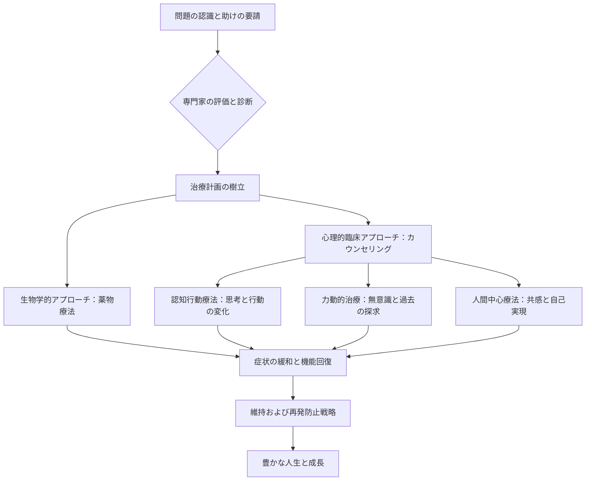

import Callout from "@/components/mdx/Callout.astro";

# 心の影：異常心理学と癒しの旅

皆さん、こんにちは。これまで私たちは、発達、社会的関係、動機と情動など、人間の普遍的な心の働きについて学んできました。本日は、少し重いテーマではありますが、私たちの人生と最も密接につながっている主題を扱いたいと思います。それは**異常心理学（Abnormal Psychology）**です。

人間の心は1枚の絵のようです。時には明るい光が差し込むこともあれば、時には濃い影が落ちることもあります。異常心理学は、その**影**を分析する学問です。しかし、覚えておいてください。影が濃いということは、それだけ強い光が存在している証拠でもあります。今日私たちは、心の痛みを単なる「病気」として見るのではなく、<mark><strong>人間存在の苦しみを理解し、癒やしの道を模索する旅</strong></mark>を始めます。

---

## 1. 何が「異常」なのか？基準の曖昧さ

「正常」と「異常」を分ける境界線はどこにあるでしょうか？心理学では、以下の4つの基準（4Ds）を総合的に考慮します。

### 📊 異常行動判別の4つの基準（4Ds）

| 基準          | 用語            | 意味                                    | 例                              |
| :------------ | :-------------- | :-------------------------------------- | :------------------------------ |
| **逸脱性**    | **Deviance**    | 社会的規範や統計的平均からの逸脱        | 公共の場における極端な奇行      |
| **苦痛**      | **Distress**    | 個人自身が感じる激しい心理的苦痛        | 日常生活を麻痺させる深い悲しみ  |
| **機能障害**  | **Dysfunction** | 日常的業務や社会的関係の維持が困難      | 社会不安障害による失業          |
| **危険性**    | **Danger**      | 自分や他人への脅威となる可能性          | 自傷の意図や暴力的衝動          |

重要な点は、どれか一つだけが絶対的な基準になり得ないということです。芸術家の独特な奇行は「逸脱的」であっても「機能障害」ではない場合があり、深い悲しみは誰もが経験する普遍的な苦痛かもしれません。<mark><strong>「苦痛の深さと人生の機能性」</strong></mark>が調和したときに初めて診断的価値が生じます。

---

## 2. 現代診断の標準：DSM-5-TR

心理学者や精神保健の専門家たちは、世界的に通用する診断体系である**DSM-5-TR**（精神疾患の診断・統計マニュアル）を使用します。これはまるで心の地形図のようなものです。主要な障害を体系的に分類してみましょう。

### 🧩 主要な心理障害分類の概要

1.  **不安障害（Anxiety Disorders）**: 過度な恐怖と不安。全般不安障害、パニック障害、社会不安障害など。
2.  **気分障害（Mood Disorders）**: 感情の高低の調節が困難。大うつ病性障害、双極性障害（躁うつ病）。
3.  **パーソナリティ障害（Personality Disorders）**: 固定された思考と行動パターンが社会的適応不全を招く。境界性パーソナリティ障害、自己愛性パーソナリティ障害など。
4.  **統合失調症スペクトラム（Schizophrenia Spectrum）**: 現実との接触の喪失、妄想、幻覚。

---

## 3. 癒やしのプロセス：闇から光へ

心の影を発見したなら、今度はどう癒やすべきかを考えなければなりません。心理療法とは、単に症状をなくすことではなく、<mark><strong>自分を受容し、新しい生き方を学習するプロセス</strong></mark>です。

### 🔄 心理療法および回復ガイド（Flowchart）

最も広く使われている**認知行動療法（CBT）**の核心は、<mark><strong>「状況が私たちを苦しめるのではなく、状況を見つめる私たちの思考が私たちを苦しめるのだ」</strong></mark>という気づきです。歪んだ思考のレンズを拭き取るだけでも、世界は違って見え始めます。

---

## 4. 深く見つめる：現代人の難病「不安」と「うつ」

私たちは「不安」を無条件に悪いものだと考えます。しかし、不安とは本来、危険から私たちを守ろうとする**生存の警報音**です。問題は、脅威がない状況でも警報音が鳴りやまないときに発生します。

<Callout type="note">
  **うつは「精神的インフルエンザ」ではありません。** インフルエンザはウイルスが去れば治りますが、うつは私たちの人生の方向性を見直しなさいという**内なるシグナル**である場合が多いです。「あなたの魂が現在の生き方に疲れ果てている」というメッセージである可能性もあると、心理学者たちは強調しています。
</Callout>

---

## 5. パーソナリティの固着：パーソナリティ障害の理解

パーソナリティ障害は「悪い性格」ではありません。幼少期の欠乏や傷から自分を守るために形成された、<mark><strong>「硬いが柔軟性のない鎧」</strong></mark>のようなものです。他人の視線に極端に敏感であったり、他人をコントロールしようとしたりする行為は、実はその下に深い「不安と恐怖」を隠している場合が少なくありません。

癒やしの始まりは、その鎧がもはや成長を妨げていることを認め、少しずつ脱ぎ捨てる勇気を持つことです。

---

## 6. 結論：傷ついた癒やし手としての人間

受講生の皆さん、異常心理学を学ぶ目的は、他人にレッテル（Stigma）を貼るためではありません。むしろ、**「人間なら誰しも心が痛むことがある」**ことを認め、互いの傷を包み込む共感の幅を広げるためです。

心理学者のカール・ユングは言いました。<mark><strong>「光の形を想像するのではなく、闇を意識化することが目覚めをもたらす」</strong></mark>あなたの影を恐れないでください。その影を観察し、受容するとき、初めて真の意味での自己統合と成熟が起こります。

次回、心理学の勉強の大団円を締めくくり、**幸福とポジティブ心理学、そして私たちが追求すべき心理的ウェルビーイング（Well-being）**についてお話しします。

---

## 📖 参考文献
心の影を包み込み、癒やしの知恵を得たい方のための推薦図書です。

- **[限界のない心 (The No-Boundary Mind)] - ケン・ウィルバー（Ken Wilber）**: 人間意識のスペクトルを分析し、私たち内面の分裂をどのように統合し癒やすべきか、哲学的・心理学的な洞察を提供します。
- **[あなたが正しい (You Are Right)] - チョン・ヘシン**: 共感がどのように人を救うのか、カウンセラーとしての熾烈な現場経験を通じて心の飢えた隅々を満たしてくれる「心理的人工呼吸」のような本です。
- **[真昼の悪魔 うつ病の歴史と記録 (The Noonday Demon)] - アンドリュー・ソロモン（Andrew Solomon）**: うつ病という苦しみの解剖学的、文化的、個人的な記録であり、病気そのものを超えた人間的叙事を示しています。

---

お疲れ様でした。皆さんの心が温かい慰めと知恵で満たされる夜になることを願っています。