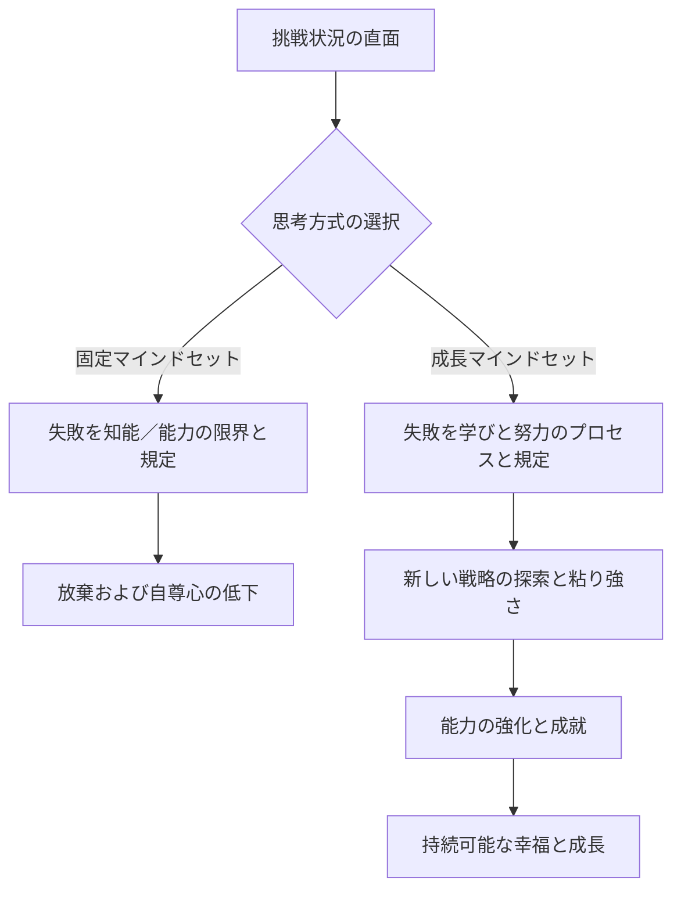

import Callout from "@/components/mdx/Callout.astro";

# 幸福の科学：ポジティブ心理学と満たされた人生

皆さん、こんにちは。ついに私たちが共にしてきた心理学の旅の大団円を飾る最終回に到達しました。私たちはこれまで、人間の無意識、社会的関係、動機と感情、そして心の痛みまで幅広く扱ってきました。今日私たちが扱うテーマは、そのすべての知識の終着点であり、私たちが心理学を学ぶ究極の理由——まさに**幸福**です。

過去の心理学が「何が間違っているのか？」を直すことに集中していたなら、現代の**ポジティブ心理学（Positive Psychology）**は<mark><strong>「何が私たちを豊かにするのか？」</strong></mark>を問いかけます。単に不幸ではない状態を超えて、どのようにすれば人生を花咲かせる（Flourish）ことができるのか、その科学的な解答を探してみましょう。

---

## 1. ウェルビーイングの5つの柱：セリグマンのPERMAモデル

ポジティブ心理学の創始者マーティン・セリグマン（Martin Seligman）は、幸福が単なる一時の楽しい気分ではないと言います。彼は持続可能なウェルビーイング（Well-being）のための5つの核心要素を提案しました。

### 🌟 満たされた人生のためのPERMAガイド

| 要素                     | 意味            | 核心の問い                            | 実践戦略                           |
| :----------------------- | :-------------- | :------------------------------------ | :--------------------------------- |
| **P (Positive Emotion)** | **ポジティブな感情** | 今日どれほど喜びと感謝を感じたか？    | 毎晩、感謝の日記を3つ書く            |
| **E (Engagement)**       | **没頭（エンゲージメント）** | 時間を忘れて没頭した仕事や活動があるか？ | 自分の強みを発揮する機会を見つける |
| **R (Relationships)**    | **人間関係**    | 自分を支えてくれる健全な関係があるか？| 大切な人と深く対話する             |
| **M (Meaning)**          | **意味（意義）** | 自分より大きな存在のために貢献しているか？ | 自分の価値を実現するボランティア／貢献 |
| **A (Accomplishment)**   | **達成**        | 目標を立てて達成した経験があるか？    | 小さな成功（Small Wins）を記録する |

幸福は、これら5つの要素がまんべんなく均衡をなすときに訪れます。皆さんは現在、どの柱が最も頑丈で、どの柱を補修すべきでしょうか？

---

## 2. 心の筋力：レジリエンスと成長マインドセット

幸福とは苦難がない状態ではなく、<mark><strong>「苦難を乗り越える力」</strong></mark>があるときに維持されます。これを**レジリエンス（Resilience）**と呼びます。レジリエンスを育てる決定的な鍵は、キャロル・ドゥエック（Carol Dweck）の**成長マインドセット（Growth Mindset）**です。

### 🔄 思考方式の転換プロセス

成長マインドセットを持つ人は「自分にはできない」と言いません。代わりに<mark><strong>「自分は『まだ（Not yet）』できないだけだ」</strong></mark>と言います。この小さな単語一つが脳の回路を変え、幸福への道筋を作ります。

---

## 3. 幸福の40%は私たちのもの：ソニア・リュボミアスキーの公式

心理学者のソニア・リュボミアスキー（Sonja Lyubomirsky）は、幸福を決定する要因を分析しました。

- **遺伝的設定値（50%）**: 生まれ持った気質
- **外部環境（10%）**: お金、居住地、既婚・未婚など
- **意図的活動（40%）**: 私たちの思考と毎日の行動

驚くべきなのは、お金や家といった環境が幸福に及ぼす影響がわずか10%に過ぎないという点です。一方で、私たちが<mark><strong>どのような習慣を持ち、どのような考えをするのか（意図的活動）</strong></mark>が40%をも占めています。これはすなわち、私たちの努力で幸福のかなりの部分を変えられるという希望のメッセージです。

---

## 4. 本当の自分に出会う時間：強みの発見

自分の欠点を直すことにエネルギーを注ぐよりも、自分が持つ**シグネチャー・ストレングス（代表的な強み、Signature Strengths）**を発揮するとき、人間は最も大きな達成感と幸福を感じます。粘り強さ、好奇心、公正さ、創造性など、あなただけの輝く原石を見つけてみてください。

<Callout type="note">
  **比較は幸福の泥棒です。** ポジティブ心理学でいう幸福とは、他人と比べて優位に立つことではなく、
  昨日の自分よりももう少し「自分らしさ」に近づいていくプロセスです。
</Callout>

---

## 5. 意味論的平穏：マインドフルネスと感謝

現代心理学は、古代の知恵である「瞑想」を**マインドフルネス（Mindfulness）**という名前で科学化しました。過去や未来にとらわれず、「今この瞬間」に丸ごと存在する能力です。ここに**感謝**というスパイスを加えてみてください。感謝は、私たちの脳がポジティブな情報により敏感に反応するように訓練する、最も強力な神経可塑性（Brain Plasticity）の訓練です。

---

## 6. 結論：人生は「解決すべき問題」ではなく「経験すべき神秘」です

受講生の皆さん、6週間の心理学の大遠征を締めくくり、私の最後のメッセージをお伝えします。心理学は皆さんを「完璧な人間」にするための学問ではありません。むしろ**皆さんの不完全さを理解し、それにもかかわらず一歩前へ進む勇気を得るための学問**です。

<mark><strong>「幸福とは目的地ではなく、旅をする方法そのものです。」</strong></mark> 今日、皆さんが出会った人にかける温かい一言、自分自身に送る励ましの笑顔こそが、幸福の実体です。

これまで私と共に心の地図を描いてくださり、ありがとうございます。皆さんの人生が、心理学というレンズを通してより透明に、美しく輝くことを応援しております。

---

## 📖 参考文献
満たされた人生と幸福の科学を日常に応用したい方におすすめの図書です。

- **『楽観主義を学ぶ（Learned Optimism）』 - マーティン・セリグマン**: 悲観主義を克服し、楽観的思考（成長マインドセット）を学習する具体的な方法を提示したポジティブ心理学の経典です。
- **『幸福の起源』 - ソ・ウングク**: 幸福を「道徳的義務」ではなく「生存のための道具」という進化論的観点から、型破りで明快に解き明かした本です。
- **『やり抜く力 GRIT(グリット)』 - アンジェラ・ダックワース**: 成功の核心が天才性ではなく、情熱と粘り強さの結合である「グリット（Grit）」にあることを科学的に証明しています。

---

お疲れ様でした。皆さんのすべての前途に満ちあふれた祝福がありますように。