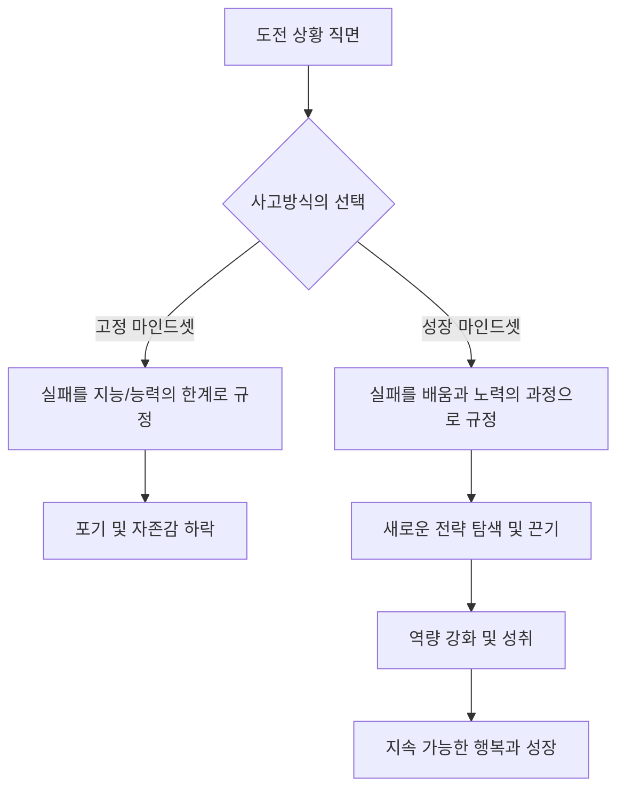

import Callout from "@/components/mdx/Callout.astro";

# Chapter 6. 행복의 과학: 긍정 심리학과 충만한 삶

안녕하세요, 여러분. 드디어 우리가 함께한 심리학 여정의 대미를 장식할 마지막 시간에 도달했습니다. 우리는 그동안 인간의 무의식, 사회적 관계, 동기와 정서, 그리고 마음의 아픔까지 폭넓게 다뤄왔습니다. 오늘 우리가 다룰 주제는 그 모든 지식의 종착역이자, 우리가 심리학을 공부하는 궁극적인 이유—바로 **행복**입니다.

과거의 심리학이 "무엇이 잘못되었는가?"를 고치는 데 집중했다면, 현대의 **긍정 심리학(Positive Psychology)**은 <mark><strong>"무엇이 우리를 풍요롭게 하는가?"</strong></mark>를 묻습니다. 단순히 불행하지 않은 상태를 넘어, 어떻게 하면 삶을 꽃피울(Flourish) 수 있을지 그 과학적인 해답을 찾아봅시다.

---

## 1. 웰빙의 5가지 기둥: 셀리그먼의 PERMA 모델

긍정 심리학의 창시자 마틴 셀리그먼(Martin Seligman)은 행복이 단순히 잠깐의 즐거운 기분이 아니라고 말합니다. 그는 지속 가능한 안녕(Well-being)을 위한 5가지 핵심 요소를 제안했습니다.

### 🌟 충만한 삶을 위한 PERMA 가이드

| 요소                     | 의미            | 핵심 질문                             | 실천 전략                        |
| :----------------------- | :-------------- | :------------------------------------ | :------------------------------- |
| **P (Positive Emotion)** | **긍정적 정서** | 오늘 얼마나 기쁨과 감사를 느꼈나?     | 매일 밤 감사 일기 3가지 쓰기     |
| **E (Engagement)**       | **몰입**        | 시간 가는 줄 모르고 빠져든 일이 있나? | 자신의 강점을 발휘할 기회 찾기   |
| **R (Relationships)**    | **관계**        | 나를 지지해주는 건강한 관계가 있나?   | 소중한 사람과 깊이 있게 대화하기 |
| **M (Meaning)**          | **의미**        | 나보다 큰 존재를 위해 기여하고 있나?  | 자신의 가치를 실현하는 봉사/기여 |
| **A (Accomplishment)**   | **성취**        | 목표를 세우고 달성한 경험이 있나?     | 작은 성공(Small Wins) 기록하기   |

행복은 이 5가지 요소가 골고루 균형을 이룰 때 찾아옵니다. 여러분은 현재 어느 기둥이 가장 튼튼하고, 어느 기둥을 보수해야 하나요?

---

## 2. 마음의 근력: 회복탄력성과 성장 마인드셋

행복은 고난이 없는 상태가 아니라, <mark><strong>"고난을 이겨내는 힘"</strong></mark>이 있을 때 유지됩니다. 이를 **회복탄력성(Resilience)**이라고 부릅니다. 회복탄력성을 키우는 결정적인 열쇠는 캐럴 드웩(Carol Dweck)의 **성장 마인드셋(Growth Mindset)**입니다.

### 🔄 사고방식의 전환 프로세스

성장 마인드셋을 가진 사람은 "나는 못 해"라고 말하지 않습니다. 대신 <mark><strong>"나는 '아직(Not yet)' 못 할 뿐이야"</strong></mark>라고 말하죠. 이 작은 단어 하나가 뇌의 회로를 바꾸고 행복의 가도를 만듭니다.

---

## 3. 행복의 40%는 우리의 몫: 소냐 류보머스키의 공식

심리학자 소냐 류보머스키(Sonja Lyubomirsky)는 행복을 결정하는 요인을 분석했습니다.

- **유전적 설정점 (50%)**: 타고난 기질
- **외부 환경 (10%)**: 돈, 거주지, 결혼 여부 등
- **의도적 활동 (40%)**: 우리의 생각과 매일의 행동

놀라운 것은 돈이나 집 같은 환경이 행복에 미치는 영향이 단 10%에 불과하다는 점입니다. 반면 우리가 <mark><strong>어떤 습관을 지니고 어떤 생각을 하느냐(의도적 활동)</strong></mark>가 40%나 차지합니다. 이는 곧 우리의 노력으로 행복의 상당 부분을 바꿀 수 있다는 희망의 메시지입니다.

---

## 4. 진정한 나를 만나는 시간: 강점 발견

자신의 단점을 고치는 데 에너지를 쏟기보다, 자신이 가진 **대표 강점(Signature Strengths)**을 발휘할 때 인간은 가장 큰 성취감과 행복을 느낍니다. 끈기, 호기심, 공정성, 창의성 등 여러분만의 빛나는 원석을 찾아보세요.

<Callout type="note">
  **비교는 행복의 도둑입니다.** 긍정 심리학에서 말하는 행복은 타인과 비교 우위에 서는 것이 아니라,
  어제의 나보다 조금 더 '자기다움'에 가까워지는 과정입니다.
</Callout>

---

## 5. 의미론적 평온: 마음챙김과 감사

현대 심리학은 고대의 지혜인 '명상'을 **마음챙김(Mindfulness)**이라는 이름으로 과학화했습니다. 과거나 미래에 매몰되지 않고 '지금 이 순간'에 온전히 존재하는 능력입니다. 여기에 **감사**라는 양념을 더해보세요. 감사는 우리의 뇌가 긍정적인 정보에 더 민감하게 반응하도록 훈련하는 가장 강력한 뇌 가소성 훈련입니다.

---

## 6. 결론: 삶은 '해결해야 할 문제'가 아니라 '경험해야 할 신비'입니다

학우 여러분, 6주간의 심리학 대장정을 마무리하며 제 마지막 메시지를 전합니다. 심리학은 여러분을 '완벽한 사람'으로 만들기 위한 학문이 아닙니다. 오히려 **여러분의 불완전함을 이해하고, 그럼에도 불구하고 한 걸음 더 나아갈 용기를 얻기 위한 학문**입니다.

<mark><strong>"행복은 목적지가 아니라, 여행하는 방법 자체입니다."</strong></mark> 오늘 여러분이 만난 사람에게 건네는 따뜻한 말 한마디, 스스로에게 보내는 격려의 미소가 바로 행복의 실체입니다.

그동안 저와 함께 마음의 지도를 그려주셔서 감사합니다. 여러분의 삶이 심리학이라는 렌즈를 통해 더욱 투명하고 아름답게 빛나기를 응원하겠습니다.

---

## 📖 참고문헌
충만한 삶과 행복의 과학을 일상에 적용하고 싶은 분들을 위한 추천 도서입니다.

- **[낙관성 길들이기 (Learned Optimism)] - 마틴 셀리그먼**: 비관주의를 극복하고 낙관적 사고(성장 마인드셋)를 학습하는 구체적인 방법을 제시한 긍정 심리학의 경전입니다.
- **[행복의 기원] - 서은국**: 행복을 '도덕적 의무'가 아닌 '생존을 위한 도구'라는 진화론적 관점에서 파격적이고 명쾌하게 풀어낸 책입니다.
- **[그릿 (Grit)] - 앤절라 더크워스**: 성공의 핵심이 천재성이 아닌, 열정과 끈기의 결합인 '그릿'에 있음을 과학적으로 증명합니다.

---

수고하셨습니다. 여러분의 모든 앞날에 충만한 축복이 가득하길 바랍니다.
