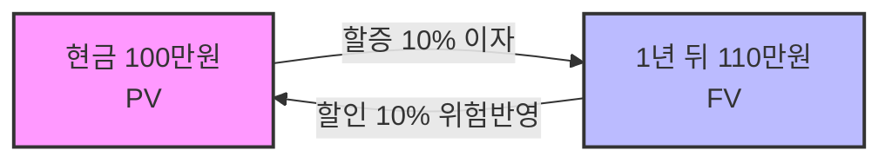

import Callout from "@/components/mdx/Callout.astro";
import StatCards from "@/components/mdx/StatCards.astro";
import CompareTable from "@/components/mdx/CompareTable.astro";
import FormulaBox from "@/components/mdx/FormulaBox.astro";

# Chapter 1. 부의 연금술: 재무관리의 목표와 화폐의 시간가치

학우 여러분, 반갑습니다. '교수님'과 함께하는 **재무관리(Financial Management)**의 세계에 오신 것을 환영합니다. 경영학의 여러 분야 중에서도 재무관리는 가장 차갑고 논리적이지만, 동시에 가장 역동적인 '돈의 흐름'을 다루는 학문입니다.

<Callout type="note">
사람들은 흔히 재무관리를 단순히 '회계'와 혼동하곤 합니다. 하지만 회계가 과거의 기록을 통해 성적표를 만드는 작업이라면, 재무관리는 그 성적표를 바탕으로 **"미래의 가치를 창조하는 의사결정"**을 내리는 작업입니다.
</Callout>

---

## 1. 재무관리의 북극성: 무엇을 위해 관리하는가?

기업의 모든 행동에는 목적이 있어야 합니다.

### (1) 이윤 극대화 vs 기업가치 극대화

<CompareTable
  title="재무관리의 목표 변천사"
  leftTitle="이윤 극대화 (Profit Maximization)"
  rightTitle="기업가치 극대화 (Value Maximization)"
  rows={[
    { label: "목표의 대상", left: "단기적인 '회계상 당기순이익'", right: "장기적인 '주식가치 총액 (주주 부)'" },
    { label: "시점 고려", left: "타이밍을 무시함 (미래의 1억 = 현재의 1억)", right: "★ 화폐의 시간가치를 엄격히 반영" },
    { label: "위험 고려", left: "위험 수준을 무시함", right: "★ 현금흐름의 불확실성(위험)을 할인율에 반영" },
    { label: "평가", left: "현대 재무학에서는 폐기된 이론", right: "현대 재무관리의 통일된 최종 목표" }
  ]}
  leftColor="#ef4444"
  rightColor="#3b82f6"
/>

따라서 현대 재무관리는 **"주주 부의 극대화(기업가치 극대화)"**를 최종 목표로 삼습니다. 이는 미래의 모든 이익과 도사리고 있는 위험을 '현재의 통찰'로 통합한 가장 진보적인 개념입니다.

### (2) 대리인 문제 (Agency Problem)

주주(본인)가 경영자(대리인)에게 회사를 위임했을 때 발생하는 근본적인 정보 비대칭과 이익 상충 문제입니다.

- **대리인 비용 3가지**: 감시비용(외부감사), 확증비용(IR 공시), 잔여손실
- **해결책**: 스톡옵션(자사주 매입 선택권) 부여를 통해 주주의 이익과 경영자의 이익을 동기화시킴.

---

## 2. 시간의 마법: 화폐의 시간가치 (TVM)

재무학의 제1원칙은 이것입니다. **"오늘의 1원은 내일의 1원보다 가치가 높다."** 왜냐하면 오늘의 1원은 1) 투자를 통한 이자수익 기회비용이 있고, 2) 인플레이션으로 인한 구매력 하락을 방어하며, 3) 불확실성(위험)이 없기 때문입니다.

<StatCards
  items={[
    {
      label: "PV",
      value: "현재가치",
      icon: "💵",
      description: "미래의 현금을 일정한 이자율로 할인한 오늘의 가치 (할인)"
    },
    {
      label: "FV",
      value: "미래가치",
      icon: "📈",
      description: "현재의 원금에 이자가 눈덩이처럼 불어난 미래의 가치 (복리)"
    },
    {
      label: "r",
      value: "할인율/이자율",
      icon: "⚖️",
      description: "시간에 대한 보상과 위험에 대한 프리미엄의 합"
    }
  ]}
  cols={3}
/>

### 🔄 가치 환산의 메커니즘

### (1) 미래가치 산출과 복리의 힘

아인슈타인이 '세계 8대 불가사의'라고 불렀던 것이 바로 **복리(Compound Interest)**입니다. 이자에 이자가 붙는 마법입니다.

<FormulaBox
  label="미래가치 (FV) 방정식"
  formula="FV_n = PV \times (1 + r)^n"
  description="이자율(r)이 높아지거나 기간(n)이 길어지면 미래가치는 기하급수적으로 폭발합니다."
  color="#10b981"
/>

### (2) 현재가치 산출과 할인의 마법

<FormulaBox
  label="현재가치 (PV) 방정식"
  formula="PV = \frac&#123;FV_n&#125;{(1 + r)^n}"
  description="미래에 받을 돈을 현재가치로 끌어오는 필수 공식입니다. 분모의 할인율(위험)이 클수록 현재 가치는 폭락합니다."
  color="#f59e0b"
/>

---

## 3. 영구연금: 마르지 않는 샘물의 가치

매달 일정액을 영원히 받는 연금(Perpetuity)의 가치는 무한대일까요? 아닙니다.

<FormulaBox
  label="영구연금의 현재가치"
  formula="PV = \frac&#123;C&#125;&#123;r&#125;"
  description="매기수령액(C)을 이자율(r)로 나눈 값. 회사의 영구적 가치나 부동산 월세 수익률 계산의 뼈대입니다."
  color="#6366f1"
/>

---

<Callout type="important">
**[금융기초 Ch1 출제 포인트 요약]**
1. 이윤 극대화의 치명적 결함 3가지: 시간 무시, 위험 무시, 현금흐름 무시.
2. 대리인 문제의 해결책 = 주식매입선택권 (스톡옵션)
3. 복리와 할인의 기본 수식 지배력: 할인율(r)이 커지면 현재가치(PV)는 작아진다.
</Callout>
