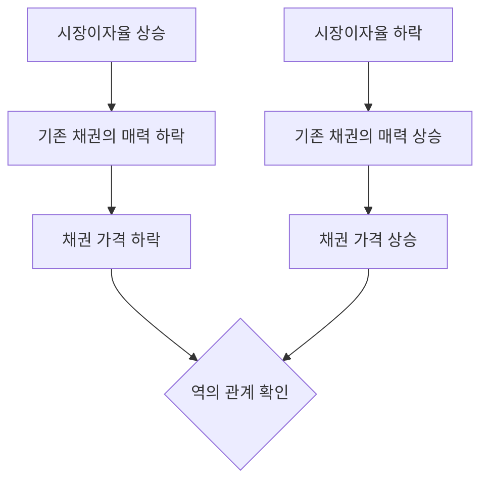

import Callout from "@/components/mdx/Callout.astro";

# Chapter 2. 가격과 가치의 미학: 주식과 채권의 가치평가

학우 여러분, 반갑습니다. 지난 시간 우리는 '화폐의 시간가치'라는 재무학의 심장을 배웠습니다. 오늘은 그 심장이 펌프질하는 실전 현장으로 가보겠습니다. 바로 **주식과 채권의 가치평가(Valuation)**입니다.

워런 버핏은 말했습니다. "가격은 당신이 지불하는 것이고, 가치는 당신이 얻는 것이다." 재무 관리자의 가장 중요한 능력은 시장에 떠도는 '가격'에 휘둘리지 않고, 그 자산이 가진 진짜 <mark><strong>"내재가치(Intrinsic Value)"</strong></mark>를 꿰뚫어 보는 눈입니다. 미래의 현금흐름을 현재의 가치로 끌어오는 마법의 공식들을 오늘 함께 정복해 봅시다.

---

## 1. 약속의 증표: 채권의 가치평가 (Bond Valuation)

채권은 발행자가 투자자에게 "언제까지 이자를 주고, 나중에 원금을 갚겠다"고 약속한 차용증서입니다.

### (1) 채권 가치 결정의 논리

채권의 가치는 미래에 받을 정해진 '이자'와 '원금'을 시장이자율(할인율)로 할인하여 합산한 것입니다.
<mark><strong>"이율이 오르면 채권 값은 떨어진다"</strong></mark>는 재무학의 기본 법칙이 여기서 탄생합니다. 왜일까요? 시장에 더 높은 이자를 주는 새로운 채권이 나왔는데, 옛날 낮은 이자를 주는 내 채권은 인기가 없어지니 가격을 깎아서 팔아야 하기 때문이죠.

### 🔄 채권 가격과 이자율의 시소 관계

---

## 2. 꿈의 가격표: 주식의 가치평가 (Stock Valuation)

주식은 채권보다 훨씬 어렵습니다. 만기도 없고, 줄 배당도 불확실하기 때문이죠. 그래서 주식은 '꿈'을 먹고 산다고 말합니다.

### (1) 배당할인모형 (DDM: Dividend Discount Model)

주식의 가치는 그 회사가 망할 때까지 줄 모든 배당금을 현재 가치로 합친 것입니다.

- **고든의 항상성장모형**: "배당이 매년 일정 비율(g)로 자라난다"고 가정했을 때의 공식입니다.
- **<mark>주가 ($P_0$) = $D_1 / (k - g)$</mark>** (D: 배당, k: 요구수익률, g: 성장률)

<Callout type="tip">
  **성장률(g)의 마법**: 공식에서 분모에 있는 성장률(g)이 조금만 커져도 주가는 폭발적으로 상승합니다.
  이것이 바로 시장이 왜 '성장주'에 열광하는지를 보여주는 수식의 증거입니다.
</Callout>

### (2) 주가수익비율 (PER)의 재해석

우리가 흔히 쓰는 PER도 결국 주식 가치평가의 요약판입니다. 이익 대비 주가가 몇 배인지 보는 것이죠. 하지만 재무학적으로 보면 PER은 <mark><strong>"이 기업의 위험이 얼마나 낮고, 성장이 얼마나 높을 것인가"</strong></mark>를 시장이 매긴 점수표입니다.

---

## 3. 깊이 들여다보기: 내재가치 vs 시장가격

지적 능력이 뛰어난 재무 관리자는 항상 이 둘을 비교합니다.

- **내재가치 > 시장가격**: 저평가 상태입니다. 사야(Buy) 하죠.
- **내재가치 < 시장가격**: 거품(Bubble) 상태입니다. 팔아야(Sell) 합니다.

<Callout type="important">
  **위험의 반영**: 채권의 가치가 '이자율'에 달렸다면, 주식의 가치는 기업의 '위험'에 달렸습니다.
  위험이 커지면 우리는 더 높은 요구수익률(k)을 요구하게 되고, 분모가 커지면서 주식의 내재가치는 뚝
  떨어지게 됩니다.
</Callout>

---

## 4. 결론: 숫자를 넘어 가치를 보십시오

오늘 우리는 복잡한 수식들을 만났습니다. 하지만 기억하십시오. 수식은 도구일 뿐입니다. 채권 가치평가 이면에는 '신뢰'가 있고, 주식 가치평가 이면에는 '미래에 대한 희망'이 있습니다.

<mark><strong>"가치는 미래의 현금흐름과 그것을 기다리는 인내심의 합작품입니다."</strong></mark> 여러분이 투자를 하든 기업을 운영하든, 가격이라는 파도 아래에 유유히 흐르는 가치라는 심해를 볼 수 있는 혜안을 가지시길 바랍니다.

---

## 📖 참고문헌
가치평가의 핵심 원리와 투자 철학을 배우기 위한 추천 도서입니다.

- **[현명한 투자자 (The Intelligent Investor)] - 벤저민 그레이엄**: 가치 투자의 창시자가 쓴 고전입니다. 오늘 배운 '내재가치'와 '안전마진'의 개념이 세상에 처음 소개된 책입니다.
- **[다모다란의 투자가치평가 (Investment Valuation)] - 아스워스 다모다란**: 가치평가의 세계적 권위자가 쓴 책으로, 주식과 채권을 넘어 스타트업과 파생상품의 가치를 산정하는 치밀한 로직을 담고 있습니다.
- **[월가의 영웅 (One Up on Wall Street)] - 피터 린치**: 수식 너머 일상의 관찰을 통해 어떻게 위대한 '성장주'를 찾아내는지 실전의 지혜를 전해줍니다.

---

수고하셨습니다. 다음 시간에는 기업이 어떤 사업에 수조 원을 투자할지 결정하는 가장 중요한 순간, **자본예산: NPV와 IRR을 활용한 투자 결정**에 대해 본격적으로 학습하겠습니다.
