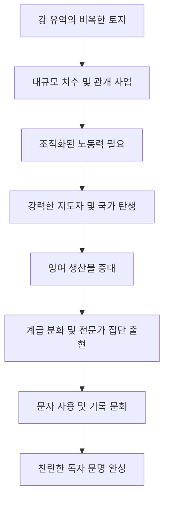

import Callout from "@/components/mdx/Callout.astro";

# Chapter 1. 모든 곳의 역사: 선사에서 문명으로

안녕하십니까, 학우 여러분. '교수님'으로서 여러분과 함께 인류라는 거대한 종의 서사시, **세계사(World History)**의 첫 페이지를 열게 되어 영광입니다. 많은 이들이 역사를 단순히 '이미 지나간 과거의 암기'라고 생각합니다. 하지만 제 생각은 다릅니다. 역사는 <mark><strong>"현재의 우리를 있게 한 수만 번의 결정과 투쟁의 생생한 기록"</strong></mark>입니다.

오늘 우리는 먼지 쌓인 연표를 외우는 대신, 지구 곳곳에서 동시에 혹은 시차를 두고 일어났던 인류의 거대한 **동시성**에 주목해 보려 합니다. 우리가 어디서 왔는지를 이해하는 것이, 우리가 어디로 가야 할지를 아는 유일한 길이기 때문입니다.

---

## 1. 인류의 여정: 생존에서 생산으로

인류의 역사는 약 250만 년 전 뗀석기를 손에 쥐면서 시작되었습니다. 하지만 인류 최대의 반전은 약 1만 년 전 일어난 **신석기 혁명(Neolithic Revolution)**이었습니다.

### 🗓️ 동서양 선사 시대 비교 연대

| 시기 (B.C.)          | 서양 / 오리엔트 (Occident)                  | 동아시아 / 한국 (Orient)  | 인류사적 의의                 |
| :------------------- | :------------------------------------------ | :------------------------ | :---------------------------- |
| **B.C. 1만 년 이전** | 라스코 동굴 벽화 (프랑스)                   | 전곡리 아슐리안 주먹도끼  | 생존: 수렵과 채집, 이동 생활  |
| **B.C. 8,000년**     | **농경과 목축의 시작** (비옥한 초승달 지대) | 신석기 정착 생활의 징후   | **생산 경제**로의 대전환      |
| **B.C. 5,000년**     | 초기 농경 마을 형성 (예리코 등)             | 빗살무늬 토기 문화 (한국) | 잉여 생산물 발생 및 계급 분화 |

신석기 혁명 이후 인류는 자연에 적응하는 것을 넘어, **자연을 통제**하기 시작했습니다. <mark><strong>"정착은 문명의 어머니이고, 농경은 역사의 연료"</strong></mark>였습니다.

---

## 2. 거대한 물줄기: 세계 4대 문명

강은 문명을 낳았습니다. 농경에 필수적인 물과 비옥한 토지를 제공했기 때문이죠. 인류 최초의 문명들은 모두 거대한 강 유역에서 꽃을 피웠습니다.

### 🔄 문명 발생의 메커니즘

---

## 3. 4대 문명의 특징과 개성

| 문명             | 중심 강             | 핵심 유산               | 특징적 세계관                               |
| :--------------- | :------------------ | :---------------------- | :------------------------------------------ |
| **메소포타미아** | 티그리스·유프라테스 | **쐐기 문자**, 지구라트 | 현세 중심적, 비관주의 (홍수 잦음)           |
| **이집트**       | 나일 강             | **상형 문자**, 피라미드 | **내세 신앙**, 영혼 불멸 (나일 강의 규칙성) |
| **인더스**       | 인더스 강           | 계획 도시 (모헨조다로)  | 정교한 하수 시설, 목욕 문화                 |
| **황하**         | 황하                | **갑골 문자**, 은허     | 조상 숭배, 정치와 종교의 결합               |

<Callout type="note">
  **지리적 운명**: 이집트는 사막과 바다로 둘러싸인 폐쇄적 지형 덕분에 수천 년간 안정된 문명을
  유지했습니다. 반면 개방적인 지형의 메소포타미아는 정복 전쟁이 잦아 매우 치열한 현세 중심의
  법전(함무라비 법전)을 낳았습니다. **<mark>"지리는 역사의 운명을 결정하는 가장 기초적인
  무대"</mark>**입니다.
</Callout>

---

## 4. 깊이 들여다보기: 문자의 힘

문자는 단순한 기록 수단이 아니었습니다. 세금을 걷고, 법을 공포하며, 왕의 권위를 멀리까지 전달하는 **통치의 도구**였습니다. 인류가 문자를 손에 쥔 순간부터 역사는 <mark><strong>'선사(Pre-history)'</strong></mark>를 끝내고 <mark><strong>'역사(History)'</strong></mark>의 시대로 진입하게 되었습니다.

---

## 5. 결론: 인간은 모두 동시대인입니다

오늘 우리는 인류의 탄생부터 문명의 발생까지를 훑어보았습니다. 비록 지리적으로는 멀리 떨어져 있었지만, 초기 인류는 공평하게 같은 문제(생존, 식량, 질서)에 직면했고, 각자의 강가에서 자신만의 답을 내놓았습니다.

우리는 이제 그 답들이 어떻게 서로 충돌하고 화합하며 거대한 세계의 그물을 짜 나가는지를 보게 될 것입니다.

---

## 📖 참고문헌
인류의 거시적 흐름을 이해하는 데 지대한 영향을 미친 명저들입니다.

- **[총, 균, 쇠 (Guns, Germs, and Steel)] - 재레드 다이아몬드**: 왜 서구가 세계를 지배하게 되었는가에 대해 지리적, 환경적 결정론으로 답하는 인류 문명사의 고전입니다.
- **[사피엔스 (Sapiens)] - 유발 하라리**: 변방의 유인원 사피엔스가 어떻게 지구의 지배자가 되었는지, '허구의 믿음'이라는 독특한 시각으로 분석합니다.
- **[문명의 창조자들 (The Creators)] - 다니엘 부어스틴**: 인류 역사를 바꾼 위대한 발견과 발명, 그리고 인간의 창조적 본능에 집중한 장엄한 역사서입니다.

---

수고하셨습니다. 다음 시간에는 이렇게 탄생한 고대 문명들이 제국으로 성장하며 동양과 서양의 각기 다른 정치 체제를 완성해 나가는 과정, **고대 제국의 형성과 종교의 탄생**에 대해 다뤄보겠습니다.
