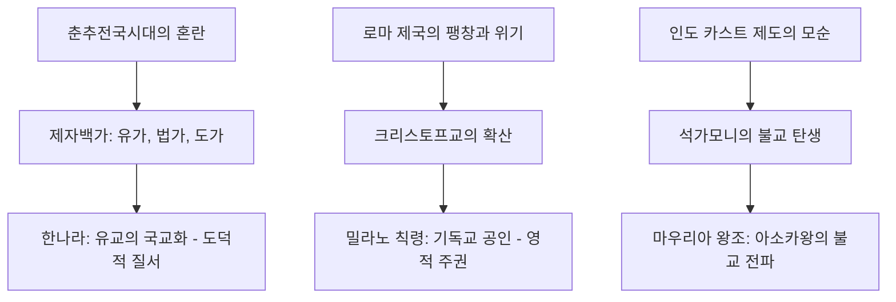

import Callout from "@/components/mdx/Callout.astro";

# Chapter 2. 제국의 시대: 고대 국가의 기틀과 사상의 탄생

학우 여러분, 다시 만나 반갑습니다. 지난 시간 우리는 인류가 어떻게 큰 강 유역에서 문명의 싹을 틔웠는지 살펴보았습니다. 오늘 우리가 다룰 주제는 그 문명들이 어떻게 거대한 영토를 다스리는 **제국(Empire)**으로 성장했는가 하는 점입니다.

단순히 영토를 넓히는 것은 전쟁의 영역이지만, 그 넓은 영토와 서로 다른 민족들을 수백 년간 하나의 질서로 묶어두는 것은 **통치와 사상**의 영역입니다. 동양과 서양이 각기 다른 환경에서 어떤 통치의 지혜를 발휘했는지 비교해 보는 것은 오늘날의 정치를 이해하는 데도 매우 큰 통찰을 줍니다.

---

## 1. 동양의 질서: 혈연에서 능력으로

고대 중국은 인류 역사상 가장 정교한 통치 시스템을 발전시킨 곳 중 하나입니다.

### (1) 주나라의 봉건제 (Feudalism)

상나라를 무너뜨린 주나라는 넓은 영토를 효율적으로 다스리기 위해 왕의 친족들에게 땅을 나누어 주는 **봉건제**를 실시했습니다.

- **특징**: 혈연을 기반으로 한 끈끈한 유대감.
- **사상**: <mark><strong>"천명(Mandate of Heaven)"</strong></mark> 사상 - 왕은 하늘의 뜻을 받들어 나라를 다스린다는 도덕적 정당성을 확보했습니다.

### (2) 진나라의 혁명: 군현제와 법치

하지만 혈연은 갈수록 멀어졌고, 중국은 전국 시대의 혼란에 빠졌습니다. 이를 통일한 **진시황**은 완전히 새로운 체제를 선언합니다.

- **군현제**: 혈연이 아닌, 왕이 직접 임명한 관리들이 지방을 다스리는 **중앙집권**의 시작.
- **법가 사상**: 인간의 선함이 아닌, 엄격한 법과 보상(신상필벌)으로 나라를 다스림.

---

## 2. 서양의 기틀: 폴리스에서 제국으로

같은 시기 서양에서는 그리스의 작은 도시 국가들과 이를 흡수한 거대 제국 로마가 탄생했습니다.

### (2) 로마: 지중해의 주인

그리스의 문화를 흡수한 로마는 **법과 길**을 통해 세계 제국을 완성했습니다.

### 🏛️ 고대 제국 통치 시스템 비교

| 부문          | 진·한 (중국)             | 로마 (서양)                         |
| :------------ | :----------------------- | :---------------------------------- |
| **권력 형태** | 절대적 황제권 (중앙집권) | 공화정에서 제정으로 이행            |
| **통치 기반** | 유교적 관료제, 군현제    | **로마법 (Roman Law)**, 시민권 확대 |
| **사회 구조** | 사농공상의 수직적 질서   | 원로원, 귀족과 평민의 정치적 균형   |
| **인프라**    | **만리장성** (방어 중심) | **로마의 가도** (연결 및 물류 중심) |

로마가 전 세계에 시민권을 부여하며 <mark><strong>"모든 길은 로마로 통한다(All roads lead to Rome)"</strong></mark>는 포용 정책을 펼친 것은 동양의 중앙집권과는 또 다른 제주의의 매력을 보여줍니다.

---

## 3. 제국을 떠받치는 기둥: 사상과 종교

제국은 무력만으로 유지되지 않습니다. 사람들의 마음을 하나로 모으는 사상이 필요했죠.

### 🔄 고대 주요 사상의 탄생 흐름도

<mark><strong>"사상은 무기보다 강하다"</strong></mark>는 말은 고대사에서 증명됩니다. 한나라가 망해도 유교는 살아남았고, 로마가 무너져도 기독교는 서구 사회의 근간이 되었습니다.

---

## 4. 깊이 들여다보기: 제국의 붕괴와 그 이후

모든 제국은 멸망합니다. 비대해진 관료제, 외부 이민족의 침입, 그리고 내부적인 부패는 거대한 제국들을 무너지게 했습니다. 하지만 제국이 남긴 법, 문자, 사상은 사라지지 않고 다음 시대를 준비하는 씨앗이 되었습니다.

<Callout type="warning">
  **제국의 역설**: 제국은 평화(Pax)를 가져다주기도 하지만, 그 평화는 정복당한 수많은 민족의 희생
  위에 세워진 것입니다. 역사를 읽을 때 우리는 항상 **승자의 기록 이면**을 들여다보아야 합니다.
</Callout>

---

## 5. 결론: 오늘날 우리가 제국을 공부하는 이유

오늘 우리는 고대 제국들이 어떻게 사람들을 다스리고, 어떤 사상으로 세상을 조직했는지 보았습니다. 우리가 지금 쓰는 법 체계, 우리가 믿는 가치관의 상당 부분은 이미 2000년 전 이 거대 제국들의 용광로 안에서 만들어진 것입니다.

여러분 자신이 속한 사회가 유교적 질서에 가까운지, 혹은 로마의 법치와 공화정 전통에 가까운지 한 번 생각해보는 계기가 되었으면 합니다.

---

## 📖 참고문헌
제국의 흥망성쇠와 고대인의 지혜를 엿볼 수 있는 명저들입니다.

- **[로마 제국 쇠망사 (The History of the Decline and Fall of the Roman Empire)] - 에드워드 기번**: 제국이라는 거대한 유기체가 어떻게 늙고 병들어가는지 그 과정을 장엄하게 기록한 역사학의 고전입니다.
- **[사기 (Records of the Grand Historian)] - 사마천**: 동양 역사학의 정수입니다. 통계나 연표가 아닌 '인간'의 삶을 통해 제국의 역동성을 보여줍니다.
- **[국가 (The Republic)] - 플라톤**: 올바른 국가와 정의란 무엇인가에 대한 서양 정치 철학의 근원적 질문을 담고 있습니다.

---

수고하셨습니다. 다음 시간에는 이렇게 형성된 제국들이 무너지고, 기사들의 시대인 **중세의 명암과 종교적 세계관**에 대해 본격적으로 학습해 보겠습니다.
