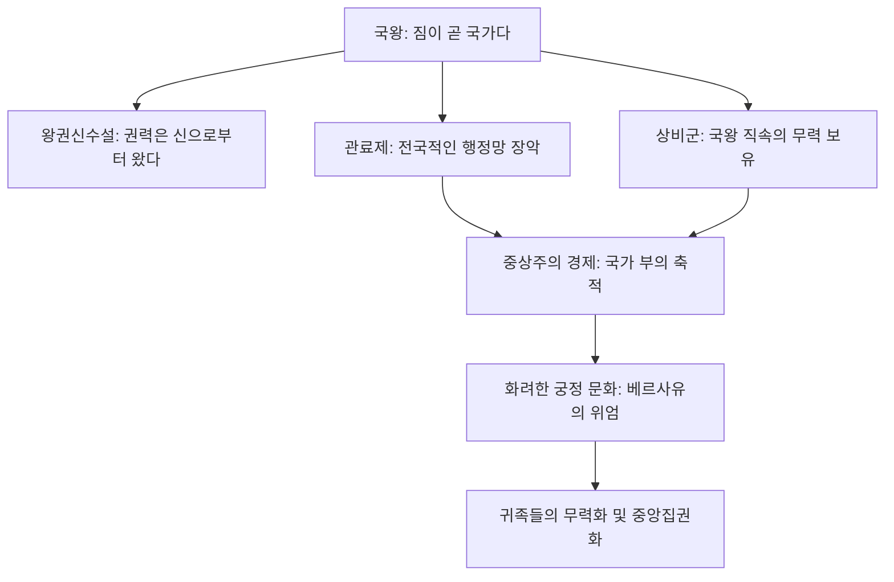

import Callout from "@/components/mdx/Callout.astro";

# Chapter 5. 이성의 시대: 과학 혁명과 절대 왕정의 충돌

반갑습니다, 역사학도 여러분. 지난 시간 우리는 르네상스와 종교 개혁을 통해 인간이 어떻게 신의 그늘에서 벗어나 자신의 주체성을 자각했는지 배웠습니다. 오늘 우리는 그 자각이 실질적인 세상의 변화로 이어진 두 개의 거대한 물줄기를 살펴보려 합니다. 하나는 우주의 비밀을 풀어낸 **과학 혁명**이고, 다른 하나는 지상의 권력을 하나로 모은 **절대 왕정**입니다.

이 시대는 한마디로 <mark><strong>"전통적 권위와 새로운 이성의 치열한 투쟁"</strong></mark>의 시기였습니다. 교회와 국왕이 "우리가 진리다"라고 외칠 때, 과학자들은 "증거를 가져오라"고 답했습니다. 이 긴장이 어떻게 현대 사회의 토대를 만들었는지 따라가 봅시다.

---

## 1. 우주의 지도를 다시 그리다: 과학 혁명

16세기와 17세기에 걸쳐 일어난 과학 혁명은 인류의 사고방식을 근본적으로 바꾸어 놓았습니다. 핵심은 눈에 보이지 않는 권위보다 <mark><strong>"관찰과 실험, 그리고 수학"</strong></mark>을 신뢰하기 시작했다는 점입니다.

### 🔭 과학적 사고의 패러다임 전환

| 인물                    | 핵심 업적                       | 시사점                                                          |
| :---------------------- | :------------------------------ | :-------------------------------------------------------------- |
| **코페르니쿠스**        | **지동설(Heliocentrism)** 제안  | 인간 중심의 우주관(천동설)에 대한 최초의 도전                   |
| **갈릴레이**            | 망원경 관찰 및 관성의 법칙 발견 | "그래도 지구는 돈다" - 종교적 권위에 맞선 과학의 용기           |
| **뉴턴 (Isaac Newton)** | **만유인력의 법칙** 확립        | 우주 전체가 하나의 기계처럼 정교한 법칙(수학)으로 돌아감을 증명 |

뉴턴에 의해 우주는 더 이상 신이 매 순간 마법을 부리는 공간이 아니라, 수학적으로 예측 가능한 <mark><strong>'거대한 시계'</strong></mark>가 되었습니다. 이는 인간이 이성을 통해 자연의 법칙을 지배할 수 있다는 거대한 자신감을 안겨주었습니다.

---

## 2. 지상의 태양 아래로: 절대 왕정(Absolutism)

과학이 하늘의 주인을 바꾸고 있을 때, 지상에서는 국왕들이 자신을 세상의 중심이라고 선언했습니다. 이를 상징하는 인물이 바로 프랑스의 루이 14세, **태양왕**입니다.

### 절대 왕정의 권력 구조 (Flowchart)

절대 왕정은 **왕권신수설(Divine Right of Kings)**이라는 사상적 무기와 **관료제 및 상비군**이라는 물리적 도구를 통해 지방 영주들을 누르고 권력을 독점했습니다. 특히 루이 14세의 "짐이 곧 국가다(L'État, c'est moi)"라는 말은 이 시기 국가 권력의 정점을 상징합니다.

---

## 3. 중상주의: 국가라는 이름의 주식회사

절대 왕정을 유지하려면 막대한 돈이 필요했습니다. 전쟁을 치르고, 상비군을 먹이고, 화려한 궁전을 지어야 했기 때문이죠. 여기서 탄생한 경제 정책이 **중상주의(Mercantilism)**입니다.

<Callout type="important">
  **중상주의의 논리**: "세계의 부(금과 은)는 한정되어 있다. 따라서 남보다 더 많이 가지려면 수출을
  늘리고 수입을 억제해야 한다."
</Callout>

중상주의는 국가가 경제에 적극적으로 개입하게 만들었습니다. 관세를 높여 수입품을 막고, 식민지를 건설하여 원료를 빼앗아 오고 시장을 개척했습니다. 이 과정에서 유럽은 부유해졌지만, 세계의 다른 지역들은 제국주의의 희생양이 되기 시작했습니다.

---

## 4. 왕권에 균열을 내는 목소리: 사회 계약설

국왕의 권력이 절대적이었던 만큼, 이에 저항하는 사상적 흐름도 강력해졌습니다. 과학 혁명이 "자연에는 법칙이 있다"고 가르쳤듯이, 사상가들은 "정치에도 보편적인 법칙이 있다"고 주장하기 시작했습니다.

### 📜 사회 계약설의 핵심 인물 비교

1.  **홉스 (Thomas Hobbes)**: "인간은 만인의 만인에 대한 투쟁 상태다. 혼란을 막기 위해 강력한 군주(리바이어던)에게 권력을 다 줘야 한다." (절대 왕정 옹호적)
2.  **로크 (John Locke)**: "정부의 목적은 생명, 자유, 재산을 보호하는 것이다. <mark><strong>왕이 이를 어기면 인민은 저항할 권리(저항권)가 있다.</strong></mark>" (근대 민주주의의 초석)

로크의 생각은 혁명적이었습니다. 권력의 원천이 신이 아니라 **사람들 사이의 계약**에서 나온다는 이 생각은 훗날 미국 독립 혁명과 프랑스 대혁명의 불꽃이 됩니다.

---

## 5. 결론: 거대한 변화의 전야

학우 여러분, 17세기의 유럽은 마치 폭발 직전의 압력솥과 같았습니다. 뉴턴의 과학은 낡은 미신을 부수고 있었고, 루이 14세의 절대 권력은 그 화려함 속에 이미 재정 위기와 분노의 씨앗을 품고 있었습니다.

무엇보다 중요한 것은, 이 시기를 거치며 사람들의 머릿속에 <mark><strong>'이성(Reason)'</strong></mark>이라는 강력한 무기가 자리 잡았다는 점입니다. 이제 사람들은 더 이상 어둠 속에서 기도만 하지 않습니다. 질문하고, 계산하고, 행동하기 시작했습니다.

다음 시간, 우리는 이 이성의 불꽃이 어떻게 낡은 체제를 불사지르고 시민이 주인이 되는 시대를 열었는지—**시민 혁명과 산업 혁명**을 통해 근대 세계의 완성을 살펴보겠습니다.

---

## 📖 참고문헌
이성의 비상과 제국주의의 명암을 깊이 있게 통찰하고 싶은 분들을 위한 추천 도서입니다.

- **[과학 혁명의 구조 (The Structure of Scientific Revolutions)] - 토머스 쿤**: 과학적 지식이 단순히 쌓이는 것이 아니라, '패러다임'의 전환을 통해 어떻게 혁명적으로 변하는지 보여주는 현대의 고전입니다.
- **[루이 14세와 베르사유 궁전] - 주경철**: 태양왕 루이 14세가 어떻게 베르사유를 통해 절대 권력을 시각화하고 통제했는지, 그 화려함 이면의 정치를 파헤칩니다.
- **[정의론 (A Theory of Justice)] - 존 롤스**: 사회 계약설의 현대적 계승자로, 공정하고 정의로운 사회를 위한 합리적 이성의 역할이 무엇인지 깊이 있게 논합니다.

---

수고하셨습니다. 여러분이 서 있는 지금 이 자리가 수많은 이성적 분투의 결과임을 기억하는 하루가 되길 바랍니다.
