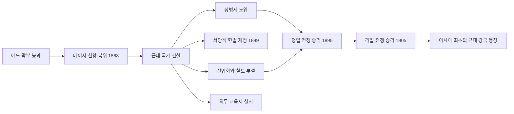

import Callout from "@/components/mdx/Callout.astro";

# Chapter 7. 민족주의와 제국주의: 통일과 팽창의 시대

반갑습니다, 학우 여러분. 지난 시간 우리는 시민 혁명과 산업 혁명이라는 두 거대한 물결이 어떻게 현대 세계의 토대를 놓았는지를 살펴보았습니다. 자유주의와 민족주의라는 두 이념을 가슴에 품은 19세기의 인류는 이제 더욱 역동적인 역사의 무대로 걸어 들어갑니다.

오늘 우리가 다룰 주제는 **민족주의와 제국주의**입니다. 하나의 민족이 하나의 국가를 이루어야 한다는 열망이 유럽의 지도를 다시 그리는 한편, 산업 혁명으로 무장한 유럽 열강은 아시아와 아프리카를 향해 날카로운 발톱을 드러냈습니다. 그리고 그 격랑 속에서 일본이라는 나라는 전혀 예상치 못한 방법으로 살아남는 길을 선택했습니다.

---

## 1. 피와 철로 세워진 제국: 독일과 이탈리아의 통일

19세기 중반까지만 해도 '독일'과 '이탈리아'는 나라 이름이 아니었습니다. 수십 개의 소왕국과 공국으로 쪼개진 지리적 개념에 불과했죠. 그러나 민족주의의 불꽃은 이 분열된 땅에서도 강렬하게 타올랐습니다.

### 🇩🇪 독일의 통일: 비스마르크와 '철혈 정책'

프로이센의 재상 <mark><strong>오토 폰 비스마르크(Otto von Bismarck)</strong></mark>는 현실 정치의 화신이었습니다. 그는 유명한 연설에서 선언했습니다. *"당면한 위대한 문제들은 연설과 다수결로 결정되는 것이 아니라, 오직 피와 철(Blut und Eisen)로 결정된다."*

비스마르크는 3차에 걸친 전쟁으로 독일 통일을 완성했습니다.

| 전쟁 | 연도 | 결과 |
|------|------|------|
| 대덴마크 전쟁 | 1864 | 슐레스비히-홀슈타인 획득 |
| 프로이센-오스트리아 전쟁 | 1866 | 오스트리아 배제, 북독일연방 결성 |
| 프로이센-프랑스 전쟁 | 1870~71 | 알자스-로렌 획득, 독일 제국 선포 |

1871년 1월 18일, 프랑스 베르사유 궁전 거울의 방에서 <mark><strong>빌헬름 1세</strong></mark>가 독일 황제로 즉위했습니다. 굴욕적인 방법으로 완성된 통일이었지만, 이로써 유럽 최강의 육군 국가가 탄생했습니다.

<Callout type="important">
  **역사의 복수**: 비스마르크가 굴욕적인 장소(베르사유 궁전)를 선택해 독일 제국을 선포한 것은 프랑스에 깊은 원한을 심었습니다. 그리고 44년 후, 같은 장소에서 독일은 제1차 세계 대전의 패전국으로서 굴욕적인 베르사유 조약에 서명하게 됩니다.
</Callout>

### 🇮🇹 이탈리아의 통일: 외교·무력·민중의 삼위일체

이탈리아 통일은 세 영웅의 역할 분담으로 이루어졌습니다.

- **카보우르(Cavour)**: 사르데냐 왕국의 재상. 냉철한 외교가로 프랑스와 동맹을 맺어 오스트리아를 축출.
- **가리발디(Garibaldi)**: '천인대(붉은 셔츠단)'를 이끌고 남이탈리아를 해방한 민족 영웅.
- **비토리오 에마누엘레 2세**: 사르데냐 왕국의 군주로 통일 이탈리아 왕국의 초대 국왕이 됨.

1870년 로마가 수도로 편입되며 이탈리아 반도의 통일이 완성되었습니다.

---

## 2. 동아시아의 선택: 메이지 유신과 근대화

19세기 중반, 아시아의 나라들은 유럽의 팽창 앞에 서로 다른 운명을 맞이했습니다. 중국(청나라)은 아편 전쟁과 굴욕적인 불평등 조약으로 반식민지 상태에 빠졌고, 조선은 쇄국 정책으로 버텼습니다.

그러나 일본은 달랐습니다. 1853년 미국의 페리 제독이 흑선(黑船)을 이끌고 개항을 강요하자, 일본은 충격 속에서 근본적인 선택을 했습니다.

### 🇯🇵 메이지 유신(1868): 동아시아의 자기 혁명

<mark><strong>메이지 유신(明治維新)</strong></mark>은 단순한 정치 개혁이 아니었습니다. 일본 사회 전체를 서양식으로 재구조화하려는 문명 대전환이었습니다.

1904~05년의 **러일 전쟁** 승리는 전 세계를 뒤흔들었습니다. 유색 인종의 아시아 국가가 유럽 열강을 격파했다는 소식은 식민지 피지배 민족에게 강렬한 희망과 자극을 주었습니다.

---

## 3. 아프리카의 비극: 제국주의의 민낯

### 신제국주의(New Imperialism)의 논리

유럽 열강들이 아시아와 아프리카를 분할하며 내세운 명분은 다음과 같았습니다.

1. **경제적 동기**: 산업화에 필요한 원료 공급지와 잉여 상품의 시장.
2. **전략적 동기**: 해군 기지와 무역로 확보.
3. **이념적 명분**: 사회 다윈주의("강한 민족이 약한 민족을 지배하는 것은 자연의 법칙")와 '문명화 사명'.

<Callout type="important">
  **사회 다윈주의의 왜곡**: 다윈의 자연 선택 이론은 생물의 적응을 설명하는 과학이었습니다. 그러나 제국주의자들은 이를 "우월한 인종이 열등한 인종을 지배하는 것이 정당하다"는 식으로 악용했습니다. 과학이 폭력과 착취를 정당화하는 도구로 둔갑한 것이죠.
</Callout>

### 아프리카의 분할: 베를린 회의(1884~85)

1884년, 유럽 열강은 베를린에 모여 아프리카를 마치 케이크 자르듯 나누었습니다. **한 명의 아프리카인도 협상 테이블에 없었습니다.** 1914년까지 에티오피아와 라이베리아를 제외한 아프리카 전역이 유럽의 식민지로 전락했습니다.

---

## 4. 역사의 교훈: 민족주의는 양날의 검

민족주의는 분열된 민족을 통합하고 식민지 지배에 저항하는 강력한 힘이었습니다. 그러나 동시에, 다른 민족을 배타적으로 차별하고 제국주의적 팽창을 정당화하는 논리로도 악용되었습니다.

<mark><strong>"우리 민족이 위대하다"</strong></mark>는 자부심이 <mark><strong>"그러므로 다른 민족을 지배해도 된다"</strong></mark>는 오만으로 변질될 때, 역사는 피로 물들었습니다. 이 교훈은 21세기에도 여전히 유효합니다.

---

## 📚 핵심 체크리스트

- [ ] 비스마르크가 독일 통일을 위해 사용한 현실 정치적 방법론을 무엇이라 하나요? (답: 철혈 정책 / 실력 정치(Realpolitik))
- [ ] 메이지 유신의 결과, 일본이 아시아 최초로 격파한 유럽 강대국은 어디인가요? (답: 러시아 - 1905년 러일 전쟁)
- [ ] 1884~85년 유럽 열강이 아프리카를 분할하기 위해 개최한 회의를 무엇이라 하나요? (답: 베를린 회의)

---

## 📖 추천 도서

- **[독일 제국주의의 길 (Paths to the German Empire)] - 다양한 저자**: 비스마르크의 외교 전략과 독일 통일의 역학을 분석하는 고전적 연구서들.
- **[메이지 유신 (The Meiji Restoration)] - W.G. 비즐리**: 일본 근대화의 성격과 한계를 객관적으로 분석한 영문 고전.
- **[아프리카 분할 (The Scramble for Africa)] - 토머스 파켄햄**: 베를린 회의부터 1차 세계 대전까지, 유럽의 아프리카 분할 과정을 생생하게 서술한 대작.

---

수고하셨습니다. 다음 시간에는 이 모든 갈등이 한꺼번에 폭발한 **제1차 세계 대전**을 살펴보겠습니다.
