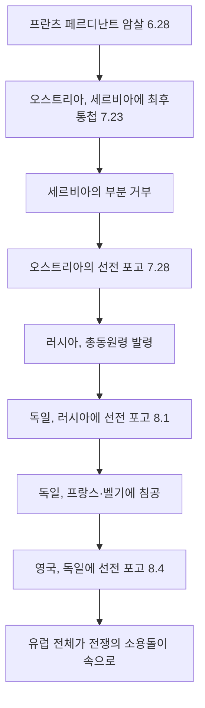

import Callout from "@/components/mdx/Callout.astro";

# Chapter 8. 제1차 세계 대전: 참호 속의 인류, 그리고 새로운 세계

학우 여러분, 지난 시간 우리는 19세기의 화려한 민족주의와 제국주의가 유럽을 얼마나 팽팽한 긴장의 도화선 위에 올려놓았는지를 살펴보았습니다. 오늘, 그 도화선에 마침내 불이 붙는 순간을 함께 목격하겠습니다.

1914년 7월 28일. 인류는 그날까지 경험해보지 못했던 규모의 전쟁 속으로 걸어 들어갔습니다. 4년 3개월 후, 전쟁이 끝났을 때 세상에는 약 1,700만 명의 시체와, 아무것도 해결되지 않은 채 더욱 복잡해진 세계 질서만이 남아있었습니다.

오늘은 제1차 세계 대전의 원인, 전개, 그리고 그것이 남긴 상처를 깊이 있게 파헤쳐 보겠습니다.

---

## 1. 왜 전쟁이 터졌나: 화약고 위의 유럽

역사가들은 1차 세계 대전의 원인을 네 가지 키워드로 요약합니다. **M.A.I.N.**

| 원인 | 내용 |
|------|------|
| **M**ilitarism (군국주의) | 독일·영국·러시아 등이 군비 경쟁에 돌입, 전쟁 대비 태세 극대화 |
| **A**lliances (동맹 체제) | 삼국 동맹(독일·오스트리아·이탈리아) vs 삼국 협상(영국·프랑스·러시아) |
| **I**mperialism (제국주의) | 식민지 쟁탈 경쟁에서 비롯된 열강 간 갈등과 불신 |
| **N**ationalism (민족주의) | 오스트리아-헝가리 제국 내 슬라브 민족의 독립 열망 |

이 모든 요소가 빽빽이 압축된 상태에서, 단 하나의 불꽃이 필요했습니다.

### 🔫 사라예보의 총성 (1914.6.28)

보스니아의 수도 사라예보. 오스트리아-헝가리 제국의 황태자 <mark><strong>프란츠 페르디난트 대공</strong></mark>이 방문 중이었습니다. 세르비아 민족주의 단체 '검은 손'의 청년 <mark><strong>가브릴로 프린치프</strong></mark>가 쏜 두 발의 총성.

이 한 사건이 동맹 체제의 도미노를 넘어뜨렸습니다.

<Callout type="important">
  **도미노의 공포**: 이 연쇄 반응은 불과 37일 만에 일어났습니다. 1914년 6월 28일 암살 사건부터 8월 4일 영국의 선전 포고까지. 어느 한 나라도 이 전쟁을 원하지 않는다고 주장했지만, 어느 나라도 멈추지 않았습니다. 경직된 동맹 체제와 군사 동원 계획이 인간의 이성을 압도했던 것입니다.
</Callout>

---

## 2. 지옥의 전쟁: 참호전(Trench Warfare)

"크리스마스까지는 집에 돌아온다." — 1914년 여름, 전쟁터로 떠나는 병사들의 말이었습니다.

현실은 달랐습니다. 기관총, 철조망, 독가스. 19세기의 낭만적 전쟁관이 20세기 산업 기술의 잔혹함 앞에 무너졌습니다.

### ⚔️ 서부 전선의 참호 지옥

영국 해협에서 스위스 국경까지, 750km에 달하는 참호선이 4년 내내 거의 움직이지 않았습니다.

| 전투 | 기간 | 희생자 |
|------|------|--------|
| 베르됭 전투 | 1916년 2월~12월 | 약 70만 명 |
| 솜 전투 | 1916년 7월~11월 | 약 120만 명 (첫날 영국군 5만 7천 명 사상) |
| 파스샹달 전투 | 1917년 | 약 50만 명 |

병사들은 쥐와 이, 진흙과 포탄 속에서 살았습니다. 참호열(Trench Fever), 포탄 충격(Shell Shock, 오늘날의 PTSD)이 만연했습니다. 이것이 **총력전(Total War)**의 현실이었습니다.

---

## 3. 전쟁의 확대: 세계 속으로

이 전쟁이 '세계 대전'이 된 이유가 있습니다.

- **오스만 제국 참전**: 중동 전선이 열렸습니다. 영국은 아랍 민족에게 독립을 약속하며 봉기를 지원했습니다('아라비아의 로렌스').
- **식민지 병사들**: 영국의 인도·오스트레일리아·캐나다·아프리카 병사들, 프랑스의 북아프리카 병사들이 유럽의 전쟁터에 끌려왔습니다. 이들의 희생이 후일 민족 독립 운동의 불씨가 됩니다.
- **미국의 참전 (1917)**: 독일의 무제한 잠수함 작전과 짐머만 전보를 계기로 미국이 참전, 전세를 결정적으로 기울였습니다.
- **러시아 혁명 (1917)**: 전쟁의 고통을 견디지 못한 러시아에서 볼셰비키 혁명이 발발, 러시아가 전선에서 이탈했습니다.

---

## 4. 종전과 상처: 베르사유 조약의 유산

1918년 11월 11일 오전 11시, 총성이 멎었습니다. 그러나 진정한 평화는 오지 않았습니다.

### 베르사유 조약 (1919): 복수인가, 평화인가?

| 조항 | 내용 |
|------|------|
| 전쟁 책임 조항 (제231조) | 독일이 전쟁에 대한 모든 책임을 지게 함 |
| 배상금 | 1,320억 금 마르크 (현재 가치 수백조 원) |
| 영토 박탈 | 알자스-로렌 반환, 식민지 전부 몰수 |
| 군비 제한 | 육군 10만 명으로 제한, 공군·잠수함 금지 |

미국 대통령 우드로 윌슨은 **'14개조 원칙'**으로 민족 자결, 군비 축소, 국제 연맹 창설을 약속했습니다. 그러나 미국 상원은 국제 연맹 참가를 거부했고, 연맹은 이빨 빠진 호랑이로 전락했습니다.

<Callout type="important">
  **역사의 예고편**: 존 메이너드 케인스는 베르사유 조약을 "평화 조약이 아니라 20년의 휴전"이라고 예언했습니다. 굴욕적인 배상 요구와 영토 상실은 독일인의 마음속에 복수심을 심었습니다. 20년 후 그 복수심을 이용한 한 인물이 등장하게 됩니다 — 아돌프 히틀러.
</Callout>

---

## 5. 전쟁이 남긴 것들: 세계 지도의 재편

1차 세계 대전은 4개의 제국을 역사에서 지웠습니다.

- **오스만 제국** → 터키 공화국 + 영·프 위임 통치령 (현재의 이라크, 시리아, 팔레스타인)
- **오스트리아-헝가리 제국** → 오스트리아, 헝가리, 체코슬로바키아, 유고슬라비아 등으로 분리
- **러시아 제국** → 소비에트 연방 (볼셰비키 혁명)
- **독일 제국** → 바이마르 공화국

새로 탄생한 국경선들은 민족 분포를 제대로 반영하지 못했고, 각지에서 소수 민족 문제라는 시한폭탄을 안고 태어났습니다.

---

## 📚 핵심 체크리스트

- [ ] 1차 세계 대전의 구조적 원인을 나타내는 4가지 키워드(약어)를 말해보세요. (답: M.A.I.N. — 군국주의, 동맹 체제, 제국주의, 민족주의)
- [ ] 사라예보에서 암살된 인물은 누구이며, 어떤 조직이 이를 저질렀나요? (답: 오스트리아-헝가리 황태자 프란츠 페르디난트 대공 / 세르비아 민족주의 단체 '검은 손')
- [ ] 베르사유 조약의 제231조는 무엇을 규정하고 있으며, 이것이 이후 역사에 어떤 영향을 주었나요? (답: 독일의 전쟁 책임 조항. 독일의 극단적 민족주의와 나치즘의 등장에 기여했습니다.)

---

## 📖 추천 도서

- **[8월의 총성 (The Guns of August)] - 바버라 터크먼**: 1914년 8월, 유럽이 어떻게 전쟁으로 미끄러져 들어갔는지를 현장감 넘치는 필치로 서술한 퓰리처상 수상작.
- **[서부 전선 이상 없다 (All Quiet on the Western Front)] - 에리히 마리아 레마르크**: 참호전의 공포를 직접 경험한 독일 병사의 눈으로 바라본, 전쟁의 비인간성을 고발하는 반전 소설의 걸작.
- **[베르사유 조약 (The Peace to End All Peace)] - 데이비드 프롬킨**: 1차 세계 대전 이후 중동 질서가 어떻게 오늘날까지 이어지는 갈등의 씨앗이 되었는지를 추적합니다.

---

수고하셨습니다. 다음 시간에는 이 전쟁이 낳은 상처와 분노가 어떻게 전체주의라는 괴물을 탄생시켰는지 살펴보겠습니다.
