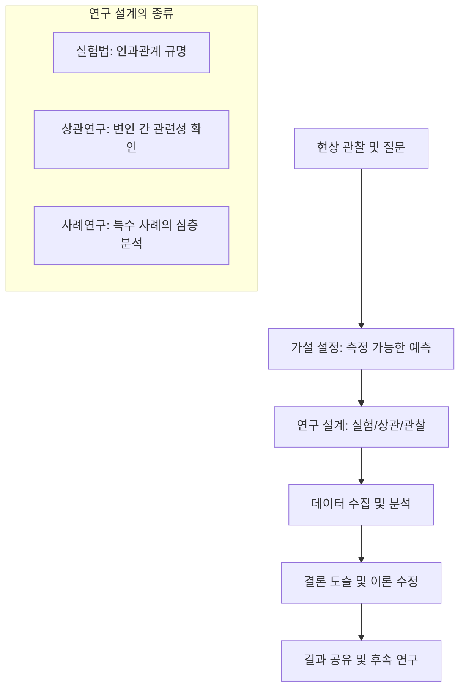

import Callout from "@/components/mdx/Callout.astro";

# Chapter 1. 심리학의 기초와 인간 행동의 이해

안녕하세요, 여러분. '교수님'으로서 여러분을 마음의 과학, **심리학(Psychology)**의 세계로 안내하게 되어 기쁩니다. 많은 분이 심리학을 '상대방의 마음을 읽는 독심술'이나 '성격 테스트' 정도로 생각하곤 합니다. 하지만 제가 정의하는 심리학은 <mark><strong>"가장 주관적인 인간의 경험을 가장 객관적인 방법으로 증명하려는 고귀한 노력"</strong></mark>입니다.

우리는 왜 특정한 방식으로 행동할까요? 우리의 생각은 어디서 올까요? 오늘 우리는 이 오래된 질문에 답하기 위해, 심리학이 쌓아온 지적인 토대를 하나씩 살펴보겠습니다.

---

## 1. 심리학의 기원: 철학에서 과학으로

심리학은 본래 철학의 한 줄기였습니다. 아리스토텔레스부터 데카르트까지, 인간의 '영혼'에 대해 사유하던 학문이었죠. 그러다 1879년, 빌헬름 분트(Wilhelm Wundt)가 독일 라이프치히 대학에 최초의 심리학 실험실을 세우면서 비로소 **독립된 과학**으로서의 길을 걷기 시작했습니다.

- **철학적 단계**: "인간의 마음이란 무엇인가?" (사유와 논리)
- **과학적 단계**: "마음은 어떻게 작동하며, 이를 어떻게 측정할 것인가?" (관찰과 실험)

---

## 2. 마음을 바라보는 5가지 렌즈: 주요 학파의 이해

인간의 마음은 너무도 복잡해서 하나의 관점만으로는 다 설명할 수 없습니다. 심리학 역사를 수놓은 대표적인 학파들을 통해 인간을 바라보는 다양한 시각을 익혀봅시다.

### 🎭 심리학 주요 학파 및 관점 비교

| 학파 (관점)  | 대표 학자          | 핵심 키워드             | 인간을 바라보는 관점                        |
| :----------- | :----------------- | :---------------------- | :------------------------------------------ |
| **정신분석** | **프로이트**       | <mark>무의식</mark>, 어린 시절   | 보이지 않는 본능과 무의식에 지배당하는 존재 |
| **행동주의** | **스키너, 왓슨**   | <mark>자극-반응 (S-R)</mark>     | 환경에 의해 학습되고 통제되는 유기체        |
| **인본주의** | **로저스, 매슬로** | <mark>자아실현</mark>, 자유 의지 | 스스로 성장하고 실현할 잠재력을 가진 주체   |
| **인지주의** | **피아제, 나이서** | <mark>정보 처리</mark>, 도식     | 컴퓨터처럼 정보를 입력, 저장, 인출하는 존재 |
| **생물학적** | **-**              | **신경전달물질**, 진화  | 뇌의 전기화학적 반응과 유전의 결과물        |

현대 심리학은 어느 한 학파에 고립되지 않고, 이 모든 관점을 통합하여 현상을 해석합니다. 이를 **통합적 접근(Eclectic Approach)**이라고 부르죠.

---

## 3. 심리학의 연구 방법: 과학의 증명

심리학이 '점술'과 다른 이유는 그 **방법론**에 있습니다. 우리는 가설을 세우고 이를 엄격하게 검증합니다.

### 🔄 심리학적 연구의 순환 과정

특히 **실험법**은 원인(독립변인)이 되는 조건을 조작하여 결과(종속변인)가 어떻게 변하는지 살펴봄으로써 <mark><strong>인간 행동의 인과관계를 밝히는 심리학의 가장 강력한 무기</strong></mark>입니다.

---

## 4. 깊이 들여다보기: 마음과 몸의 연결 (Mind-Body)

과거에는 마음과 몸을 분리된 것으로 보았습니다. 하지만 현대 심리학은 **심신상관**을 강조합니다. 우리의 기분이 면역 체계를 변화시키고, 거꾸로 장내 미생물의 상태가 우리의 우울감을 결정하기도 합니다.

<Callout type="important">
  **위약 효과 (Placebo Effect)**: 단순히 "나을 것이다"라는 믿음만으로 실제 신체적 변화가 일어나는
  현상은 심리학과 의학의 경계에서 마음의 힘이 얼마나 강력한지를 보여주는 대표적인 사례입니다.
</Callout>

---

## 5. 결론: 나를 이해하는 첫 번째 거울

오늘 우리는 심리학의 숲에 들어가는 지도를 손에 넣었습니다. 심리학은 타인을 조종하기 위한 도구가 아닙니다. 오히려 **"나는 왜 이렇게 느끼고 행동하는가?"**에 대한 답을 찾는 거울에 가깝습니다.

이 거울을 통해 여러분 자신의 무의식을 엿보고, 학습의 원리를 깨달으며, 더 나아가 타인과 공감하는 법을 배우게 될 것입니다.

---

## 📖 참고문헌
심리학의 지평을 넓혀줄 명저들을 소개합니다.

- **[꿈의 해석 (The Interpretation of Dreams)] - 지그문트 프로이트**: 무의식이라는 미지의 대륙을 처음으로 발견한 기념비적인 저작입니다. 다소 어렵더라도 심리학의 원천을 이해하는 데 큰 도움이 됩니다.
- **[인간의 의미 탐구 (Man's Search for Meaning)] - 빅터 프랑클**: 죽음의 수용소라는 극한의 상황에서도 생존을 결정지은 것은 인간의 '의미 찾기'였음을 보여주는 감동적인 심리학서입니다.
- **[설득의 심리학 (Influence)] - 로버트 치알디니**: 사회 심리학적 원리가 일상과 비즈니스에서 어떻게 강력하게 작동하는지 보여주는 실전 심리학의 고전입니다.

---

오늘 강의는 여기까지입니다. 다음 시간에는 우리의 뇌와 감각이 어떻게 세상을 받아들이는지, **마음의 하드웨어와 소프트웨어**에 대해 본격적으로 공부해보겠습니다. 수고하셨습니다.
