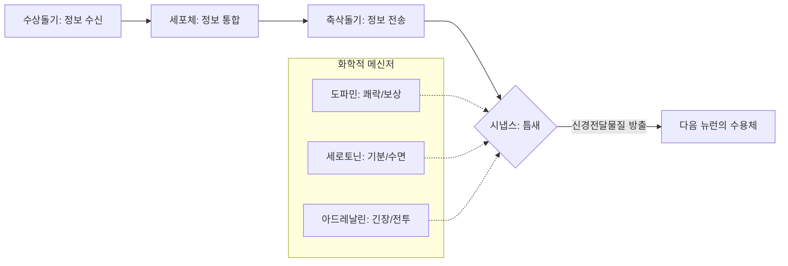

import Callout from "@/components/mdx/Callout.astro";

# Chapter 2. 뇌와 마음의 하드웨어: 신경과학과 감각 지각

학우 여러분, 다시 만나 반갑습니다. 지난 시간 우리는 심리학의 역사적 흐름과 과학적 방법론을 배웠습니다. 오늘은 심리학에서 가장 강력하게 부상하고 있는 분야인 **생물 심리학(Biological Psychology)**의 세계로 떠나보겠습니다.

인간의 마음이 정교한 소프트웨어라면, 우리의 뇌와 신경계는 그 소프트웨어가 구동되는 **최첨단 하드웨어**입니다. 우리가 느끼는 슬픔, 사랑, 그리고 창의적인 아이디어까지도 사실은 뇌 안에서 일어나는 미세한 전기화학적 반응의 결과물입니다. 오늘 우리는 이 경이로운 생물학적 기계의 작동 원리를 파헤쳐 보겠습니다.

---

## 1. 마음의 전기 신호: 뉴런과 시냅스

우리 뇌에는 약 860억 개의 **뉴런(Neuron, 신경세포)**이 있습니다. 이들은 끊임없이 정보를 주고받으며 거대한 네트워크를 형성하고 있죠.

### 🔄 신경 전달의 메커니즘

<mark><strong>"세로토닌이 부족하면 우울해지고, 도파민이 넘치면 중독에 빠진다"</strong></mark>는 말처럼, 이 호르몬들의 아주 미세한 불균형만으로도 우리의 성격과 삶의 질이 완전히 바뀔 수 있습니다. 우리는 '정신력'만으로 모든 것을 이겨낼 수 있다고 믿지만, 때로는 뇌의 화학적 균형을 맞추는 것이 더 효과적인 치유가 되기도 합니다.

---

## 2. 뇌의 지도: 부위별 기능과 역할

우리의 뇌는 부위에 따라 역할이 철저히 나누어진 **분업 시스템**입니다. 하지만 이 부위들은 서로 긴밀하게 협력하며 '나'라는 정체성을 만들어냅니다.

### 🧠 주요 뇌 부위와 기능 가이드

| 부위         | 명칭           | 주요 기능                         | 손상 시 증상                |
| :----------- | :------------- | :-------------------------------- | :-------------------------- |
| **대뇌피질** | **전두엽**     | **고등 사고**, 계획, 판단, 도덕성 | 충동 조절 장애, 인격 변화   |
| **대뇌피질** | **측두엽**     | 청각 정보 처리, 기억 저장         | 기억 상실, 언어 이해 불가   |
| **변연계**   | **편도체**     | **정서 반응**, 공포와 분노        | 정서적 둔감, 위험 감지 불가 |
| **변연계**   | **해마**       | **새로운 기억**의 장기 저장       | 새로운 사실을 학습하지 못함 |
| **소뇌**     | **Cerebellum** | 균형 잡기, 정교한 운동 조절       | 비틀거림, 정교한 작업 불가  |

특히 인간을 다른 동물과 구별 짓는 가장 큰 특징은 <mark><strong>폭발적으로 진화한 전두엽</strong></mark>입니다. 우리가 본능을 억제하고 미래를 계획할 수 있는 것은 모두 이 전두엽 덕분입니다.

---

## 3. 세상은 있는 그대로 보이지 않는다: 감각과 지각

우리는 눈에 보이는 것이 진실이라고 믿습니다. 하지만 심리학적으로 볼 때, 우리는 세상을 **보는** 것이 아니라 **해석**하는 것입니다.

- **감각 (Sensation)**: 눈, 코, 귀 등 감각 기관을 통해 외부 자극을 받아들이는 물리적 과정.
- **지각 (Perception)**: 들어온 감각 정보를 뇌가 해석하여 의미를 부여하는 심리적 과정.

<Callout type="important">
  **지각적 항등성 (Perceptual Constancy)**: 멀리 있는 차가 개미만 하게 보여도 우리가 그것을 실제
  차로 인식하는 것은 뇌가 이미 크기, 형태, 색채에 대한 항등성을 유지해주기 때문입니다. **<mark>"현상은
  변해도 실체는 변하지 않는다"</mark>**는 뇌의 놀라운 인지 능력입니다.
</Callout>

---

## 4. 뇌의 마법: 가소성 (Neuroplasticity)

과거에는 성인이 되면 뇌 세포가 줄어들기만 한다고 믿었습니다. 하지만 현대 신경과학은 **뇌의 가소성**을 증명해냈습니다. 우리가 새로운 기술을 배우거나 깊게 생각할 때, 뉴런 사이의 물리적 연결(시냅스)은 강화되고 새로운 지도가 그려집니다.

<mark><strong>"우리의 뇌는 죽기 전까지 계속해서 진화할 수 있습니다."</strong></mark> 나이 때문에 못 한다는 핑계는 적어도 뇌 과학적으로는 틀린 말입니다.

---

## 5. 결론: 하드웨어를 알면 삶이 변한다

오늘 우리는 마음의 물리적 토대인 뇌와 감각의 원리를 배웠습니다. 우리의 마음이 생물학적 기초 위에 서 있다는 사실은 우리를 겸손하게 만듭니다. 동시에, 뇌의 가소성을 통해 우리가 스스로를 바꿀 수 있다는 강력한 희망을 주기도 하죠.

여러분의 뇌는 지금 이 순간에도 제 목소리와 텍스트를 처리하며 지도를 넓혀가고 있습니다. 여러분의 **하드웨어를 잘 관리하는 법(충분한 잠, 운동, 새로운 자극)**이 곧 최고의 마음 관리라는 점을 꼭 기억하시길 바랍니다.

---

## 📖 참고문헌
뇌와 지각의 신비에 빠져보고 싶은 분들을 위한 추천 도서입니다.

- **[아내를 모자로 착각한 남성 (The Man Who Mistook His Wife for a Hat)] - 올리버 색스**: 뇌 손상 환자들의 기묘한 증상들을 따뜻한 인본주의적 시선으로 풀어낸 명저입니다. 지각 심리학의 정수를 보여줍니다.
- **[의식의 탐구 (The Quest for Consciousness)] - 크리스토프 코흐**: 뇌의 어느 부위에서 '의식'이 탄생하는지, 현대 과학의 최전선을 보여주는 책입니다.
- **[정리하는 뇌 (The Organized Mind)] - 대니얼 레비틴**: 정보 과잉 시대에 우리의 뇌가 어떻게 주의를 기울이고 정보를 처리하는지, 뇌 과학적 효율성을 가르쳐주는 실용서입니다.

---

수고하셨습니다. 다음 시간에는 이렇게 정교한 하드웨어를 통해 우리가 어떻게 배우고 기억하는지, **학습과 기억의 메커니즘**에 대해 본격적으로 다뤄보겠습니다.
