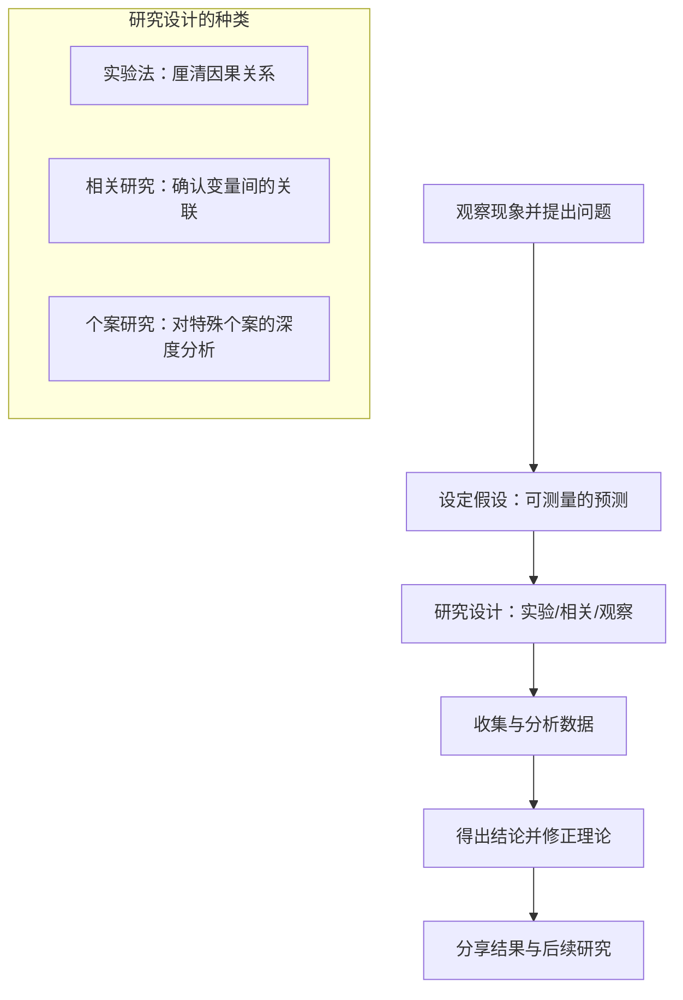

import Callout from "@/components/mdx/Callout.astro";

# 心理学的基础与人类行为的理解

各位好。作为"教授"，我很高兴带大家走进心灵的科学——**心理学（Psychology）**的世界。许多人以为心理学不过是"看穿他人心思的读心术"或"性格测试"。但在我的定义里，心理学是<mark><strong>"用最客观的方法，去证明最主观的人类经验的一项高尚努力"</strong></mark>。

我们为什么会以特定的方式行动？我们的想法又从何而来？今天，为了回答这些古老的问题，我们将逐一梳理心理学所积累起来的知识根基。

---

## 1. 心理学的起源：从哲学到科学

心理学原本是哲学的一个分支。从亚里士多德到笛卡尔，它一直是思辨人类"灵魂"的学问。直到 1879 年，威廉·冯特（Wilhelm Wundt）在德国莱比锡大学建立了第一个心理学实验室，它才真正开始作为一门**独立的科学**向前迈进。

- **哲学阶段**：「人的心灵是什么？」（思辨与逻辑）
- **科学阶段**：「心灵如何运作，又该如何测量？」（观察与实验）

---

## 2. 观察心灵的五种镜片：主要流派一览

人的心灵过于复杂，任何单一视角都无法完整解释。让我们透过心理学史上几个代表性的流派，熟悉看待人的不同角度。

### 🎭 心理学主要流派与视角对照

| 流派（视角） | 代表学者 | 核心关键词 | 看待人的视角 |
| :----------- | :----------------- | :---------------------- | :------------------------------------------ |
| **精神分析** | **弗洛伊德** | <mark>无意识</mark>、童年经验 | 受看不见的本能与无意识支配的存在 |
| **行为主义** | **斯金纳、华生** | <mark>刺激—反应（S-R）</mark> | 被环境塑造并加以控制的有机体 |
| **人本主义** | **罗杰斯、马斯洛** | <mark>自我实现</mark>、自由意志 | 拥有自我成长与实现潜能的主体 |
| **认知主义** | **皮亚杰、奈瑟** | <mark>信息加工</mark>、图式 | 像计算机一样输入、储存、提取信息的存在 |
| **生物学** | **-** | **神经递质**、演化 | 大脑电化学反应与遗传的产物 |

现代心理学并不孤立于某一个流派，而是整合所有视角来解释现象。这被称为**整合取向（Eclectic Approach）**。

---

## 3. 心理学的研究方法：科学的证明

心理学之所以不同于"占卜"，关键在于它的**方法论**。我们提出假设，并对其进行严格的检验。

### 🔄 心理学研究的循环过程

其中**实验法**通过操纵作为原因的条件（自变量），观察结果（因变量）如何变化，是<mark><strong>揭示人类行为因果关系的、心理学最有力的武器</strong></mark>。

---

## 4. 深入一层：心与身的连接（Mind-Body）

过去人们把心灵与身体看作彼此分离的两样东西。但现代心理学强调**心身相关**。我们的情绪会改变免疫系统，反过来，肠道菌群的状态也可能左右我们的抑郁感。

<Callout type="important">
  **安慰剂效应（Placebo Effect）**：仅仅因为相信"会好起来"，身体就真的发生了变化。
  这一现象处在心理学与医学的交界处，是说明心灵力量之强大的代表性例证。
</Callout>

---

## 5. 结语：理解自己的第一面镜子

今天，我们拿到了走进心理学这片森林的地图。心理学不是操控他人的工具。它更接近于一面镜子，帮我们寻找**「我为什么会这样感受、这样行动？」**的答案。

透过这面镜子，各位将窥见自己的无意识，领悟学习的原理，并进一步学会与他人共情。

---

## 📖 参考文献
在此介绍几本能拓宽心理学视野的名著。

- **《梦的解析》（The Interpretation of Dreams）— 西格蒙德·弗洛伊德**：首次发现"无意识"这块未知大陆的里程碑之作。即使读来略有难度，对理解心理学的源头也大有帮助。
- **《活出生命的意义》（Man's Search for Meaning）— 维克多·弗兰克尔**：一部动人的心理学著作，展示了即便身处集中营那样的极端境遇，决定人能否活下去的仍是"寻找意义"。
- **《影响力》（Influence）— 罗伯特·西奥迪尼**：展示社会心理学原理如何在日常与商业中强力运作的实战心理学经典。

---

今天的课就到这里。下一讲我们将正式学习大脑与感官如何接收这个世界，也就是**心灵的硬件与软件**。辛苦了。
