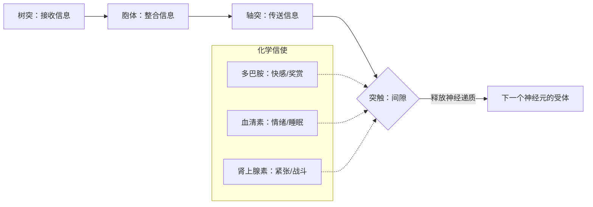

import Callout from "@/components/mdx/Callout.astro";

# Chapter 2. 大脑与心灵的硬件：神经科学与感觉知觉

各位同学，很高兴再次见面。上一讲我们学习了心理学的历史脉络与科学方法论。今天，我们要走进心理学中崛起最为强劲的领域——**生物心理学（Biological Psychology）**的世界。

如果说人的心灵是一套精密的软件，那么我们的大脑与神经系统就是运行这套软件的**尖端硬件**。我们所感受到的悲伤、爱意，乃至富有创造力的想法，实际上都是大脑内部微小电化学反应的产物。今天，我们就来剖析这台神奇的生物机器的运作原理。

---

## 1. 心灵的电信号：神经元与突触

我们的大脑中约有 860 亿个**神经元（Neuron，神经细胞）**。它们不停地传递信息，构成了一张庞大的网络。

### 🔄 神经传递的机制

正如<mark><strong>"血清素不足会让人抑郁，多巴胺过剩会让人成瘾"</strong></mark>这句话所说，这些化学物质哪怕只是极其细微的失衡，也足以彻底改变我们的性格与生活质量。我们总相信仅凭"意志力"就能战胜一切，但有时候，调整大脑的化学平衡才是更有效的疗愈。

---

## 2. 大脑的地图：各部位的功能与角色

我们的大脑是一套按部位彻底分工的**分工系统**。但这些部位彼此紧密协作，共同造就了"我"这个身份。

### 🧠 主要脑区与功能指南

| 部位 | 名称 | 主要功能 | 受损时的症状 |
| :----------- | :------------- | :-------------------------------- | :-------------------------- |
| **大脑皮层** | **额叶** | **高级思维**、计划、判断、道德感 | 冲动控制障碍、人格改变 |
| **大脑皮层** | **颞叶** | 听觉信息加工、记忆储存 | 记忆丧失、无法理解语言 |
| **边缘系统** | **杏仁核** | **情绪反应**、恐惧与愤怒 | 情绪迟钝、无法察觉危险 |
| **边缘系统** | **海马** | **新记忆**的长期储存 | 无法学习新的事实 |
| **小脑** | **Cerebellum** | 保持平衡、精细动作的调控 | 步态不稳、无法完成精细工作 |

尤其把人类与其他动物区分开来的最大特征，是<mark><strong>爆发式演化的额叶</strong></mark>。我们之所以能抑制本能、规划未来，全都仰赖这块额叶。

---

## 3. 世界并非如其所是地呈现：感觉与知觉

我们相信眼见即为真。但从心理学来看，我们并不是在**看**世界，而是在**解释**世界。

- **感觉（Sensation）**：通过眼、鼻、耳等感觉器官接收外部刺激的物理过程。
- **知觉（Perception）**：大脑对进来的感觉信息加以解释、赋予意义的心理过程。

<Callout type="important">
  **知觉恒常性（Perceptual Constancy）**：远处的汽车看起来只有蚂蚁那么大，我们却仍把它认作一辆真正的
  汽车，这是因为大脑已经为我们维持了大小、形状与颜色上的恒常性。这正是**<mark>"现象在变，实体不变"</mark>**
  的、大脑令人惊叹的认知能力。
</Callout>

---

## 4. 大脑的魔法：可塑性（Neuroplasticity）

过去人们相信，成年之后脑细胞就只会不断减少。但现代神经科学证明了**大脑的可塑性**。当我们学习新技能或深入思考时，神经元之间的物理连接（突触）会被强化，新的地图也随之绘出。

<mark><strong>"我们的大脑可以一直演化到生命终点。"</strong></mark>用年龄当作做不到的借口，至少在脑科学上是站不住脚的。

---

## 5. 结语：了解硬件，人生就会改变

今天我们学习了心灵的物理基础——大脑与感觉的原理。心灵建立在生物学基础之上这一事实，让我们变得谦逊。与此同时，大脑的可塑性也给了我们一个有力的希望：我们能够改变自己。

此时此刻，各位的大脑正在处理我的声音与文字，并不断拓展自己的地图。请务必记住，**照顾好自己的硬件（充足的睡眠、运动、新鲜的刺激）**，就是最好的心灵管理。

---

## 📖 参考文献
献给想要沉浸在大脑与知觉之谜中的各位。

- **《错把妻子当帽子》（The Man Who Mistook His Wife for a Hat）— 奥利弗·萨克斯**：以温暖的人本主义目光，讲述脑损伤患者种种奇特症状的名著，展现了知觉心理学的精髓。
- **《意识探秘》（The Quest for Consciousness）— 克里斯托夫·科赫**：探究"意识"究竟诞生于大脑何处，呈现现代科学最前沿的一本书。
- **《有条理的大脑》（The Organized Mind）— 丹尼尔·列维京**：在信息过载的时代，讲解大脑如何分配注意、加工信息的实用之作，教你脑科学意义上的高效。

---

辛苦了。下一讲我们将正式探讨，凭借这样精密的硬件，我们究竟是如何学习与记忆的，也就是**学习与记忆的机制**。
