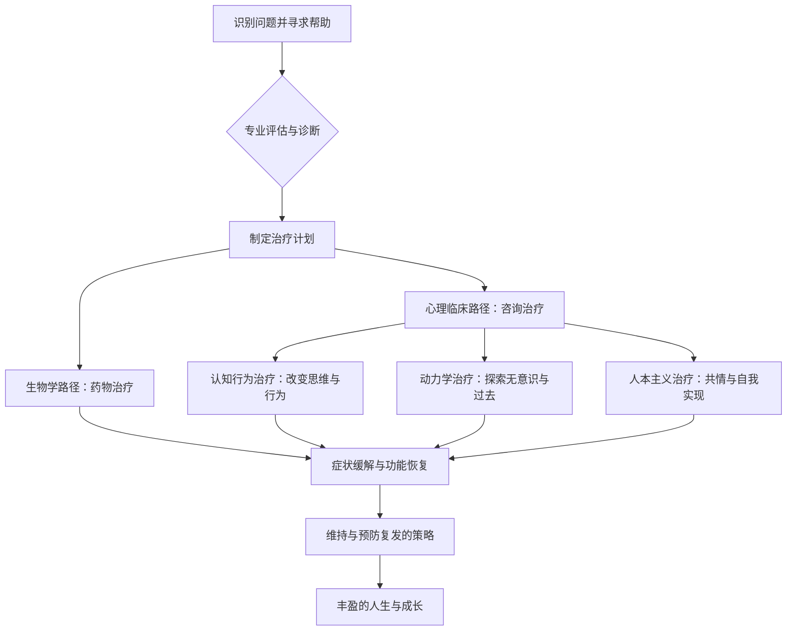

import Callout from "@/components/mdx/Callout.astro";

# 心灵的阴影：异常心理学与疗愈之旅

各位好。到目前为止，我们学习了发展、社会关系、动机与情绪等人类心灵普遍的运作原理。今天要谈的话题稍显沉重，却与我们的生活贴得最近，那就是**异常心理学（Abnormal Psychology）**。

人的心灵像一幅画。有时明亮的光洒落其上，有时也会覆上浓重的阴影。异常心理学正是分析那片**阴影**的学问。但请记住：阴影之所以浓，恰恰证明光同样强烈地存在。今天，我们将超越把心灵的痛苦单纯视作"病"的看法，开始一段<mark><strong>理解人之存在的苦痛、并探寻疗愈之路的旅程</strong></mark>。

---

## 1. 什么算"异常"？标准的模糊地带

区分"正常"与"异常"的界线究竟在哪里？心理学会综合考量以下四项标准（4Ds）。

### 📊 判别异常行为的四项标准（4Ds）

| 标准 | 术语 | 含义 | 例子 |
| :------------ | :-------------- | :-------------------------------------- | :------------------------------ |
| **偏离性** | **Deviance** | 偏离社会规范或统计上的平均 | 在公共场所做出极端的怪异举动 |
| **痛苦** | **Distress** | 个体自身感受到的强烈心理苦痛 | 让日常生活陷入瘫痪的深切悲伤 |
| **功能失调** | **Dysfunction** | 难以维持日常工作或社会关系 | 因社交恐惧而失业 |
| **危险性** | **Danger** | 可能对自己或他人构成威胁 | 自伤意图或暴力冲动 |

要紧的是，任何单独一项都不能成为绝对标准。艺术家独特的怪癖或许"偏离"了常规，却未必构成"功能失调"；深切的悲伤也可能是任何人都会经历的普遍痛苦。只有当<mark><strong>"痛苦的深度与生活的功能性"</strong></mark>彼此相互印证时，诊断才真正具有意义。

---

## 2. 现代诊断的标准：DSM-5-TR

心理学家与精神科医师使用的是通行全球的诊断体系**DSM-5-TR**（精神疾病诊断与统计手册）。它就像一张心灵的地形图。下面我们把主要障碍作一次系统的梳理。

### 🧩 主要心理障碍分类概览

1.  **焦虑障碍（Anxiety Disorders）**：过度的恐惧与焦虑。广泛性焦虑障碍、惊恐障碍、社交焦虑障碍等。
2.  **心境障碍（Mood Disorders）**：难以调节情绪的起伏。重性抑郁障碍、双相情感障碍（躁郁症）。
3.  **人格障碍（Personality Disorders）**：僵化的思维与行为模式导致社会适应不良。边缘型人格障碍、自恋型人格障碍等。
4.  **精神分裂谱系（Schizophrenia Spectrum）**：与现实失去接触，出现妄想与幻觉。

---

## 3. 疗愈的过程：从黑暗走向光

一旦发现了心灵的阴影，接下来要思考的就是如何疗愈。心理治疗并不只是消除症状，而是<mark><strong>接纳自己、并学习一种新的生活方式的过程</strong></mark>。

### 🔄 心理治疗与康复指南（Flowchart）

应用最广的**认知行为治疗（CBT）**，其核心在于这样一个领悟：<mark><strong>"让我们痛苦的并不是处境本身，而是我们看待处境的想法"</strong></mark>。仅仅是擦拭那副扭曲的思维镜片，世界就会开始变得不一样。

---

## 4. 深入一层：现代人的顽疾"焦虑"与"抑郁"

我们往往把"焦虑"一概视为坏事。但焦虑本来是为了保护我们免于危险的**生存警报**。问题出在，明明没有威胁，警报却停不下来的时候。

<Callout type="note">
  **抑郁不是"精神上的流感"。**流感在病毒离开后就会痊愈，而抑郁更多时候是要求我们重新审视生活方向的
  **内在信号**。心理学家们强调，它也可能是在传达这样一条讯息："你的灵魂已经厌倦了眼下的活法。"
</Callout>

---

## 5. 性格的固着：理解人格障碍

人格障碍并不等于"坏性格"。它更像是为了保护自己免受童年的匮乏或伤害，而逐渐形成的<mark><strong>"坚硬却不再柔韧的铠甲"</strong></mark>。对他人目光极度敏感，或是试图控制他人的举动，其底下往往藏着深深的"不安与恐惧"。

疗愈的起点，是承认这副铠甲如今已在妨碍成长，并拿出一点点把它卸下的勇气。

---

## 6. 结语：作为受伤的疗愈者的人

各位同学，我们学习异常心理学，不是为了给他人贴上标签（Stigma）。恰恰相反，是为了承认**"只要是人，心都可能生病"**，并拓宽彼此包容伤口的共情半径。

心理学家卡尔·荣格说过：<mark><strong>"带来觉悟的不是想象光的形象，而是把黑暗意识化。"</strong></mark>请不要害怕自己的阴影。当你能够观察并接纳那片阴影时，真正意义上的自我整合与成熟才会发生。

下一讲，我们将为这趟心理学的长途学习收尾，谈一谈**幸福与积极心理学，以及我们该追求的心理幸福感（Well-being）**。

---

## 📖 参考文献
献给想要抚慰心灵的阴影、获得疗愈智慧的各位。

- **《无界》（The No-Boundary Mind）— 肯·威尔伯**：分析人类意识的光谱，就如何整合并疗愈我们内在的分裂，给出哲学与心理学层面的洞见。
- **《你没有错》— 郑惠信**：透过咨询师在一线的激烈实践，讲述共情如何救人，是一本填补心灵饥饿角落的"心理急救"之书。
- **《正午之魔》（The Noonday Demon）— 安德鲁·所罗门**：关于抑郁这一痛苦的解剖学、文化与个人记录，呈现出超越疾病本身的人性叙事。

---

辛苦了。愿今夜，各位的心被温暖的慰藉与智慧填满。
