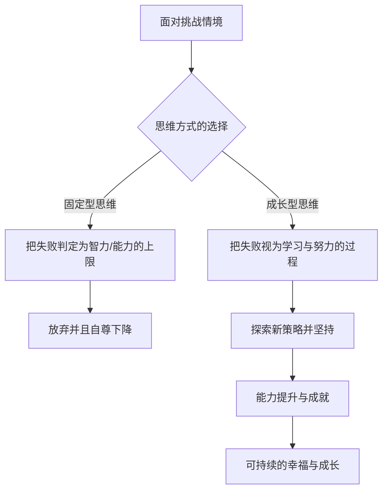

import Callout from "@/components/mdx/Callout.astro";

# 幸福的科学：积极心理学与丰盈的人生

各位好。我们终于走到了这趟心理学旅程的收官一讲。一路上，我们广泛地谈过人的无意识、社会关系、动机与情绪，乃至心灵的痛苦。今天的主题，是这一切知识的终点站，也是我们学习心理学的终极理由——**幸福**。

如果说过去的心理学专注于修复"哪里出了问题"，那么现代的**积极心理学（Positive Psychology）**追问的则是<mark><strong>"什么让我们变得丰盈？"</strong></mark>。让我们一起寻找那个科学的答案：如何超越单纯的"不痛苦"，让人生真正绽放（Flourish）。

---

## 1. 幸福感的五根支柱：塞利格曼的 PERMA 模型

积极心理学的创立者马丁·塞利格曼（Martin Seligman）说，幸福并不只是片刻的愉悦心情。他提出了通向可持续幸福感（Well-being）的五个核心要素。

### 🌟 迈向丰盈人生的 PERMA 指南

| 要素 | 含义 | 核心提问 | 实践策略 |
| :----------------------- | :-------------- | :------------------------------------ | :------------------------------- |
| **P（Positive Emotion）** | **积极情绪** | 今天我感受到多少喜悦与感恩？ | 每晚写下三件值得感恩的事 |
| **E（Engagement）** | **投入** | 有没有让我忘记时间流逝的事？ | 寻找能发挥自身优势的机会 |
| **R（Relationships）** | **关系** | 我是否拥有支持我的健康关系？ | 与重要的人进行有深度的交谈 |
| **M（Meaning）** | **意义** | 我是否在为比自己更大的存在做贡献？ | 参与能实现自身价值的服务与奉献 |
| **A（Accomplishment）** | **成就** | 我有没有设定目标并达成的经验？ | 记录下每一个小小的成功（Small Wins） |

幸福，来自这五个要素均衡地相互支撑。各位眼下哪一根柱子最结实，又该修补哪一根呢？

---

## 2. 心灵的肌力：心理韧性与成长型思维

幸福并非没有苦难的状态，而是在拥有<mark><strong>"战胜苦难的力量"</strong></mark>时才得以维系。这种力量被称为**心理韧性（Resilience）**。培养心理韧性的关键钥匙，是卡罗尔·德韦克（Carol Dweck）提出的**成长型思维（Growth Mindset）**。

### 🔄 思维方式的转换过程

拥有成长型思维的人不会说"我做不到"。他们说的是<mark><strong>"我只是'还没有（Not yet）'做到而已"</strong></mark>。就是这一个小小的词，改变了大脑的回路，也铺出了通往幸福的路。

---

## 3. 幸福的四成掌握在自己手里：柳博米尔斯基的公式

心理学家索尼娅·柳博米尔斯基（Sonja Lyubomirsky）分析了决定幸福的各项因素。

- **遗传设定点（50%）**：与生俱来的气质
- **外部环境（10%）**：金钱、居住地、婚姻状况等
- **有意的行动（40%）**：我们的想法与每天的行为

令人惊讶的是，金钱或房子这类环境因素对幸福的影响仅占 10%。相反，<mark><strong>我们拥有什么样的习惯、抱着什么样的想法（有意的行动）</strong></mark>却占了整整 40%。这意味着，凭借自己的努力，我们可以改变幸福中相当大的一部分——这是一条充满希望的讯息。

---

## 4. 与真正的自己相遇：发现优势

比起把精力耗在修补缺点上，当人得以发挥自身的**标志性优势（Signature Strengths）**时，才会感受到最大的成就感与幸福。坚持、好奇、公正、创造力……请去寻找只属于你的那块闪光的原石。

<Callout type="note">
  **比较是幸福的窃贼。**积极心理学所说的幸福，不是在与他人的比较中占据上风，
  而是比起昨天的自己，更靠近一点"像自己的样子"的过程。
</Callout>

---

## 5. 意义层面的平静：正念与感恩

现代心理学把"冥想"这一古老的智慧，以**正念（Mindfulness）**之名加以科学化。它是一种不被过去或未来吞没、完整地存在于"此刻"的能力。请再为它添上**感恩**这味调料。感恩是最强有力的大脑可塑性训练，它让我们的大脑学会对积极信息更为敏感。

---

## 6. 结语：人生不是"待解的问题"，而是"待经历的神秘"

各位同学，在这六周心理学长途的终点，我想留下最后一句话。心理学并不是一门把各位塑造成"完美的人"的学问。它更是**一门让各位理解自身的不完美，并在明知不完美的情况下，依然获得再往前一步的勇气的学问**。

<mark><strong>"幸福不是目的地，而是旅行的方式本身。"</strong></mark>今天你对遇见的人说出的那句温暖的话，你送给自己的那个鼓励的微笑，就是幸福的实体。

感谢各位一路与我共同绘制这张心灵的地图。愿各位的人生透过心理学这面镜片，闪耀得更加澄澈而美丽。

---

## 📖 参考文献
献给想把丰盈人生与幸福科学落实到日常的各位。

- **《学习乐观》（Learned Optimism）— 马丁·塞利格曼**：给出克服悲观、习得乐观思维（成长型思维）的具体方法，是积极心理学的经典之作。
- **《幸福的起源》— 徐恩国**：以进化论视角，把幸福解读为"生存的工具"而非"道德义务"，写得大胆而清晰。
- **《坚毅》（Grit）— 安杰拉·达克沃斯**：以科学方式论证，成功的关键不在天赋，而在热情与坚持的结合——"坚毅"。

---

辛苦了。愿丰盈的祝福，充满各位往后的每一天。
